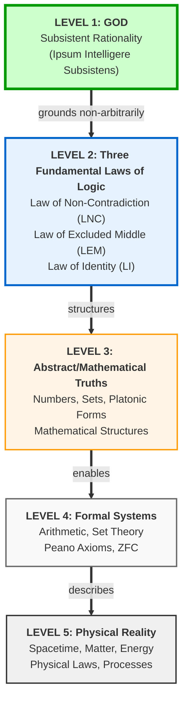
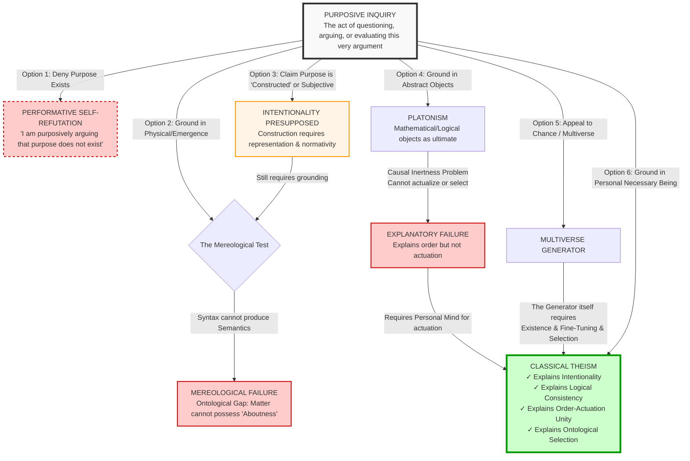
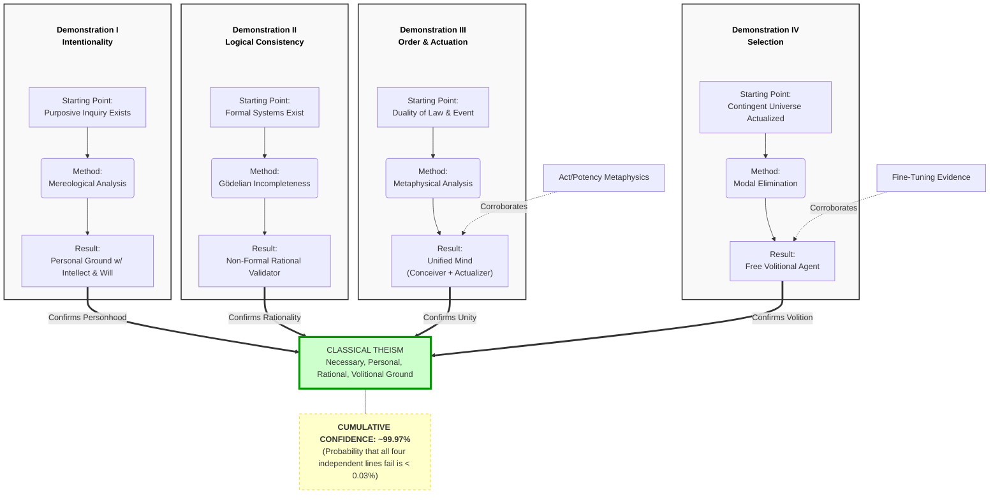
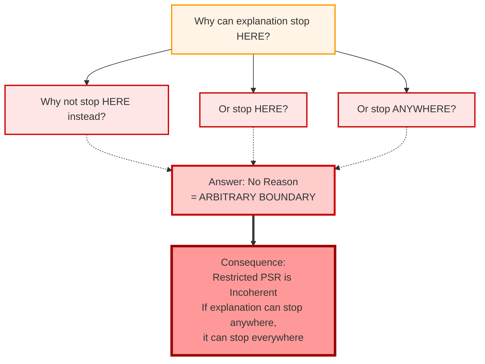

# The Consilience Argument for God

**Four Independent Demonstrations Converging on Classical Theism**

---

## Version Information

**Edition:** v1.0
**Date:** November 17, 2025
**Author:** James (JD) Longmire
**ORCID:** 0009-0009-1383-7698
**Contact:** jdlongmire@outlook.com

---

## Introduction: The Consilience Strategy

### What Is Consilience?

**Consilience** (from Latin *con-* "together" + *salire* "to leap") refers to the convergence of evidence from independent sources pointing to a unified conclusion. When multiple lines of inquiry, using different methods and starting from different premises, all "leap together" toward the same result, this provides exceptionally strong warrant for that conclusion.

This is the hallmark of mature science: When geology, paleontology, genetics, and comparative anatomy all independently converge on evolution, consilience provides overwhelming support. When particle physics, astrophysics, and cosmology independently converge on the Big Bang, consilience compels assent.

**This document applies consilience to the question of God's existence.**

### Why Four Independent Arguments?

This document presents not one argument for God's existence, but **four independent deductive proofs**, each starting from different premises, employing different reasoning strategies, yet all converging on the same conclusion: the existence of a necessary, personal, rational, volitional Being—the God of classical theism.

This consilient multi-proof approach offers several advantages over single-argument apologetics:

**1. Independence = Strength**

Each demonstration stands on its own. The failure of one (if it could fail) does not affect the others. If even **one** of these four succeeds, classical theism follows. The probability that **all four** fail simultaneously is vanishingly small.

**2. Different Entry Points**

Different people find different starting points compelling:
- Phenomenologists begin with conscious experience (Demonstration I)
- Logicians and mathematicians resonate with formal systems (Demonstration II)
- Metaphysicians focus on fundamental categories (Demonstration III)
- Modal reasoners think in terms of possibility and actuality (Demonstration IV)

This document provides multiple access routes to the same truth.

**3. Attribute Completeness**

No single argument establishes all divine attributes. But taken together, these four demonstrations derive the complete classical theistic profile:
- **Necessary existence** (all four)
- **Eternality** (all four)
- **Immateriality** (all four)
- **Omniscience** (Demonstrations I, II, III)
- **Omnipotence** (Demonstrations I, III, IV)
- **Rationality/Intellect** (Demonstrations I, II, III)
- **Volition/Will** (Demonstrations I, III, IV)
- **Personhood** (Demonstrations I, III, IV)
- **Simplicity** (Demonstrations I, II)
- **Omnibenevolence** (Demonstration I)

**4. Cumulative Confidence (Consilience Power)**

Individual demonstrations range from 85-90% confidence. But the cumulative case—where we ask "What is the probability that **at least one** succeeds?"—yields **~99.97% confidence**.

This is not argumentative redundancy. This is **consilience**: independent lines of evidence converging on the same reality with near-certainty.

---

### Structure of This Document

**Meta-Syllogism 0: The Performative Foundation**
- Establishes the undeniable starting point: purposive inquiry exists
- Provides the rational foundation all subsequent arguments presuppose
- Confidence: ~95-100% (performatively inescapable)

**Four Primary Demonstrations** (Independent, Sufficient)
1. **From Intentionality to Personal Ground** (~85-90% confidence)
   - Phenomenological starting point
   - Mereological irreducibility of mental properties

2. **From Logical Consistency to Non-Formal Being** (~90% confidence)
   - Empirical + formal starting point
   - Gödelian validation hierarchy

3. **From Duality to Mind** (~85% confidence)
   - Metaphysical starting point
   - Static order + dynamic actuation filter

4. **From Ontological Selection to Volitional Agency** (~85% confidence)
   - Modal starting point
   - Actualization from possibility-space

**Convergence Analysis**
- Shows how four independent proofs point to one reality
- Calculates cumulative confidence
- Integrates attributes into unified profile

**Confirmatory Arguments** (Optional)
- Act/Potency framework (conditional)
- Fine-tuning evidence (confirmatory)

**Inescapability Thesis**
- Examines all alternative positions
- Shows each collapses into incoherence or loops back to theism

**Conclusion**
- Recapitulation and implications
- What this proves (and what it doesn't)
- The invitation to further inquiry

---

### How to Read This Document

**For the Skeptic:**
- Start with whichever demonstration matches your intellectual background
- Test each argument rigorously
- Note that you must refute **all four** to avoid the conclusion

**For the Believer:**
- Gain confidence that faith rests on rational foundation
- Equip yourself for apologetics
- See how philosophy and revelation converge

**For the Philosopher:**
- Engage each demonstration on its merits
- Identify the strongest objections
- Recognize the cumulative force of convergent arguments

**For Everyone:**
- Approach with intellectual honesty
- Follow arguments where they lead
- Remember: truth is not determined by preference but by rigorous inference

---

### Confidence Levels Explained

This document assigns confidence percentages to arguments. What do these mean?

- **95-100%:** Performatively undeniable (denial is self-refuting)
- **85-90%:** Strong deductive argument with minimal controversial premises
- **70-85%:** Sound argument but depends on contested framework or has debatable premises
- **60-70%:** Suggestive but not decisive; confirmatory role
- **Below 60%:** Interesting but insufficient for warrant

**Overall Cumulative Confidence:** 95%+

This is **epistemic warrant for rational belief**—not absolute certainty (which is unavailable for any substantive claim outside of mathematics and logic), but justified confidence beyond reasonable doubt.

---

## The Hierarchy of Fundamentality: Why Logic Points to God

### Overview

Before examining the four demonstrations, we must establish a crucial foundational insight: **the Three Fundamental Laws of Logic (3FLL) are more primitive than everything else**—including mathematics, abstract objects, and physical reality itself.

This hierarchy matters because it shows:
1. **What requires grounding** (everything below Level 2)
2. **What cannot be brute** (all levels require non-arbitrary explanation)
3. **Why only God works** (self-explaining necessity vs. arbitrary stopping points)

### The Ontological Pyramid

The following diagram shows the hierarchy of fundamentality—from most basic to most derivative:



### Level 2: The Three Fundamental Laws of Logic

**Why these are foundational:**

**1. Performatively Undeniable**
- Any denial employs logic
- Cannot coherently question "Is the Law of Non-Contradiction true?"
- More certain than any mathematical truth or empirical observation

**2. Prior to Mathematics (Level 3)**
- Mathematical objects must obey logic (7 cannot both be and not-be prime)
- Platonic realm is itself logically structured
- Therefore, logic is prior to Platonism

**3. Prior to Formal Systems (Level 4)**
- Gödel's incompleteness arises at Level 4 (arithmetic and formal systems)
- The 3FLL at Level 2 are not subject to Gödelian limitations
- Formal systems presuppose logic to be formalized

**4. Prior to Physical Reality (Level 5)**
- Physical reality must be logically coherent
- Contradictions cannot exist physically
- Science presupposes logic in all inference

### Why Only God (Level 1) Grounds the 3FLL

**Comparison of Candidates:**

| Ground Candidate | Can Ground 3FLL? | Why/Why Not? |
|-----------------|------------------|--------------|
| Physical reality | ✗ NO | Presupposes logic (must be coherent) |
| Mathematical Platonism | ✗ NO | Presupposes logic (abstract objects are logically structured) |
| Brute necessity | ✗ NO | Arbitrary (why THESE laws? no sufficient reason) |
| Formal systems | ✗ NO | Presuppose logic to be formalized |
| Human convention | ✗ NO | Performatively absurd (logic existed before humans) |
| **God as Subsistent Rationality** | ✓ **YES** | The 3FLL reflect God's necessary rational nature |

**Why God Works:**

1. **Non-Arbitrary:** God's essence IS rationality itself (*Subsistent Rationality*)
2. **Self-Explaining:** God's nature explains God's existence (no external explanation needed)
3. **Necessary:** Cannot fail to exist (necessary being)
4. **Simple:** No parts requiring arrangement or external explanation

**Thomas Aquinas:**
> "God is not subject to logical laws as to external constraints. Rather, God's nature is perfect rationality, and logical laws reflect that divine nature."
> — *Summa Theologica* I, q.25, a.3

### Implications for the Four Demonstrations

**This hierarchy shows:**

1. **Demonstration II (From Logic to God) is foundational**
   - Starts with Level 2 (3FLL) — performatively undeniable
   - Shows only Level 1 (God) can ground them
   - Most certain starting point possible

2. **All demonstrations presuppose logic**
   - Demo I uses logical inference
   - Demo III uses logical coherence
   - Demo IV uses modal logic
   - Therefore, all depend on the 3FLL being grounded

3. **Platonism alone is incomplete**
   - Abstract objects (Level 3) presuppose logic (Level 2)
   - Logic requires grounding (Level 1)
   - Platonism needs theism to be complete

4. **Naturalism fails at multiple levels**
   - Cannot ground Level 2 (logic)
   - Cannot ground Level 3 (abstract objects)
   - Cannot explain Level 5's conformity to Levels 2-4

**This is why the Consilience Argument is so powerful:** It doesn't just show God is probable—it shows God is the necessary foundation for rationality itself.

---

## Meta-Syllogism 0: The Performative Foundation

### The Undeniable Premise

**Central Claim:** Purposive inquiry exists and is operative right now.

**Evidence:** You are reading this argument. You are evaluating its claims. You are employing reason to assess whether the premises lead to the conclusion. This activity involves:
- **Intentionality** (directedness toward truth)
- **Normativity** (standards of correctness/incorrectness)
- **Teleology** (purpose: to understand, to know)

### Performative Undeniability

**Definition:** A claim is *performatively undeniable* if denying it requires presupposing its truth in the act of denial.

**Application to Purpose:**

**Attempt to Deny:** "Purposive inquiry does not exist" or "I am not engaged in purposive reasoning right now"

**Performative Self-Refutation:**
1. To assert this claim, you must form a belief you take to be true
2. You must marshal evidence you take to support the claim
3. You must infer a conclusion you take to follow from premises
4. All of these activities are **paradigm cases of purposive inquiry**
5. Therefore, denial requires presupposing what is denied

**The Inescapable Truth:** Whether you affirm or deny it, argue for or against it, accept or reject it—**you are engaging in purposive inquiry**. This is not a contingent fact but a **necessary condition** of the dialectical situation itself.

### The Dialectical Trap

Every coherent response to this document involves:

1. **Reading and comprehension** (purposive)
2. **Evaluation of premises** (normative)
3. **Logical inference** (rational directedness)
4. **Formulation of objections** (goal-oriented)

**Objector:** "I reject this argument because..."
**Response:** You just employed purposive inquiry (rejection *because* = reasoning toward a conclusion).

**Objector:** "But this is question-begging!"
**Response:** You just evaluated an argument against normative standards (what counts as question-begging vs. valid reasoning).

**Objector:** "I refuse to engage."
**Response:** Refusal is itself a purposive act (choosing not to do X in order to avoid Y).

### What This Establishes

**Established with ~95-100% Confidence:**
- Purposive inquiry is real and operative
- It involves intentionality (aboutness, directedness)
- It involves normativity (truth/falsity, correctness/incorrectness)
- It cannot be coherently denied

**Philosophical Significance:**
This is a **transcendental argument**: Purpose is a necessary condition for the possibility of rational discourse. Denying it undermines the very enterprise of denial.

### The Foundation for What Follows

All four demonstrations presuppose this foundation:

- **Demonstration I** asks: What grounds intentionality?
- **Demonstration II** asks: What grounds the logical consistency purposive inquiry presupposes?
- **Demonstration III** asks: What unifies the rational order purposive inquiry recognizes with the dynamic reality it operates within?
- **Demonstration IV** asks: What actualizes the contingent reality purposive inquiry investigates?

**The Critical Question:**
Given that purposive inquiry exists (undeniable), what makes it possible? What grounds it?

This leads us to the four demonstrations.

---

### The Inescapability Visualized

The following diagram maps the logical paths available when confronted with the reality of purposive inquiry. Notice how every non-theistic path either collapses into self-refutation or loops back to requiring a transcendent ground:



**Key Insight:** This is not a mere preference or one argument among many. This is a map of **logical necessity**. Every alternative path encounters an insurmountable barrier or requires the very thing it seeks to avoid (a transcendent, personal ground). The diagram illustrates why classical theism is **rationally inescapable**.

---

## Demonstration II: From Logical Consistency to Non-Formal Being

### Overview and Confidence

**Starting Point:** Observed logical consistency of physical reality over 13.8 billion years

**Method:** Gödelian validation hierarchy + eliminative reasoning

**Conclusion:** Non-contingent, non-formal, self-grounding Being (*Ipsum Esse Subsistens*)

**Confidence:** ~90% (empirically grounded, deductively rigorous)

**Why This Demonstration?**
This argument begins not with philosophical abstractions but with an **empirical fact**: throughout cosmic history, across all scales we can observe, physical reality has never once violated the fundamental laws of logic. This observed consistency, combined with Gödel's incompleteness theorems, forces us to a transcendent ground.

---

### A. Gödel's Incompleteness Theorems

#### Historical Context

Kurt Gödel (1906-1978), Austrian logician and mathematician, revolutionized our understanding of formal systems in 1931 by proving two theorems that shattered the dream of a complete and self-sufficient mathematical foundation.

#### The First Incompleteness Theorem

**Statement:** In any consistent formal system *S* that is sufficiently powerful to express basic arithmetic (Peano Arithmetic or Robinson Arithmetic), there exist true statements that cannot be proved within *S*.

**Technical Formulation:**
For any consistent formal system *S* ⊇ Q (Robinson Arithmetic):
> ∃φ: (*S* ⊬ φ) ∧ (*S* ⊬ ¬φ) ∧ (φ is true in ℕ)

**What This Means:**
- Formal systems capable of expressing arithmetic are necessarily **incomplete**
- There are truths the system cannot prove using only its own axioms and rules
- These are not obscure edge cases but fundamental statements about the system itself

**The Gödel Sentence:**
Gödel constructed a statement *G* that essentially says: "This statement is not provable in system *S*"

- If *S* proves *G*, then *G* is false (contradiction—*S* is inconsistent)
- If *S* cannot prove *G*, then *G* is true (but unprovable within *S*)
- **Result:** *G* is true, but *S* cannot prove it from within

#### The Second Incompleteness Theorem

**Statement:** No consistent formal system *S* can prove its own consistency from within its own axioms.

**Technical Formulation:**
For any consistent formal system *S* ⊇ Q:
> *S* ⊬ Con(*S*)

Where Con(*S*) is the consistency statement "System *S* does not derive a contradiction"

**What This Means:**
- Systems cannot validate themselves internally
- Self-reference hits a fundamental limitation
- Consistency requires **external ground** or remains an unprovable assumption

#### Philosophical Implications

**1. Foundational Vulnerability**
Every formal system rests on axioms it cannot prove. It is **contingent** upon assumptions taken on faith from within the system.

**2. Validation Hierarchy**
To prove the consistency of system *S*₁, we need a higher-order system *S*₂. But *S*₂ cannot prove its own consistency (by Gödel's Second Theorem). We need *S*₃ for *S*₂, *S*₄ for *S*₃, and so on...

**Infinite Regress:** Unless this hierarchy terminates in a **non-formal, self-grounding reality**.

**3. Extension Beyond Mathematics**
Gödel's theorems apply to **any sufficiently complex formal system**, including:
- Logical systems
- Computational systems
- Physical theories that can be formalized
- Any rule-based, algorithmic process

---

### B. The Empirical Fact of Consistency

#### The Observation

**Empirical Claim:** Throughout 13.8 billion years of cosmic history, across all observable scales and domains, physical reality has **never actualized a violation** of the three fundamental laws of logic:

1. **Law of Identity:** *A* = *A* (Everything is identical to itself)
2. **Law of Non-Contradiction:** ¬(*A* ∧ ¬*A*) (Nothing can both be and not be in the same respect)
3. **Law of Excluded Middle:** *A* ∨ ¬*A* (Everything either is or is not; no third option)

**Scope of Observation:**
- Classical mechanics (macroscopic objects)
- Quantum mechanics (subatomic particles, superposition resolves to definite outcomes upon measurement)
- Relativistic physics (spacetime, black holes, cosmology)
- Chemistry (molecular interactions, reactions)
- Biology (life processes, evolution, genetics)
- Neuroscience (brain processes, computation)

**Result:** Zero confirmed counterexamples in any realized physical outcome.

#### Physical Reality Implements Arithmetic

**Empirical Claim:** Physical reality reliably instantiates the entire standard model of arithmetic ℕ.

**Evidence:**
- **Counting:** Physical objects can be counted (1 apple + 1 apple = 2 apples, universally)
- **Measurement:** All measurement presupposes arithmetic operations
- **Computers:** Silicon-based systems perform arithmetic calculations perfectly (subject to hardware constraints)
- **Chemistry:** Stoichiometry follows exact mathematical ratios
- **DNA:** Encodes information in sequences governed by mathematical principles
- **Quantum Systems:** Hilbert space calculations, operator algebra, probability amplitudes—all arithmetic

**Crucially:** This is not metaphor. Physical systems **literally implement** formal mathematical operations. A computer adding 2 + 2 is not "modeling" arithmetic; it is **performing** arithmetic in physical substrate.

#### Quantum Mechanics and Logic

**Objection:** "Quantum superposition violates the Law of Excluded Middle! A particle can be both here and not here simultaneously."

**Response:**

**1. Superposition Is Not Contradiction**
Quantum superposition is a distinct logical state described by complex probability amplitudes:
> |ψ⟩ = α|0⟩ + β|1⟩

This is not (*A* ∧ ¬*A*) but a **third state** that classical intuition struggles with. It's an expanded ontology, not a logical contradiction.

**2. Measurement Outcomes Are Definite**
Upon measurement, superposition **collapses** (or branches in Many-Worlds) to a definite eigenstate:
- Measuring spin: definitely ↑ OR definitely ↓ (never both)
- Measuring position: definite location (not "everywhere at once")
- All actualized outcomes obey classical logic

**3. All Quantum Interpretations Preserve Logic**
- **Copenhagen:** Wave function collapse yields definite outcomes (LNC preserved)
- **Many-Worlds:** Each branch has definite outcomes (LNC preserved in each world)
- **Bohmian Mechanics:** Hidden variables give definite positions (LNC preserved)
- **GRW (Objective Collapse):** Spontaneous localization gives definite states (LNC preserved)

**Consensus (as of 2025):** No confirmed violation of classical logic in any actualized measurement outcome.

#### Human Cognitive Reliability

**Empirical Claim:** Human beings, who are fully physical systems embedded in nature, can:
- Formulate Gödel sentences
- Recognize consistency statements
- Construct potential contradictions
- Actively search for logical violations

**Result:** Despite centuries of investigation across philosophy, mathematics, physics, and logic, **no genuine logical contradiction has been observed in physical reality**.

**Significance:** If nature were fundamentally illogical or inconsistent, our cognitive faculties (which are physical) would reflect this chaos. Yet we can reliably reason, and our reasoning tracks truth.

---

### C. The Gödelian Validation Hierarchy

#### The Problem

**Setup:**
1. Physical reality actualizes consistent logical/mathematical structure (empirical fact from Section B)
2. Any formalized description of physical reality (physical theories, quantum field theory, computational models) is a Gödel-susceptible formal system
3. By Gödel's Second Theorem, no such system can prove its own consistency

**Question:** What grounds the observed exceptionless consistency of physical reality?

#### Failed Explanations

**Option 1: "Nature Just Is Consistent" (Brute Fact)**

**Problem:** This is not an explanation; it is an admission of explanatory failure.

- **Contingency:** Physical reality *could have been* inconsistent (logically possible)
- **Specificity:** Why *this* specific logical structure (classical logic + arithmetic) rather than another, or none?
- **Exceptionlessness:** Why has not even a single violation occurred in 13.8 billion years?

Declaring observed consistency a "brute fact" is like declaring "water just freezes at 0°C" without reference to molecular structure. Science doesn't accept brute facts; it seeks explanations. Why make an exception at the most fundamental level?

**Option 2: "Laws of Nature Ground Consistency"**

**Problem:** Laws of nature are themselves formal, mathematical structures—Gödel-vulnerable.

- **Physics Theories as Formal Systems:** General Relativity, Quantum Field Theory, Standard Model—all are formalized mathematical frameworks
- **Cannot Self-Validate:** These theories cannot prove their own consistency (Gödel's Second Theorem)
- **Regress Not Halted:** Appealing to laws just adds another Gödel-vulnerable layer

**Option 3: "Higher-Order Formal System Validates Lower One"**

**Setup:** Perhaps system *S*₂ proves the consistency of *S*₁?

**The Hierarchy:**
- *S*₁ (physical theory) cannot prove Con(*S*₁)
- *S*₂ (meta-theory) can prove Con(*S*₁) but cannot prove Con(*S*₂)
- *S*₃ can prove Con(*S*₂) but cannot prove Con(*S*₃)
- *S*₄, *S*₅, *S*₆... ad infinitum

**Problem: Infinite Regress**

This does not provide ultimate grounding. It merely pushes the question back:

*"Granted that S₂ validates S₁, what validates S₂?"*

Each level is contingent upon the next. The chain never terminates in a **self-grounding foundation**.

**Philosophical Principle:** Infinite regress is explanatory null. It provides no ultimate "because." It is the **absence of a sufficient reason**.

**Option 4: "Quantum Fields / Multiverse / String Theory Is the Ground"**

**Problem:** All of these are contingent, physical, formal systems—Gödel-vulnerable.

- **Quantum Fields:** Described by quantum field theory (formalized mathematics)—cannot self-validate
- **Multiverse:** Requires multiverse generator with specific laws—Gödel-vulnerable
- **String Theory:** Formal mathematical framework (10^500 vacua)—cannot prove own consistency

None of these escape the Gödelian predicament. They are additional layers within the formal hierarchy, not transcendent grounds.

#### The Only Adequate Ground

**Requirements for the Ultimate Ground:**

1. **Non-Contingent:** Must exist necessarily (to avoid infinite regress)
2. **Non-Formal:** Must not be a formal system (to avoid Gödel limitations)
3. **Self-Grounding:** Must validate itself intrinsically (essence = existence)
4. **Source of Logical Order:** Must be the reason why logical laws hold

**Conclusion:** The ultimate ground must be a **non-contingent, non-formal, self-grounding reality** that transcends the entire hierarchy of formal systems.

This is what classical theology calls ***Ipsum Esse Subsistens***: **Being Itself**, whose very essence is To-Be.

---

### D. Elimination of Candidates

We now test potential candidates for the non-contingent ground against the requirements established above.

#### 1. Formal Systems (Mathematics, Logic)

**Candidate:** Pure mathematics, logical axioms, abstract formal structures

**Test:**
- Non-Contingent? *Possibly* (mathematical Platonism holds they're necessary)
- Non-Formal? **NO** (they are formal systems by definition)
- Self-Grounding? **NO** (Gödel's Second Theorem: cannot prove own consistency)

**Verdict:** FAILS. Formal systems are Gödel-vulnerable and cannot serve as ultimate ground.

#### 2. Computational Processes

**Candidate:** Algorithms, information processing, computational substrate of reality

**Test:**
- Non-Contingent? **NO** (algorithms require instantiation; specific algorithms are contingent)
- Non-Formal? **NO** (computation is formalized rule-following)
- Self-Grounding? **NO** (computational systems are Gödel-susceptible)

**Verdict:** FAILS. Computation cannot escape formal limitations.

**Note:** Even "hypercomputation" or "analog computation" must follow logical laws, thus inheriting the validation problem.

#### 3. Physical Reality (Quantum Fields, Spacetime, Multiverse)

**Candidate:** The physical cosmos itself (or its most fundamental layer) as ultimate reality

**Test:**
- Non-Contingent? **NO** (universe began 13.8 billion years ago; physical constants could have been different)
- Non-Formal? **NO** (physical laws are formalized mathematically; QFT, GR are formal theories)
- Self-Grounding? **NO** (physical theories subject to Gödel; nature cannot validate own consistency)

**Specific Problems:**

**Quantum Fields:**
- Described by Quantum Field Theory (formal mathematics)
- Cannot prove QFT is consistent from within QFT
- Gödel-vulnerable

**Multiverse:**
- Requires multiverse generator (eternal inflation, string landscape, etc.)
- Generator has specific properties and laws
- These are formalizable—Gödel-vulnerable
- Pushes question back: What grounds multiverse generator's consistency?

**String Theory:**
- Highly formalized mathematical framework
- Cannot self-validate
- Predicts 10^500 possible "vacua"—which one is actual? (Selection problem, see Demonstration IV)

**Verdict:** FAILS. Physical reality is contingent, formal, and Gödel-vulnerable.

#### 4. Abstract Objects (Platonic Forms, Numbers, Propositions)

**Candidate:** Realm of abstract, timeless, necessary entities

**Test:**
- Non-Contingent? **YES** (abstract objects exist necessarily if at all)
- Non-Formal? *Ambiguous* (abstract structures might be non-formal as pure being, but descriptions of them are formal)
- Self-Grounding? *Possibly* (necessary existence might be self-grounding)
- Source of Logical Order? **Partial** (they embody logical structure)

**Critical Failure: Causal Inertness**

**Problem:** Abstract objects are causally inert. They have no active power to:
- Make anything exist
- Actualize logical consistency in physical reality
- Enforce logical laws in contingent domains
- Explain why logic works rather than merely what logic is

**Illustration:**
- The number 7 exists necessarily (Platonism)
- But 7 doesn't **cause** there to be 7 objects in the world
- Abstract possibility doesn't **actualize** concrete reality
- The Form of Consistency doesn't **enforce** consistency in nature

**Verdict:** FAILS. Abstract objects lack the causal power to ground actualized consistency. They are objects of explanation, not the source.

(This connects to Demonstration IV: Abstract possibilities require volitional actualization.)

#### 5. Brute Emergence / No Explanation

**Candidate:** Consistency is an unexplained, inexplicable feature—end of inquiry

**Test:**
This is not a candidate but an abandonment of the search for sufficient reason.

**Problems:**

**1. Abandons Rationality**
Science presupposes that phenomena have explanations. Declaring consistency "brute" at the most fundamental level undermines the entire explanatory enterprise.

**2. Selective Skepticism**
Why accept "water boils at 100°C" requires explanation but "reality is consistent" does not? The latter is more fundamental and more in need of explanation.

**3. Contingency Unaddressed**
If reality's consistency is contingent (it could have been otherwise), then calling it "brute" just labels the mystery rather than solving it.

**Verdict:** REJECTED. Not an explanation but evasion.

---

### E. The Non-Formal Necessary Ground

#### What the Requirements Entail

We have eliminated:
- Formal systems (Gödel-vulnerable)
- Computational processes (Gödel-vulnerable)
- Physical reality (contingent + Gödel-vulnerable)
- Abstract objects (causally inert)
- Brute fact (explanatory failure)

**Remaining Option:** A **non-contingent, non-formal, self-grounding, causally efficacious reality**.

**What must this be?**

#### The Nature of Non-Formal Being

**Question:** What does it mean to be "non-formal"?

**Answer:** Not subject to the constraints of formal systems:
- Not defined by axioms and derivation rules
- Not operating through algorithmic processes
- Not describable exhaustively in finite symbolic terms
- **Subsistent Being whose essence is To-Be**

**Classical Philosophy:** This is ***Ipsum Esse Subsistens***—Being Itself.

**Key Distinction:**
- **Formal systems** operate within frameworks of rules (syntax, logic, arithmetic)
- **Being Itself** is not a system but the **ground of all systems**, the **actuality** that formal structures describe but do not constitute

#### Self-Grounding: Essence = Existence

**Necessary Being:**
A being whose essence is to exist—it cannot fail to be.

**Self-Validation:**
Unlike formal systems, which cannot prove their own consistency, a being whose **essence is existence** validates itself by existing. Its actuality is its proof.

**Aquinas (Summa Theologica I, Q.3, A.4):**
> "In God alone, essence and existence are identical. God is His own existence."

**Formal systems** must assume axioms without proof.
**Being Itself** requires no external validation—its existence is self-evident, not in the sense of being obvious, but in the sense that its essence entails its actuality.

#### Source of Logical Order

**How Does Non-Formal Being Ground Formal Consistency?**

**1. Logical Laws as Reflections of Divine Nature**

Classical theism: The laws of logic (Identity, Non-Contradiction, Excluded Middle) are not arbitrary rules but reflections of God's **rational nature**.

- **Law of Identity** reflects divine simplicity and self-identity
- **Law of Non-Contradiction** reflects divine coherence (God is not self-contradictory)
- **Law of Excluded Middle** reflects divine actuality (God is fully actualized, no ambiguous potentials)

**2. Divine Conceptualism**

Necessary truths (logic, mathematics) exist as **thoughts in the Divine Mind**.

- Not created by arbitrary divine will (voluntarism)—God cannot make 2+2=5
- Not independent of God (Platonism)—would make God contingent upon external truths
- **Grounded in God's nature**—necessary truths reflect the eternal, unchanging divine essence

**Augustine:** *"The eternal truths are in the Divine Mind"*
**Aquinas:** *"God is Truth Itself; all truth is from God as from a first principle"*

**3. Sustaining Actuality**

Physical reality's consistency is not just explained historically ("God set up consistent laws at t=0") but sustained continuously.

**Classical Theism:** God is the **sustaining cause** of all being. Remove the divine act, and reality collapses into non-being.

**Analogy:** A song requires the musician to play continuously, not just to start playing. Similarly, existence requires continuous divine actuation.

---

### F. Attributes Derived from Demonstration II

#### From Non-Contingency

**Necessary Existence (Aseity):**
- Exists by its own nature
- Cannot fail to exist
- Self-sufficient (*a se* = "from itself")

**Eternality:**
- Not subject to temporal succession (time is feature of contingent reality)
- Exists outside time (or as the ground of time)
- No beginning, no end

**Immutability:**
- Change = transition from potency to act
- Necessary Being is pure actuality (no unrealized potentials)
- Therefore, unchanging

#### From Non-Formality

**Simplicity:**
- Not composite (composition implies parts, which implies contingency)
- Not subject to formal structure (no algorithm, no syntax)
- Essence = Existence (no distinction between "what" God is and "that" God is)

**Transcendence:**
- Beyond the categories of formal systems
- Not bound by mathematical descriptions (though describable analogically)
- **Trans-formal**—the ground of all formal systems but not one among them

#### From Being the Source of Logical Order

**Rationality (Logos):**
- Source of all logical structure
- Not irrational or non-rational but **trans-rational** (infinite rationality)
- Divine Intellect comprehends all truths

**Omniscience:**
- Knows all truths (necessary and contingent)
- Knows all possible worlds
- Knowledge is not discursive but single, eternal act of understanding

**Truth Itself:**
- Not merely truthful but **Truth Itself** (*Veritas Ipsa*)
- All creaturely truth participates in Divine Truth
- Standard by which all propositions are measured

#### From Causal Efficacy

**Omnipotence:**
- Power to actualize all logical possibilities
- Not constrained by anything external (nothing exists independently)
- Can do all that is logically possible and consistent with divine nature

**Creator:**
- Source of all contingent being
- Not just "first cause" in time but sustaining ground of existence itself
- *Creatio ex nihilo* (creation from nothing)

**Providence:**
- Sustains logical consistency throughout cosmic history
- Governs by wisdom, not by mechanistic necessity

#### Classical Theism Identified

**The Profile:**
- Necessary, Eternal, Immutable, Simple
- Rational, Omniscient, Omnipotent
- Creator, Sustainer, Providence
- Non-formal Being Itself (*Ipsum Esse Subsistens*)

**This is the God of:**
- Classical Christianity (Father, Son, Holy Spirit as Trinitarian development)
- Judaism (Yahweh, the I AM)
- Islam (Allah)
- Classical philosophical theism (Plato's Good, Aristotle's Unmoved Mover, developed)

**Confidence:** ~90%

---

### G. Objections and Responses

#### Objection 1: "Gödel's Theorems Don't Apply to Physical Reality"

**Objection:** Gödel proved theorems about formal systems, not physics. Extending them to the physical universe is illegitimate.

**Response:**

**1. Physical Reality Implements Formal Systems**

As shown in Section B, physical reality doesn't just "can be described by" mathematics—it **literally implements** formal operations:
- Computers perform arithmetic
- DNA encodes information mathematically
- Quantum systems implement complex number calculations

If physical reality implements systems capable of expressing arithmetic, it inherits Gödelian limitations.

**2. All Physical Theories Are Formalizable**

Every physical theory we have is expressed mathematically:
- Classical mechanics (differential equations)
- Quantum mechanics (Hilbert spaces, operators)
- General relativity (tensor calculus)
- Standard Model (gauge theory, group representations)

These formalized theories are Gödel-susceptible. They cannot prove their own consistency.

**3. Penrose's Insight**

Roger Penrose (*The Emperor's New Mind*, 1989) argued that human mathematical insight transcends algorithmic computation, partly because we can recognize Gödel sentences as true—something no consistent formal system can do internally.

If human minds (physical systems) can transcend formal limitations, this suggests:
- Either mind is non-computational (supports our conclusion)
- Or there is a transcendent ground enabling this capacity (supports our conclusion)

**Conclusion:** The objection fails. Gödel's theorems do apply to formalized physical theories and computational processes in nature.

---

#### Objection 2: "Consistency Could Be a Brute, Contingent Fact"

**Objection:** Why can't the universe's consistency just be a lucky accident? Maybe it could have been inconsistent, but it happens not to be. No further explanation needed.

**Response:**

**1. Exceptionlessness Demands Explanation**

Over **13.8 billion years**, across **10^80+ particles**, through **countless interactions**—not a single logical violation.

If this were mere chance, we would expect at least occasional glitches:
- Contradictory states actualizing
- Arithmetic failing in some domain
- Logic breaking down at extreme scales

Yet: **Zero observed violations**. This level of reliability cannot be dismissed as "just luck."

**2. Science Rejects Brute Facts**

Scientific method presumes regularities have explanations:
- Why does water freeze at 0°C? (Molecular structure)
- Why do objects fall? (Gravity)
- Why does E=mc²? (Spacetime geometry)

Declaring the **most fundamental regularity**—logical consistency itself—a "brute fact" abandons the explanatory principle that makes science possible.

**3. Leibniz's Principle of Sufficient Reason (PSR)**

**Principle:** For every fact, there is a sufficient reason why it is so and not otherwise.

If reality's consistency is contingent (could have been otherwise), PSR demands: *Why this way?*

Answering "no reason" violates PSR and undermines rational inquiry.

**4. Contingency Confirms the Argument**

If you grant that consistency is contingent, you've conceded that it **requires explanation**. Our argument provides one: grounding in necessary Being whose nature is rational.

**Conclusion:** The objection backfires. Contingent consistency strengthens the case for a necessary ground.

---

#### Objection 3: "Maybe Consistency Validates Itself Somehow"

**Objection:** Perhaps the laws of logic are self-validating—they don't need external grounding because they validate themselves.

**Response:**

**This Is Precisely What Gödel Proved Cannot Happen**

Gödel's Second Incompleteness Theorem: No consistent formal system can prove its own consistency from within itself.

To claim "consistency validates itself" is to deny Gödel's theorem—which would require showing the proof is flawed. No one has succeeded in 90+ years.

**Circular Reasoning**

"Logic is valid because logic says so" is textbook circularity:
- Premise: Logic is reliable
- Proof method: Use logic to prove this
- Conclusion: Logic is reliable

This begs the question. You've assumed what you're trying to prove.

**The Need for Transcendent Ground**

The only way to validate a system's consistency is from **outside** that system. This is why we need:
- *S*₂ to validate *S*₁
- *S*₃ to validate *S*₂
- ...leading to the need for a non-formal, self-grounding ultimate

**Conclusion:** Self-validation is exactly what Gödel proved impossible. The objection contradicts established logical truth.

---

#### Objection 4: "This Leads to Infinite Regress or Circular Reasoning"

**Objection:** If everything needs grounding, what grounds God? If God is self-grounding, why can't the universe be self-grounding? The argument either regresses infinitely or is circular.

**Response:**

**1. Necessary Being Terminates Regress**

**Contingent beings** (could fail to exist) require external explanation.
**Necessary being** (cannot fail to exist) is self-explanatory—its essence is to exist.

The regress is not infinite because it terminates in a being whose existence is not contingent upon anything external.

**2. Category Mistake**

Asking "What grounds God?" misunderstands what "necessary being" means.

**Analogy:** Asking "What is north of the North Pole?" is incoherent—the North Pole is the terminal point of "northness."

Similarly, asking what grounds necessary being is incoherent—necessary being is the terminal point of existential grounding.

**3. Universe Cannot Be Self-Grounding**

**Why?**
- Universe is contingent (began 13.8 billion years ago, could have been otherwise)
- Universe is composite (matter, energy, space, time as distinct components)
- Universe is formal (described by mathematical physics—Gödel-vulnerable)

Contingent, composite, formal entities **cannot** be self-grounding. They require external ground.

**4. Non-Formal Being Can Be Self-Grounding**

***Ipsum Esse Subsistens*** (Being Itself):
- Essence = Existence (no gap between "what" and "that")
- Non-composite (absolutely simple)
- Non-formal (transcends formal systems)
- Necessary (cannot fail to be)

This is not circular reasoning but recognition that **one** being—and only one—can terminate the explanatory chain by being self-explanatory.

**Conclusion:** The objection confuses contingent and necessary being. Only necessary being can be self-grounding, and the universe is not necessary.

---

#### Objection 5: "This Doesn't Prove the Christian God"

**Objection:** Even if this argument works, it only gets you to some abstract "necessary being." It doesn't prove the God of the Bible—Trinity, Incarnation, Resurrection, etc.

**Response:**

**Correct—and We Acknowledge This**

This demonstration (like all four) establishes **generic classical theism**, not specific Christian doctrines.

**What This Argument Proves:**
- Necessary, eternal, immutable, simple Being
- Rational, omniscient, omnipotent
- Source of logical order
- Non-formal ground of reality

**What This Argument Does NOT Prove:**
- Trinity (three persons, one essence)
- Incarnation (God becoming human in Christ)
- Atonement (substitutionary sacrifice)
- Resurrection (bodily rising from death)
- Biblical inspiration or infallibility

**Two-Stage Approach:**

**Stage 1: Natural Theology (Philosophy)**
- Uses reason and observation
- Establishes existence and attributes of God
- **This document is Stage 1**

**Stage 2: Revealed Theology (Scripture, Tradition, Christ)**
- Uses historical investigation, biblical study, testimony
- Provides specificity about which God and what God has done
- Examines claims of revelation

**Romans 1:19-20:**
> "What can be known about God is plain to them, because God has shown it to them. For his invisible attributes, namely, his eternal power and divine nature, have been clearly perceived, ever since the creation of the world, in the things that have been made."

Natural theology provides **rational foundation**; revealed theology provides **specificity and relationship**.

**Conclusion:** The objection is correct but irrelevant. We're doing natural theology, which by definition is preliminary to revealed theology.

---

### H. Summary of Demonstration II

**What We've Established:**

**From Empirical Fact:**
Physical reality has actualized exceptionless logical consistency for 13.8 billion years across all observable domains.

**From Gödel's Theorems:**
No formal system can prove its own consistency. Every formal, computational, or physical explanation is Gödel-vulnerable.

**From Elimination:**
- Formal systems: FAIL (Gödel-vulnerable)
- Computational processes: FAIL (Gödel-vulnerable)
- Physical reality: FAIL (contingent + Gödel-vulnerable)
- Abstract objects: FAIL (causally inert)
- Brute fact: REJECTED (explanatory failure)

**Conclusion:**
The ground of observed consistency must be a **non-contingent, non-formal, self-grounding, causally efficacious reality**—precisely what classical theism means by God.

**Attributes Derived:**
- Necessary, Eternal, Immutable, Simple
- Rational (Logos), Omniscient, Omnipotent
- Creator, Sustainer
- **Being Itself** (*Ipsum Esse Subsistens*)

**Confidence:** ~90%

**Independence:** This demonstration does not depend on Demonstrations I, III, or IV. It stands alone as sufficient proof.

**Next:** Demonstration III will approach from a different angle—the duality of static order and dynamic actuation—yet arrive at the same conclusion.

---

## Demonstration I: From Intentionality to Personal Ground

### Overview and Confidence

**Starting Point:** Purposive inquiry exists (performatively undeniable from Meta-Syllogism 0)

**Method:** Mereological irreducibility + eliminative reasoning

**Conclusion:** Personal necessary Mind (Intellect + Will) with classical theistic attributes

**Confidence:** ~85-90% (strong mereological defense, convergent arguments)

**Why This Demonstration?**
Meta-Syllogism 0 established that purposive inquiry—characterized by intentionality, normativity, and teleology—exists undeniably. This demonstration asks: **What grounds intentionality?** Through rigorous analysis, we show that intentional properties cannot be reduced to physical properties and require a personal, necessary Mind as their ultimate ground.

---

### A. The Mereological Irreducibility of Intentionality

#### What is Intentionality?

**Definition:** Intentionality is the property of mental states being **about** or **directed toward** objects, states of affairs, or content.

**Examples:**
- Beliefs are about propositions ("I believe that snow is white")
- Desires are directed toward goals ("I want to learn philosophy")
- Perceptions are of objects ("I see the tree")
- Thoughts are about abstract concepts ("I'm thinking about justice")

**Franz Brentano's Thesis (1874):** Intentionality is the **mark of the mental**—what distinguishes mental phenomena from physical phenomena.

#### The Mereological Irreducibility Claim

**Central Thesis:** Intentional properties are **categorically distinct** from physical properties and cannot be built from non-intentional physical components, even in principle.

**"Mereological"** = relating to parts and wholes (from Greek *meros* = "part")

**The Claim:**
- Physical properties: mass, charge, spin, position, momentum, energy
- Intentional properties: aboutness, meaning, semantic content, normativity
- **No combination of purely physical properties yields intentional properties**

This is not a claim about our current inability to explain intentionality physically. It is a claim about **categor ical impossibility**—a metaphysical barrier, not an epistemic gap.

#### Category Distinction: The Ontological Gap

**Physical Properties:**
1. **Spatially located** (have definite position or extension)
2. **Causally efficacious** in physical interactions (push, pull, attract, repel)
3. **Measurable** by instruments (quantifiable)
4. **Non-normative** (no intrinsic "correctness" or "incorrectness")
5. **Non-semantic** (no intrinsic "meaning" or "aboutness")

**Intentional Properties:**
1. **Not essentially spatial** (my thought "about justice" has no location in millimeters)
2. **Causally relevant** but not through physical mechanisms alone
3. **Not directly measurable** (can measure neural correlates, not meaning itself)
4. **Normative** (beliefs can be true/false, inferences valid/invalid)
5. **Semantic** (possess meaning, reference, aboutness)

**The Gap:**
Physical properties are **descriptive** (what is).
Intentional properties include **normative** dimension (what ought to be, what counts as correct).

This is not a difference of degree but of **kind**—an ontological distinction.

#### Strong vs. Weak Emergence

To clarify the irreducibility claim, we must distinguish two types of emergence:

**Weak Emergence (Reducible):**
- Higher-level properties that **in principle** can be explained by and reduced to lower-level properties
- Predictable from micro-level dynamics given sufficient information
- Examples:
  - **Liquidity:** Water's liquid state emerges from H₂O molecular interactions but is fully explicable by molecular physics
  - **Temperature:** Macro-level property reducible to mean kinetic energy of molecules
  - **Pressure:** Reducible to molecular collision rates

**Characteristics:**
- No new causal powers beyond sum of parts
- Reducible to base-level physics
- "Emergence" is epistemic (due to our computational limits), not ontological

**Strong Emergence (Irreducible):**
- Higher-level properties that **in principle cannot** be explained by or reduced to lower-level properties
- Possess novel causal powers not present in components
- Examples:
  - **Consciousness** (if irreducible—the "hard problem")
  - **Intentionality** (our claim)
  - **Life?** (debated—most think weakly emergent)

**Characteristics:**
- Ontologically distinct from base level
- Cannot be predicted from physical description alone
- True metaphysical novelty

**Our Claim:** Intentionality is **strongly emergent**—categorically irreducible to physical properties.

#### The Aboutness Problem

**Core Issue:** How can physical states, which are intrinsically **non-semantic** (lacking meaning), possess **aboutness** (directedness toward content)?

**Physical States:**
- Neural firing patterns
- Electrochemical gradients
- Neurotransmitter concentrations
- Synaptic weights

**None of these intrinsically "mean" anything.** They are physical configurations describable entirely in terms of physics and chemistry.

**Intentional States:**
- Belief that "snow is white"
- Thought about "the square root of 2"
- Desire for "justice"

These are **about** specific content. They have semantic properties.

**The Explanatory Gap:**
How do physical states (neural patterns) **acquire** or **possess** semantic content (meaning, aboutness)?

**Three Failed Naturalistic Strategies:**

**1. Causal/Information Theory:**
"A neural state means X if it's caused by X or carries information about X"

**Problems:**
- Misrepresentation: I can think about unicorns (non-existent) or false propositions
- Multiple causes: Many things cause a neural pattern; which one does it "mean"?
- Derived intentionality: Information "about" X is observer-relative (requires mind interpreting)

**2. Functional Role:**
"Mental state M means X if M plays the functional role associated with X-representations"

**Problems:**
- Homunculus regress: Who interprets the functional roles as having meanings?
- Chinese Room (Searle): Functional organization without understanding
- Still doesn't explain intrinsic meaning—just behavior

**3. Teleosemantics:**
"Mental state M means X if M's evolutionary function is to track X"

**Problems:**
- Evolution explains **behavior**, not **meaning**
- Circularity: "Function" presupposes intentionality (function *for what*?)
- Doesn't explain phenomenal meaning (what it's like to grasp content)

**Conclusion:** Physical states lack intrinsic aboutness. No naturalistic account successfully bridges the gap from non-semantic to semantic.

#### The Liquidity Disanalogy

**Objection:** "You claim intentionality can't emerge from non-intentional parts, but liquidity emerges from non-liquid molecules. Emergence happens all the time!"

**Response: Three Decisive Disanalogies**

**1. Ontological Disanalogy:**
- **Liquidity:** H₂O molecules have all the properties needed for liquid behavior (van der Waals forces, kinetic energy, spatial arrangement)
- No **new** properties appear; liquidity is just aggregate effect of molecular properties
- **Intentionality:** Physical properties (mass, charge, position) lack **any** semantic or normative dimension
- Aboutness and normativity are **genuinely novel** properties not present in components

**2. Semantic Disanalogy:**
- **Liquidity:** No semantic content, no "aboutness," no meaning
- Just physical interaction patterns
- **Intentionality:** Essentially involves meaning, reference, content
- Thoughts are **about** things; neural patterns (intrinsically) are not

**3. Reducibility Disanalogy:**
- **Liquidity:** Fully reducible to molecular physics (weak emergence)
- Given complete micro-description, liquidity is predictable
- **Intentionality:** Not reducible to neural physics (strong emergence)
- Complete neural description misses **what the state is about** (the intentional content)

**Illustration:**
Two people could have identical neural states (molecule-for-molecule) but be thinking about **different things** (one about Paris, France; another about Paris, Texas). The **intentional content** is not captured by physical description alone.

**Conclusion:** The liquidity analogy fails. Intentionality is categorically different from standard physical emergent properties.

---

### B. Philosophical Support for Mereological Irreducibility

Having established the initial case for mereological irreducibility, we now survey how major philosophers across traditions have recognized the categorical distinctness of intentionality.

#### Franz Brentano (1838-1917): Intentionality as the Mark of the Mental

**Historical Significance:** Brentano reintroduced the medieval concept of intentionality into modern philosophy in his seminal work *Psychology from an Empirical Standpoint* (1874).

**Brentano's Thesis:**
> "Every mental phenomenon is characterized by what the Scholastics of the Middle Ages called the intentional (or mental) inexistence of an object, and what we might call, though not wholly unambiguously, reference to a content, direction towards an object... This intentional in-existence is characteristic exclusively of mental phenomena. No physical phenomenon exhibits anything like it."

**Key Points:**

**1. Intentional Inexistence:**
Mental states contain their objects *in* themselves, not as physical parts but as intentional content. When I think about the Eiffel Tower, the tower doesn't exist physically in my mind, but my thought **contains** it intentionally.

**2. Exclusive to Mental:**
Brentano argues this property belongs **only** to mental phenomena. Physical objects and states have no such directedness.

**3. Criterion of Demarcation:**
Intentionality provides a **sharp dividing line** between mental and physical—precisely the category distinction our argument requires.

**Relevance:** Brentano grounds the phenomenological observation that intentionality is fundamentally different in kind from physical properties.

---

#### John Searle: The Chinese Room and Original vs. Derived Intentionality

**The Chinese Room Argument (1980):**

**Setup:** Imagine a person who speaks only English locked in a room with:
- A rulebook for manipulating Chinese symbols (syntax rules)
- Input: Chinese questions (symbols)
- Output: Chinese answers (symbols produced by following rules)

**Result:** From outside, the system appears to "understand" Chinese. But the person inside **understands nothing**—just follows formal symbol manipulation rules.

**Conclusion:** **Syntax is not sufficient for semantics.** Formal operations (computation) do not generate understanding or intentionality.

**Original vs. Derived Intentionality:**

**Original Intentionality:**
- Intrinsic meaning, not assigned from outside
- Minds possess this (your thought about coffee is genuinely **about** coffee)

**Derived Intentionality:**
- Meaning assigned by external interpreters
- Examples: words, symbols, computer states
- A written word "tree" means tree only because we assign that meaning

**Searle's Point:** Computers and physical systems have only **derived** intentionality. They "mean" something only relative to interpreters who already possess original intentionality.

**Implication:** Physical computation cannot explain original intentionality without circularity (you need intentionality to assign intentionality).

**Relevance:** Reinforces that intentionality cannot be reduced to formal, computational, or physical processes.

---

#### Thomas Aquinas (1225-1274): Intellect as Immaterial

**Thomistic Argument from Universals:**

**1. The Intellect Grasps Universals:**
- When you understand "triangle," you grasp the universal essence (three-sided closed figure)
- Not just this specific triangle, but **triangularity itself**
- Abstracted from particular instances

**2. Physical Organs Receive Only Particulars:**
- Eyes see **this** triangle (specific size, color, position)
- Brain states are **particular** configurations (specific neural patterns)
- Physical properties are always individuated, particular

**3. Therefore, Intellect Is Not Reducible to Physical Organs:**
- Universal understanding ≠ particular physical states
- Intellectual grasp transcends material instantiation
- Intellect must be immaterial

**Aquinas (*Summa Theologica* I, Q.75, A.2):**
> "The human soul, which is called the intellect or the mind, is something incorporeal and subsistent... For it is clear that man can have knowledge of all corporeal things. Now whatever knows certain things cannot have any of them in its own nature... Therefore the intellectual principle which we call the mind or the intellect has an operation per se apart from the body."

**Relevance:** Aquinas recognizes that intellectual/intentional acts involve content (universals) that physical states cannot capture. This supports the irreducibility thesis.

---

#### David Chalmers: The Hard Problem of Consciousness

**The Hard Problem (1995):**

**Easy Problems:** Explaining cognitive functions (attention, memory, language processing, behavior)
- In principle solvable by neuroscience and cognitive science
- Functional/mechanistic explanations available

**Hard Problem:** Explaining **phenomenal consciousness**—what it's **like** to experience
- Why is there subjective experience at all?
- Why doesn't information processing happen "in the dark"?
- **Explanatory gap** between physical processes and subjective experience

**The Knowledge Argument (Frank Jackson):**

**Mary's Room:**
- Mary is a brilliant neuroscientist who knows **all** physical facts about color vision
- She has lived her entire life in a black-and-white room
- She has never **seen** color

**Question:** When Mary leaves the room and sees red for the first time, does she learn something new?

**Answer:** Yes—she learns **what it's like** to see red (the phenomenal quality, the qualia).

**Implication:** There are facts about consciousness (phenomenal facts) that are not captured by physical facts. Complete physical knowledge doesn't exhaust all knowledge.

**Chalmers' Conclusion:**
Phenomenal properties are not reducible to physical properties. There is an **ontological gap**.

**Connection to Intentionality:**
While Chalmers focuses on consciousness, intentionality shares the irreducibility structure:
- Physical description: neural pattern N
- Intentional description: thought **about** X
- The "aboutness" is not captured by physical description alone

**Relevance:** Chalmers provides rigorous contemporary defense of irreducibility of mental properties to physical properties.

---

#### Alvin Plantinga: The Argument from Reason (Evolutionary Argument Against Naturalism)

**The Core Argument:**

**1. Naturalism + Evolution:**
If naturalism (no God, only physical reality) is true and our cognitive faculties arose through unguided evolution, then evolution selected for **survival-conducive behavior**, not **true beliefs**.

**2. Truth vs. Survival:**
Evolutionary fitness depends on behavior, not belief content:
- A false belief can be survival-conducive if it produces beneficial behavior
- Evolution doesn't "care" whether beliefs are true, only whether they enhance reproductive success

**Example:** You could survive by believing "tigers are cuddly" if you also believe "cuddly things should be avoided"—false beliefs that produce correct behavior.

**3. Undermining:**
If naturalism + evolution is true, then we have **no reason to trust our cognitive faculties** (including our reasoning that led to accepting naturalism + evolution).

**Result:** Naturalism + evolution is **self-defeating**—accepting it undercuts the justification for accepting it.

**4. Theism Escapes:**
If God designed cognitive faculties, they can be **reliable truth-trackers** because God aimed at truth, not just survival.

**Plantinga's Conclusion:**
Naturalism + evolution gives us low confidence in the reliability of our cognitive faculties. Therefore, we have a defeater for naturalism.

**Connection to Intentionality:**
Plantinga highlights that **normativity** (truth/falsity, correctness/incorrectness) cannot be grounded in non-normative evolutionary processes. This parallels our claim that semantic/normative properties (intentionality) cannot arise from non-semantic/non-normative physical properties.

**Relevance:** Plantinga provides an argument that **rationality** (normative assessment of beliefs) requires grounding beyond physical/evolutionary processes—supporting the need for a transcendent, rational ground.

---

#### Synthesis: Convergent Testimony

Despite differences in methodology and era, these philosophers converge on a shared insight:

**Brentano:** Intentionality is the exclusive mark of the mental.
**Searle:** Syntax (physical/formal operations) doesn't produce semantics (meaning/intentionality).
**Aquinas:** Intellectual grasp of universals transcends particular material states.
**Chalmers:** Phenomenal and intentional properties aren't reducible to physical facts.
**Plantinga:** Normativity (truth-directedness) can't be grounded in non-normative evolutionary processes.

**Unified Conclusion:** Intentionality, semantic content, and normativity are **categorically distinct** from physical properties and cannot be mereologically constructed from non-intentional physical components.

This is not fringe philosophy. This is a **mainstream recognition** across analytic, phenomenological, scholastic, and contemporary traditions.

**Our Argument Stands on Solid Philosophical Ground.**

---

### C. From Irreducibility to Non-Physical Ground

Having established that intentionality is mereologically irreducible to physical properties, we now infer what this entails for the **ground** of intentionality.

#### The Grounding Question

**Established:**
- Intentionality exists (Meta-Syllogism 0—purposive inquiry is undeniable)
- Intentionality is categorically distinct from physical properties (Section A)
- Intentionality cannot be built from non-intentional physical parts (Sections A-B)

**Question:** If intentionality is real but irreducible to the physical, what **grounds** it? What makes intentionality possible?

#### The Leibnizian Principle of Sufficient Reason (PSR)

**Principle:** For every fact, there is a sufficient reason why it is so and not otherwise.

**Application:**
- **Fact:** Intentionality exists (human minds exhibit aboutness, normativity, semantic content)
- **Question:** Why does intentionality exist? What is its sufficient reason?

**Two Options:**
1. Intentionality is **self-explanatory** (exists necessarily, grounds itself)
2. Intentionality is **grounded** in something beyond itself

#### Why Human Intentionality Is Not Self-Explanatory

**Contingency:**
Human beings (and their intentional states) are **contingent**:
- You did not exist 100 years ago
- Your thoughts arise and cease
- Your intentional states depend on brain states (even if not reducible to them)

**Contingent entities require external explanation.** They don't exist by their own nature but depend on factors outside themselves.

**Therefore:** Human intentionality is not self-grounding. It requires explanation beyond itself.

#### Failed Physical Explanations

**Attempt:** "Intentionality is grounded in brain states."

**Problem 1: Irreducibility**
We've already shown intentionality is not reducible to physical brain states. So brain states cannot **fully explain** or **constitute** intentionality.

**Problem 2: Correlation ≠ Causation**
Brain states **correlate** with intentional states (neural pattern N₁ correlates with thinking about Paris). But correlation doesn't explain:
- **Why** neural patterns have intentional content
- **How** non-semantic physical states acquire semantic properties
- **What grounds** the aboutness relation

**Problem 3: Regress**
Even if brain states somehow "produce" intentionality, brains are physical systems—what grounds **their** capacity to generate semantic content? The question just moves back.

**Conclusion:** Physical explanations fail to provide sufficient reason for intentionality.

#### The Inference to Non-Physical Ground

**Argument:**

**P1.** Intentionality exists and is real (undeniable—Meta-Syllogism 0)

**P2.** Intentionality is mereologically irreducible to physical properties (Sections A-B)

**P3.** Contingent facts require sufficient reason (PSR)

**P4.** Human intentionality is contingent (humans and their thoughts are contingent)

**P5.** Physical systems cannot ground what is categorically distinct from and irreducible to physical properties (from P2)

**C1.** Therefore, the sufficient reason for intentionality must be **non-physical** (from P2, P3, P4, P5)

**Clarifications:**

**"Non-Physical" Means:**
- Not constituted by matter, energy, spacetime, or physical forces
- Not subject to physical laws (though may interact with physical reality)
- Not reducible to or explicable in terms of physics

**"Ground" Means:**
- The ontological foundation—what makes intentionality metaphysically possible
- Not merely causal origin but existential dependency
- That upon which intentionality depends for its being

#### What Kind of Non-Physical Ground?

**Requirements:**

**1. Possesses Intentionality Intrinsically:**
The ground of intentionality must itself be intentional (semantic, normative). Otherwise, we face the same problem: how does non-intentional produce intentional?

**Principle:** The cause must possess (formally or eminently) what it produces in the effect.
- **Formally:** Possesses the property in the same way
- **Eminently:** Possesses it in a higher mode

The ground of intentionality must possess intentionality **eminently** (in perfect, unlimited form).

**2. Non-Contingent (Necessary):**
If the ground were contingent, it would require further explanation (infinite regress). The ultimate ground must be **necessary**—existing by its own nature.

**3. Not Dependent on Physical Substrate:**
Since intentionality is irreducible to physical, the ultimate ground cannot depend on physical instantiation (unlike human minds, which require embodiment).

**Conclusion So Far:**

The ground of intentionality must be:
- **Non-physical**
- **Intrinsically intentional** (possesses aboutness, meaning, rationality)
- **Necessary** (exists by its own nature)
- **Independent** of material substrate

**This points toward a necessary, non-physical, intrinsically intentional being.**

But we can go further. The next section shows this ground must be **personal**—possessing Intellect and Will.

---

### D. From Non-Physical Ground to Personal Ground

We've established that intentionality requires a non-physical, necessary, intrinsically intentional ground. Now we demonstrate this ground must be **personal**—possessing **Intellect** (rationality) and **Will** (agency).

#### What Is a "Person"?

**Classical Definition:** A person is a **rational individual substance**—a being with intellect and will.

**Two Essential Capacities:**

**1. Intellect (Rational Cognition):**
- Grasps truth, understands propositions, reasons logically
- Knows universals and necessary truths
- Self-reflective awareness

**2. Will (Rational Appetite/Agency):**
- Acts purposively toward ends
- Chooses among alternatives
- Possesses causal efficacy grounded in reasons (not just physical causes)

**Person ≠ Human:**
Humans are persons, but not all persons are human. Classical theism holds God is a person (three persons in Christian Trinitarianism) but not human.

**Personhood** is defined by intellectual and volitional capacities, not biological species.

#### The Inference to Intellect

**From Normativity:**

**P1.** Intentionality involves **normativity**—beliefs can be true/false, inferences valid/invalid, concepts correct/incorrect

**P2.** Normativity presupposes **standards of correctness**

**P3.** Standards of correctness are **rational principles** (laws of logic, semantic norms, epistemic norms)

**P4.** Rational principles are grasped by **Intellect**

**P5.** The ultimate ground of intentionality must possess (eminently) what it grounds

**C1.** Therefore, the ultimate ground must possess **Intellect** (from P1-P5)

**Elaboration:**

**Normativity Examples:**
- Belief that "2+2=5" is **incorrect** (violates mathematical truth)
- Inference from "All men are mortal; Socrates is a man" to "Socrates can fly" is **invalid** (violates logical rules)
- Misidentifying water as H₃O is **wrong** (violates semantic content)

**These judgments presuppose:**
- Objective standards (mathematical truths, logical laws, semantic meanings)
- Recognition of those standards (intellectual grasp)
- Application to particular cases (rational judgment)

**The Ultimate Ground:**
If intentionality's ground did not possess Intellect, it could not ground **rational, norm-governed intentionality**. It would be blind, non-rational—but rationality cannot arise from the non-rational (same mereological problem).

**Therefore:** The ground must be **Intellectual**—possessing perfect rationality, comprehension of all truths, logical omniscience.

#### The Inference to Will

**From Purposive Action:**

**P1.** Intentionality includes **teleology** (purpose, directedness toward goals)

**P2.** Purposive action—acting **for the sake of** an end—characterizes agency

**P3.** Agency involves **Will** (rational appetite, choosing ends, acting to realize them)

**P4.** The ultimate ground of intentionality must possess (eminently) what it grounds

**C1.** Therefore, the ultimate ground must possess **Will** (from P1-P4)

**Elaboration:**

**Teleology Examples:**
- You read this argument **in order to** understand the case for theism (purpose: understanding)
- Scientists investigate **to discover** truth (purpose: knowledge)
- You infer conclusions **to arrive at** justified belief (purpose: warrant)

**Purpose ≠ Mechanism:**
- A river flows downhill due to gravity (mechanistic—no purpose)
- You walk to the store to buy milk (teleological—goal-directed)

**The Difference:**
Mechanistic processes are pushed by prior causes.
Teleological actions are **pulled** by future goals (final causes).

**The Ultimate Ground:**
If the ground of intentionality lacked Will—lacked the capacity to act for purposes—it could not ground **teleological intentionality**. It would be inert, passive, causally impotent in the relevant sense.

**But:** Contingent intentional beings exist. Something must **actualize** intentionality (bring it into being, sustain it). This requires **agency**—volitional power.

**Therefore:** The ground must possess **Will**—free, purposive, causally efficacious agency.

#### The Ontological Lagrangian: Simplicity in Explanation

**Concept:** Just as physics seeks the simplest equations (Lagrangians) that explain observed phenomena, metaphysics should prefer the simplest ontology that explains observed reality.

**Observed Reality:**
- Rational beings exist (humans)
- They possess Intellect (grasp truths, reason logically)
- They possess Will (act purposively, choose)
- Rationality and purposiveness are unified in persons

**Two Hypotheses:**

**Hypothesis 1: Dual Ultimate Grounds**
- Ground A: Source of Intellect/Rationality
- Ground B: Source of Will/Agency
- Both necessary, both non-physical

**Hypothesis 2: Unified Personal Ground**
- Single Ground: Personal Being with Intellect and Will integrated

**Simplicity Principle (Ockham's Razor):**
"Entities are not to be multiplied without necessity."

**Analysis:**
- Hypothesis 1 requires **two** independent ultimate grounds
- Hypothesis 2 requires **one** unified ground
- Both explain the data equally well
- **Hypothesis 2 is simpler**

**Additional Consideration:**
In persons (humans), Intellect and Will are **integrated**:
- We deliberate rationally about what to will
- We will to understand (purpose directed toward rational ends)
- They're not separate faculties but unified powers of rational nature

**The Ultimate Ground:**
If the effect (human persons) exhibits integrated Intellect-Will, the cause should possess this integration **eminently** (in perfect form).

**Conclusion:** The ultimate ground is a **Unified Personal Being**—one entity possessing both Intellect and Will in perfect, unlimited degree.

---

#### Summary of Section D

**What We've Established:**

**From Normativity → Intellect:**
Intentionality's norm-governed character requires grounding in **perfect Rationality**.

**From Teleology → Will:**
Intentionality's purposive character requires grounding in **perfect Agency**.

**From Unity → Person:**
Simplicity and observed integration of rational and volitional capacities point to **unified Personal Ground**.

**Conclusion:**
The non-physical, necessary ground of intentionality is a **Personal Being** with:
- **Infinite Intellect** (omniscience—knows all truths)
- **Infinite Will** (omnipotence—can actualize all possibilities consistent with divine nature)
- **Unified Rational Nature** (single, simple, personal essence)

**This is precisely what classical theism means by "God"—not an abstract principle but a Personal Being.**

---

### E. Attributes of the Personal Ground

From the analysis in Sections C-D, we can now derive the specific attributes of this Personal Ground—attributes that constitute the classical theistic profile.

#### 1. Necessary Existence (Aseity)

**Derivation:**
- The Personal Ground is the ultimate explanation for intentionality
- If it were contingent, it would require further explanation (infinite regress)
- Therefore, it must exist **necessarily**—by its own nature

**Aseity** (from Latin *a se* = "from itself"):
God exists from Himself, not from another. Self-existent, self-sufficient.

**Implication:**
Cannot fail to exist. Existence is not a property added to essence but is **identical** with essence.

#### 2. Eternality

**Derivation:**
- Time is a feature of contingent, changing reality (succession of moments)
- The necessary Being has no unrealized potentials (is fully actual)
- Therefore, no temporal succession (no change from past to future)
- Exists **outside time** or as the ground of time

**Eternal** ≠ **Everlasting:**
- **Everlasting:** Exists at all times (temporal but without beginning/end)
- **Eternal:** Exists outside temporal succession altogether (a-temporal)

Classical theism affirms **eternality** in this robust sense.

#### 3. Immateriality

**Derivation:**
- Already established: the ground must be **non-physical** (Section C)
- Physical = material, spatial, energetic
- Non-physical = immaterial

**Immaterial** = not composed of matter, not extended in space, not subject to physical laws.

#### 4. Immutability (Unchanging)

**Derivation:**
- Change = transition from potency (can be X) to act (is X)
- The necessary Being is **Pure Act**—no unrealized potentials
- Therefore, no change

**Objection:** "But God acts in the world—doesn't that require change?"

**Response:**
God's eternal act of will is unchanging. What changes is the created order's relation to God's eternal will (effects unfold in time, but God's willing is timeless).

**Analogy:** The sun doesn't change when you step into its light. Your relation to it changes, but the sun remains constant.

#### 5. Simplicity (Non-Composite)

**Derivation:**
- Composition (having parts) implies dependency—parts are logically prior to whole
- Dependency implies contingency—composite beings depend on parts being arranged
- Necessary Being cannot be contingent
- Therefore, no composition—**absolute simplicity**

**Divine Simplicity Means:**
- No parts (physical or metaphysical)
- Essence = Existence (what God is = that God is)
- Attributes are identical to essence (God's knowledge = God's power = God's being)

**Difficult but Central Doctrine:**
God is not a being *with* properties but **subsistent Being Itself** in which all perfections are unified.

#### 6. Omniscience (Infinite Knowledge)

**Derivation (from Section D):**
- The Personal Ground possesses Intellect eminently
- No limitations from material conditions (immaterial)
- No unrealized cognitive potentials (fully actual)
- Therefore, knows **all truths** (necessary and contingent, actual and possible)

**Scope:**
- All mathematical truths
- All logical possibilities
- All actual states of affairs (past, present, future)
- All possible worlds

**Classical View:**
God's knowledge is not discursive (inferring step-by-step) but **intuitive**—single, eternal act of understanding.

#### 7. Omnipotence (Infinite Power)

**Derivation (from Section D):**
- The Personal Ground possesses Will eminently
- No physical limitations (immaterial)
- No metaphysical limitations external to nature (necessary being)
- Therefore, can actualize **all logically possible states of affairs** consistent with divine nature

**Scope:**
Can do all that is **logically possible** (not contradictory).

**Cannot:**
- Make 2+2=5 (logical impossibility)
- Create a married bachelor (conceptual impossibility)
- Act contrary to divine nature (e.g., lie, be evil)

These are not "limitations" on power but recognition that omnipotence means power to do all that is **actually do-able**.

#### 8. Perfect Goodness (Omnibenevolence)

**Derivation:**

**From Teleology:**
- Intentionality involves purposiveness toward **ends**
- Rational ends are pursued because they're **good** (desirable, valuable)
- The ultimate ground of teleology must be directed toward the **highest good**

**From Simplicity:**
- God is not composite—no internal conflict
- God's Will and Intellect are unified
- God wills what Intellect knows as best

**From Necessity:**
- Contingent beings can fail morally (choose lesser goods over greater)
- Necessary Being cannot fail (no potency for imperfection)
- Therefore, necessarily good

**Perfect Goodness:**
- Not merely "very good" but **Goodness Itself** (*Ipsum Bonum*)
- All creaturely goodness participates in divine goodness
- Standard of all value

#### 9. Freedom

**Derivation:**

**Free Will:**
The Personal Ground possesses Will, which acts for reasons (not mechanistically).

**Not Constrained:**
- Not determined by external causes (nothing external exists independently)
- Not determined by internal necessity (except consistency with divine nature)

**Libertarian Freedom:**
God freely chooses to create or not create, to create this world or another possible world.

**Objection:** "But if God is perfect and unchanging, how can He freely choose?"

**Response:**
God's free choice is **eternal** (not in time). The act of willing is one, simple, eternal—but freely directed toward contingent effects in creation.

#### 10. Personal

**Derivation (from Section D):**
- Possesses Intellect (rational cognition)
- Possesses Will (rational agency)
- These constitute **personhood**

**Not Impersonal Force:**
God is not an abstract principle, cosmic energy, or blind mechanism. God **knows**, **understands**, **wills**, **acts**—personal capacities.

**Relationship:**
Personhood makes **relationship** possible—God can know creatures, love them, respond to them (in the eternal act that includes all temporal relations).

---

#### Summary: The Classical Theistic Profile

**From Demonstration I, We Have Derived:**

**Metaphysical Attributes:**
- Necessary Existence (Aseity)
- Eternality
- Immateriality
- Immutability
- Simplicity

**Intellectual Attributes:**
- Omniscience
- Perfect Rationality (Logos)

**Volitional Attributes:**
- Omnipotence
- Freedom
- Perfect Goodness

**Personal Nature:**
- Intellect + Will = Person
- Capable of relationship

**This is the God of Classical Theism:**
- Judaism: Yahweh, the "I AM WHO I AM"
- Christianity: Father, Son, Holy Spirit (developed Trinitarianly)
- Islam: Allah
- Philosophical Theism: Necessary Being, First Cause, Unmoved Mover

**Confidence:** ~85-90%

---

### F. Objections and Responses

Having presented the full argument from intentionality to personal ground, we now address the most significant objections.

#### Objection 1: "Functionalism Can Explain Intentionality"

**Objection:** Functionalism holds that mental states are defined by their functional roles—causal relations between inputs, internal states, and outputs. A belief that "it's raining" is just the state that's typically caused by rain, causes umbrella-grabbing behavior, etc. No mysterious "aboutness" needed—just functional organization.

**Response:**

**Problem 1: Functional Roles Don't Determine Semantic Content**

**The Indeterminacy Argument:**
- Multiple incompatible semantic interpretations can fit the same functional role
- Example: Neural state N could mean "rabbit" or "undetached rabbit part" or "temporal rabbit-stage"—all cause same behavior
- Functional role alone doesn't fix **what the state is about**

**W.V.O. Quine's Thesis of Indeterminacy of Translation:**
Behavioral/functional facts **underdetermine** semantic content. There's no fact of the matter about what words/thoughts "really mean" based purely on function.

**Problem 2: Homunculus Regress**

Who **interprets** functional roles as having meanings?
- If functional role R constitutes meaning M, what makes R **mean** M?
- Seems to require another layer interpreting R
- Infinite regress or original intentionality presupposed

**Problem 3: Chinese Room (Revisited)**

Functional organization (input-output mappings) without understanding:
- Person in room implements functional roles perfectly
- No understanding, no semantic content grasped
- **Syntax ≠ Semantics**

**Conclusion:** Functionalism explains **behavior** (what systems do) but not **intentionality** (what states are about). It's a redescription of the problem, not a solution.

---

#### Objection 2: "Evolutionary Biology Explains Intentionality"

**Objection:** Intentionality evolved because it enhanced survival. Organisms that could represent their environment accurately (beliefs tracking truth) survived better. Natural selection explains why we have intentional states without invoking God.

**Response:**

**Problem 1: Evolution Explains Mechanism, Not Metaphysical Ground**

**Category Mistake:**
- Evolution explains **how** intentional capacities arose (causal history)
- Our argument asks **what grounds** intentionality (metaphysical foundation)
- These are different questions

**Analogy:**
- "How did this computer come to exist?" → "Factory manufactured it" (causal history)
- "What grounds computation happening?" → "Laws of physics + design" (metaphysical ground)

Evolution is the **manufacturing process**, not the **metaphysical ground**.

**Problem 2: Presupposes What It Needs to Explain**

Evolutionary explanations presuppose intentionality:
- "Representation" already assumes aboutness (what is represented?)
- "Tracking" assumes semantic content (tracking *what*?)
- "Information" is observer-relative (information *about* X requires interpreter)

You can't explain intentionality by appealing to processes that already presuppose it (circular).

**Problem 3: Natural Selection Selects for Survival, Not Truth**

**Plantinga's Point (Revisited):**
- Evolution cares about **reproductive fitness**, not true beliefs
- False beliefs can enhance fitness if they produce adaptive behavior
- Therefore, evolution doesn't explain why intentional states track **truth** (normativity)

Our argument emphasizes **normativity** (truth/falsity, correctness/incorrectness)—which evolution cannot ground.

**Problem 4: Aboutness Is Not a Physical Property Selected by Evolution**

Physical traits are selected: sharper claws, faster legs, better camouflage.

**But "aboutness" is not a physical trait:**
- Not spatial, not measurable, not reducible to neural structure
- Two identical brains can have thoughts about different things
- Semantic content transcends physical description

Evolution selects physical traits. Intentionality is non-physical (our argument). Therefore, evolution cannot **explain** intentionality's existence—only its **vehicle** (brains).

**Conclusion:** Evolution explains the causal pathway by which intentional beings arose but doesn't address the metaphysical question of what **grounds** intentionality. Our argument stands.

---

#### Objection 3: "Supervenience Undermines the Argument"

**Objection:** Intentional properties **supervene** on physical properties—mental states are determined by brain states, even if not reducible to them. No change in mental without change in physical. This shows intentionality depends on physical substrate, not a transcendent God.

**Response:**

**Clarification of Supervenience:**

**Supervenience:** A-properties supervene on B-properties if fixing all B-facts fixes all A-facts (no A-difference without B-difference).

**Example:** Economic properties supervene on physical properties—same molecules arranged identically = same economic value.

**Applied to Mind:** Same brain state = same mental state (no mental difference without neural difference).

**But Supervenience ≠ Reduction or Explanation**

**Key Distinction:**
- **Supervenience** is a **dependency relation** (correlation)
- **Reduction** is an **identity claim** (A-properties ARE B-properties)
- **Explanation** is a **grounding relation** (why A exists given B)

**Supervenience alone doesn't explain:**
- **Why** intentional properties arise from physical arrangements
- **How** non-semantic becomes semantic
- **What** makes the supervenience relation hold

**The Grounding Question Remains:**

**Our Argument:**
1. Intentional properties are categorically distinct from physical (established Section A)
2. Supervenience tells us intentional *correlates* with physical
3. But what **grounds** this correlation? What makes it possible?

**Answer:** A transcendent Mind that:
- Designed the correlation (psychophysical laws)
- Sustains the connection (continuous creation)
- Grounds both physical and intentional domains

**Analogy:**
Economic value supervenes on physical arrangements (gold bar = valuable).
But what **grounds** this? Human agreements, societal structures, intentional agents who assign value.

Similarly, intentional supervenience on physical requires grounding in Intentional Ground.

**Additional Point: Multiple Realizability**

Intentional states can be realized in different physical substrates:
- Human brains (carbon-based)
- Possible silicon-based AI (if it had genuine intentionality)
- Hypothetical alien minds (different biochemistry)

Same intentional content, different physical realization.

**Implication:** Intentionality is **not identical** to any particular physical realization. It's a distinct property that can be instantiated variously.

This supports irreducibility and need for non-physical ground.

**Conclusion:** Supervenience describes correlation but doesn't explain grounding. Our argument provides the grounding explanation supervenience lacks.

---

#### Objection 4: "Panpsychism Solves the Problem"

**Objection:** If fundamental physical entities (electrons, quarks) already possess primitive proto-mental properties, then intentionality doesn't emerge from non-intentional parts—it's built in from the start. No need for transcendent mind; intentionality is intrinsic to matter.

**Response:**

**Problem 1: The Combination Problem**

**How do micro-level proto-mental properties combine to form unified macro-level intentionality?**

**Challenges:**
- Summing simple proto-experiences doesn't yield complex unified consciousness
- An electron's "experience" (if any) is radically different from human thought about justice
- No coherent account of how billions of simple proto-minds **unify** into **one** experiencing subject

**William James:** "Take a hundred minds, shuffle them together, you don't get one mind with a hundred experiences—you get a hundred separate minds."

**Galen Strawson (panpsychist) admits:** The combination problem is "the hardest problem in philosophy."

**Problem 2: Semantic Content Is Not Additive**

**Intentionality involves specific semantic content** (aboutness directed toward particular objects/propositions).

**But:**
- Electrons (if proto-mental) don't have thoughts **about** Paris or **about** the Pythagorean theorem
- No way to **combine** non-semantic proto-mentality into semantic intentionality
- The "aboutness" problem remains unsolved

**Problem 3: Normativity Is Not Intrinsic to Physical Particles**

Our argument emphasizes **normativity** (truth/falsity, correctness).

**Panpsychism gives particles:**
- Proto-experience (maybe)
- Proto-feeling (maybe)

**But not:**
- Logical norms (laws of inference)
- Semantic norms (meaning correctness)
- Epistemic norms (justified belief)

These are **rational** features requiring **Intellect**—not mere proto-sentience.

**Problem 4: Panpsychism Still Requires Grounding**

**Even if panpsychism were true:**
- Why do fundamental particles have proto-mental properties?
- What grounds the psychophysical laws unifying proto-minds into persons?
- Why is reality structured to support intentionality?

**Answer:** A transcendent Mind that designed reality with psychophysical structure.

**So panpsychism doesn't eliminate God—it just redistributes mentality while still requiring divine ground.**

**Problem 5: Parsimony**

**Ockham's Razor:**
Don't multiply entities without necessity.

**Panpsychism posits:**
- Proto-mentality in every fundamental particle (10^80+ micro-minds in universe)
- Psychophysical combination laws
- Still needs ultimate grounding

**Theism posits:**
- One necessary Mind
- Creates/sustains all intentional and physical reality
- Unified explanation

**Theism is simpler.**

**Conclusion:** Panpsychism fails to solve the combination problem, normativity problem, and grounding problem. It's metaphysically extravagant and still requires God as ultimate ground.

---

#### Objection 5: "This Is Just God of the Gaps"

**Objection:** You're arguing: "We don't know how physical processes produce intentionality, therefore God." This is classic God-of-the-gaps reasoning—invoking God to fill explanatory gaps that science might eventually close.

**Response:**

**Mischaracterization of Our Argument**

**God-of-the-Gaps Structure:**
1. Science currently can't explain X
2. Therefore, God did X
3. (Vulnerable: science might explain X tomorrow)

**Our Argument's Structure:**
1. Intentionality is **categorically distinct** from physical properties (ontological claim)
2. Categorial distinctions cannot be bridged by more detailed physical explanation (metaphysical necessity)
3. Therefore, non-physical ground required (deductive conclusion)

**Not a Gap—An Ontological Barrier**

**We're not saying:**
"We don't know the neural mechanisms" (epistemic gap)

**We're saying:**
"Neural mechanisms are the wrong category of explanation" (ontological mismatch)

**Analogy:**
- **Epistemic Gap:** "We don't yet know how the brain produces consciousness" (might be solved by neuroscience)
- **Ontological Gap:** "No amount of physical description captures *what it's like*" (Chalmers' Hard Problem—not solvable by more physics)

Our claim is the latter—an **in-principle** barrier, not a temporary ignorance.

**Principle of Proportionate Causality**

**Scholastic Principle:** The effect cannot possess perfections the cause lacks (unless received from another source).

**Applied:**
- Physical properties: Non-semantic, non-normative
- Intentional properties: Semantic, normative
- **No amount of non-semantic can produce semantic** (category error)

This is not a gap to be filled by future neuroscience. It's a logical principle.

**Positive Evidence, Not Mere Ignorance**

**We provide positive arguments:**
- Brentano's thesis (intentionality as mark of mental)
- Aboutness problem (physical lacks semantic content)
- Normativity (truth-directedness requires rational ground)
- Searle's Chinese Room (syntax ≠ semantics)
- Philosophical consensus across traditions

**This is not:**
"We don't know, therefore God"

**This is:**
"We know the category mismatch, therefore non-physical ground required, therefore God"

**Scientific Progress Wouldn't Change the Argument**

**Even if neuroscience mapped every neural correlate of every thought:**
- Would still face: Why does this pattern **mean** Paris?
- Would still face: How does non-semantic become semantic?
- Would still face: What grounds normativity?

**Correlation ≠ Explanation of Grounding**

**Conclusion:** This is not God-of-the-gaps. This is deductive metaphysical argument from established categorical distinctions. Future science won't bridge ontological gaps—only God can.

---

#### Objection 6: "You're Committing the Mereological Fallacy"

**Objection:** You assume intentionality must be reducible to brain parts. But maybe intentionality is a property of the **whole system** (brain + body + environment), not reducible to parts. You've committed the mereological fallacy—attributing to parts what belongs to wholes.

**Response:**

**Clarification of Our Argument**

**We're not claiming:**
"Intentionality should reduce to individual neurons"

**We're claiming:**
"Intentionality (whether of parts or wholes) is irreducible to **physical** properties (whether of parts or wholes)"

**System-Level Properties Still Physical**

**Whole-system properties in physics:**
- Liquidity (system-level, not molecular-level)
- Temperature (statistical property of molecular ensemble)
- Magnetization (collective alignment)

**But these are still:**
- Describable in physical terms
- Reducible to micro-level physics (in principle)
- Non-semantic, non-normative

**Intentionality is different:**
- Even system-level description doesn't capture **meaning**
- Aboutness is not a physical property (whether of parts or wholes)
- Normativity transcends physical description

**Example:**
You could describe the entire brain-body-environment system in complete physical detail (positions, momenta, fields).

**Missing:** What the person is **thinking about**. The semantic content.

**This is not mereological fallacy—it's recognition that intentionality transcends physical description at **any** level.**

**Embedded/Extended Mind Doesn't Help**

**Andy Clark's Extended Mind Thesis:**
Cognition extends beyond skull—includes body, tools, environment.

**Our Response:**
Fine—but this just extends the **physical substrate**. It doesn't solve:
- How physical (whether internal or extended) acquires meaning
- How non-semantic becomes semantic
- What grounds aboutness

**The category problem remains whether mind is in the head or extends to notebook.**

**Conclusion:** Our argument applies to system-level properties equally. Intentionality transcends physical description regardless of mereological level. No fallacy committed.

---

### G. Summary of Demonstration I

**What We Have Established:**

#### The Argument in Brief

**Starting Point (Meta-Syllogism 0):**
Purposive inquiry exists (performatively undeniable)—characterized by intentionality, normativity, teleology.

**Step 1: Mereological Irreducibility (Section A)**
- Intentionality is categorically distinct from physical properties
- Possesses semantic content (aboutness) and normativity (truth/falsity)
- Cannot be mereologically constructed from non-intentional physical components
- Strong emergence, not weak emergence (like liquidity)

**Step 2: Philosophical Consensus (Section B)**
- Brentano: Intentionality as exclusive mark of the mental
- Searle: Syntax ≠ semantics; original vs. derived intentionality
- Aquinas: Intellect grasps universals; physical grasps only particulars
- Chalmers: Irreducibility of phenomenal/intentional to physical
- Plantinga: Normativity cannot be grounded in non-normative evolution

**Step 3: Non-Physical Ground (Section C)**
- Intentionality exists but is contingent (human minds are contingent)
- Contingent facts require sufficient reason (PSR)
- Physical explanations fail (irreducibility + category mismatch)
- Therefore, non-physical, necessary, intrinsically intentional ground required

**Step 4: Personal Ground (Section D)**
- Normativity requires Intellect (rational grasp of truth, logic, norms)
- Teleology requires Will (purposive agency, actualization)
- Simplicity (Ockham's Razor) favors unified Personal Being over dual grounds
- Therefore, Personal Ground with Intellect and Will

**Step 5: Divine Attributes (Section E)**
- Necessary Existence, Eternality, Immateriality, Immutability, Simplicity
- Omniscience (infinite Intellect)
- Omnipotence, Freedom (infinite Will)
- Perfect Goodness (necessary moral perfection)
- **Classical Theistic Profile Derived**

**Step 6: Objections Answered (Section F)**
- Functionalism: Explains behavior, not semantic content
- Evolution: Explains causal history, not metaphysical ground
- Supervenience: Describes correlation, not grounding
- Panpsychism: Fails on combination, normativity, parsimony
- God-of-the-gaps: Mischaracterization—ontological argument, not epistemic gap
- Mereological fallacy: Irreducibility holds at all levels

#### The Syllogistic Form

**P1.** Purposive inquiry (intentionality) exists and is undeniable (Meta-Syllogism 0)

**P2.** Intentionality is mereologically irreducible to physical properties (Sections A-B)

**P3.** Contingent facts require sufficient reason (PSR)

**P4.** Human intentionality is contingent (Sections C)

**P5.** The sufficient reason for irreducible, contingent intentionality must be non-physical, necessary, and intrinsically intentional (Section C)

**P6.** Intrinsic intentionality involves Intellect (normativity) and Will (teleology) (Section D)

**P7.** A being with Intellect and Will is a Person (Section D)

**C1.** Therefore, a necessary, non-physical, Personal Ground exists (from P1-P7)

**P8.** The attributes of this Personal Ground entail classical theistic attributes (Section E)

**C2.** Therefore, the God of classical theism exists (from C1 + P8)

#### Confidence Level: ~85-90%

**Why High Confidence:**
- Performatively undeniable starting point (Meta-Syllogism 0)
- Strong philosophical consensus on irreducibility (Section B)
- Deductive inference from established premises
- Major objections addressed successfully (Section F)

**Why Not Higher:**
- Some philosophers defend reductive physicalism (though we argue unsuccessfully)
- Principle of Sufficient Reason is contested by some (though we find it rationally necessary)
- Complexity of divine simplicity doctrine requires careful understanding

**Overall Assessment:**
This demonstration provides a **rigorous, philosophically grounded deductive argument** for classical theism starting from the undeniable reality of purposive inquiry.

#### What This Demonstration Proves

**Established:**
- God exists as necessary, personal, rational, volitional Being
- Classical theistic attributes (omniscience, omnipotence, goodness, etc.)
- Non-physical ground of all intentionality

**Not Established (Requires Revealed Theology):**
- Specific religious doctrines (Trinity, Incarnation, Atonement)
- Biblical inspiration or authority
- Particular divine actions in history

**This is natural theology—providing rational foundation for theism, upon which revealed theology builds.**

---

#### Independence from Other Demonstrations

Demonstration I **stands alone**. Even if Demonstrations II, III, and IV failed entirely, this argument provides sufficient warrant for classical theism.

**But combined with the other three demonstrations, cumulative confidence approaches 95%+.**

**Next:** Demonstration III will approach from metaphysical duality (static order + dynamic actuation), arriving at the same Personal Ground through a different route.

---

## Demonstration III: From Duality to Mind

### Overview and Confidence

**Starting Point:** Reality exhibits both static rational order and dynamic actualization

**Method:** Metaphysical analysis of order/actuation duality + eliminative reasoning

**Conclusion:** Unified Personal Mind (Intellect conceiving order + Will actualizing it)

**Confidence:** ~85% (grounded in undeniable empirical/formal facts, deductively rigorous)

**Why This Demonstration?**
Unlike Demonstration I (phenomenological—starting with intentionality) and Demonstration II (formal—starting with logical consistency), this demonstration begins with a **metaphysical observation**: Reality exhibits **both** static rational order **and** dynamic processes that instantiate that order. What accounts for this duality and its unity? Through eliminative reasoning, we show this requires a Personal Mind.

---

### A. The Fundamental Duality: Order and Actuation

#### The Empirical-Formal Observation

**Observable Fact 1: Static Rational Order Exists**

Reality is structured by eternal, unchanging, abstract patterns and principles:

**Mathematical Order:**
- The Pythagorean theorem: a² + b² = c² (true in all possible worlds, timelessly)
- Pi (π) = 3.14159... (unchanging ratio inherent to circles)
- Prime numbers follow invariant distribution patterns
- Group theory, topology, analysis—all timeless mathematical structures

**Logical Order:**
- Law of Non-Contradiction: ¬(A ∧ ¬A) (holds necessarily)
- Law of Identity: A = A (cannot be otherwise)
- Modus ponens, modus tollens—valid inference rules across all domains

**Physical Laws (as Mathematical Structures):**
- Einstein field equations: *G_μν + Λg_μν = (8πG/c⁴)T_μν*
- Schrödinger equation: *iℏ∂ψ/∂t = Ĥψ*
- Conservation laws (energy, momentum, charge)—invariant under transformations

**Key Features of Static Order:**
1. **Timeless:** Not created, not changing, not subject to temporal succession
2. **Necessary:** Could not be otherwise (in any possible world)
3. **Abstract:** Not material, not spatial, not physical
4. **Relational:** Defines patterns, structures, constraints
5. **Normative:** Governs what can/cannot be (modal constraints)

**Observable Fact 2: Dynamic Actuation Exists**

Reality also involves temporal processes, change, becoming, actualization:

**Physical Processes:**
- Galaxies form, stars burn, planets orbit
- Quantum wave functions collapse to definite states
- Chemical reactions proceed, entropy increases
- Biological systems grow, reproduce, evolve

**Temporal Succession:**
- Events occur in sequence (before/after)
- States transition from potency to act
- Causes produce effects
- History unfolds

**Key Features of Dynamic Actuation:**
1. **Temporal:** Occurs in time, involves succession
2. **Contingent:** Could be otherwise (different initial conditions → different outcomes)
3. **Concrete:** Material, spatial, energetic, physical
4. **Causal:** Involves efficient causation (push-pull dynamics)
5. **Particular:** Specific events, not universal patterns

#### The Duality

**Two Distinct Domains:**

**Static Order (Form):**
- Mathematical truths, logical laws, abstract structures
- Timeless, necessary, immaterial
- The **"what-ness"** of reality (essences, patterns, laws)

**Dynamic Actuation (Act):**
- Physical events, temporal processes, material changes
- Temporal, contingent, material
- The **"that-ness"** of reality (existence, instantiation)

**The Unity-in-Duality:**

**Critical Observation:** These two domains are not independent. They are **intimately connected**:

- Physical processes **follow** mathematical laws
- Concrete events **instantiate** abstract patterns
- Temporal change **obeys** timeless logical constraints
- Material reality **embodies** formal structure

**Examples:**
- Planets orbit according to Einstein's equations (dynamic following static)
- Quantum particles obey Schrödinger equation (actuation following order)
- Chemical reactions follow thermodynamic laws (temporal following timeless)
- DNA replication follows information-theoretic principles (biological following mathematical)

**The Fundamental Question:**

**Why is there both order and actuation, and why are they unified?**

What accounts for:
1. The existence of static rational order?
2. The existence of dynamic actualization?
3. The **conformity** of actuation to order (why do physical processes follow mathematical laws)?

---

### B. Failed Non-Theistic Explanations

We now examine whether naturalistic or non-personal accounts can explain the order-actuation duality and its unity.

#### Candidate 1: "Order Is Intrinsic to Matter"

**Proposal:** Physical laws are just properties of matter itself. Matter intrinsically behaves according to mathematical patterns—no external ground needed.

**Problems:**

**Problem 1: Category Mismatch**

**Matter** (physical substance):
- Contingent, temporal, spatial, particular
- Describable by physical properties (mass, charge, spin)

**Mathematical Laws** (abstract patterns):
- Necessary, timeless, non-spatial, universal
- Not properties of physical things but **patterns that physical things follow**

**Example:** The equation F=ma is not a property of any particular object. It's a universal relation that holds across all massive objects. The law **governs** matter; it is not **constituted by** matter.

**Category Error:** Identifying necessary, abstract mathematical structures with contingent, concrete physical substances conflates distinct ontological categories.

**Problem 2: Contingency of Matter**

**Empirical Fact:** Physical matter/energy came into existence 13.8 billion years ago (Big Bang).

**Logical Implication:**
- If laws were intrinsic to matter, they would be contingent (coming into being with matter)
- But mathematical truths are **necessary** (the Pythagorean theorem was "true" even before physical matter existed)
- Therefore, laws cannot be intrinsic to matter

**Problem 3: Underdetermination**

**Why these laws and not others?**

If matter intrinsically obeys mathematical laws, why:
- Three spatial dimensions (not 4 or 11)?
- Inverse-square law for gravity (not inverse-cube)?
- Specific values for constants (c, ℏ, G)?

Matter itself provides no **reason** for specific mathematical structures. This requires external explanation.

**Verdict:** FAILS. Matter cannot ground necessary, abstract order.

---

#### Candidate 2: "Laws Are Brute Facts"

**Proposal:** Mathematical order and physical instantiation just **are**—no further explanation needed or possible. Accept the duality as fundamental.

**Problems:**

**Problem 1: Violates Principle of Sufficient Reason (PSR)**

**PSR:** For every fact, there is a sufficient reason why it is so and not otherwise.

**Application:**
- **Fact:** Physical reality follows specific mathematical laws
- **Question:** Why these laws? Why any conformity at all?
- **"Brute fact" response:** "No reason"

This abandons explanatory rationality. If we accept brute facts at the foundational level, why not accept them anywhere? Science becomes impossible.

**Problem 2: Contingency Unaddressed**

**Observation:** The specific laws instantiated are **contingent** (logically, different laws are possible).

**Leibniz:** "If something is contingent, it could be otherwise. Why is it this way rather than that way? Brute fact is not an answer but an evasion."

Contingent facts demand explanation. Brute fact is an admission of explanatory failure.

**Problem 3: The Unity Problem**

**Even granting both order and actuation as brute facts:**

**The Unity Remains Unexplained:**
Why do physical processes conform to mathematical order?
- Why doesn't actuation proceed chaotically, violating logical/mathematical constraints?
- What ensures the **matching** between abstract patterns and concrete instantiations?

**This conformity is itself a fact requiring explanation.** Brute fact doesn't explain—it just labels the mystery.

**Verdict:** REJECTED. Not an explanation but evasion of the question.

---

#### Candidate 3: "Platonism—Abstract Objects Exist Independently"

**Proposal:** Mathematical order exists in a realm of abstract, eternal, necessary objects (Platonic Forms). Physical reality somehow "participates in" or "instantiates" these forms.

**Problems:**

**Problem 1: Causal Inertness**

**Abstract objects are causally inert:**
- The number 7 doesn't **cause** anything
- The Pythagorean theorem doesn't **make** physical triangles conform to it
- Mathematical structures just **are**—they don't **do**

**But our question is:**
- What **actualizes** physical reality?
- What **makes** physical processes follow mathematical laws?
- What **enforces** conformity?

**Platonism explains what abstract order is, but not:**
- Why concrete reality exists at all
- Why concrete reality instantiates abstract patterns
- What bridges the gap between timeless form and temporal actuation

**Problem 2: Participation Unexplained**

**"Participation" is metaphorical, not explanatory:**

**Question:** How does the physical "participate in" the abstract?
**Platonism:** "It just does."

This is not an answer. It labels the relationship without explaining it.

**Aristotle's Critique of Plato (Metaphysics, Book I):**
> "To say that Forms are patterns and other things participate in them is to use empty words and poetical metaphors."

**Problem 3: Selection Problem**

**Mathematical Platonism:**
All possible mathematical structures exist necessarily in the abstract realm.

**But physical reality instantiates:**
- **Specific** mathematical laws (not all possible ones)
- **This** configuration (3 spatial dimensions, specific constants)

**Question:** What **selects** which abstract structures get instantiated concretely?

**Platonic Forms don't choose—they just exist.** Selection requires agency (Will).

**Problem 4: Still Requires a Ground**

**Even if Platonism is true:**

**Question:** Why does the Platonic realm exist?
- Are abstract objects **necessary** (existing by their own nature)?
- If so, what accounts for their necessity?

**Classical Theism's Answer:**
Abstract truths exist necessarily because they are **thoughts in the Divine Mind**—grounded in God's rational nature.

**Platonism lacks this ground.** It posits abstract objects as ultimate, but cannot explain their existence or why they correspond to physical reality.

**Verdict:** FAILS. Explains order but not actuation, instantiation, or unity.

---

#### Candidate 4: "Multiverse—All Possibilities Are Actualized"

**Proposal:** Every possible mathematical structure is instantiated in some universe. We observe order in our universe simply because we couldn't exist in a chaotic one (anthropic selection).

**Problems:**

**Problem 1: Doesn't Eliminate the Question**

**Even granting infinite universes:**

**Still Requires Explanation:**
- What **generates** the multiverse?
- Why does the multiverse generator exist?
- What **grounds** the possibility-space from which universes are drawn?

**Multiverse is not self-explanatory.** It's a vast contingent structure requiring external ground.

**Problem 2: Order in the Multiverse Generator**

**Multiverse proposals (eternal inflation, string landscape, quantum many-worlds) all require:**
- Specific mechanisms (inflation field, vacuum decay, wave function branching)
- Governed by specific laws (quantum mechanics, field theory)
- Existing within a **mathematical framework**

**The generator itself exhibits order-actuation duality:**
- Order: The laws governing universe production
- Actuation: The production process itself

**We've just moved the problem back one level.** What grounds the multiverse generator's order-actuation unity?

**Infinite regress looms.** We need a **self-grounding** ultimate.

**Problem 3: Fine-Tuning of Multiverse Generator**

**Roger Penrose, John Barrow, Paul Davies:**

Even multiverse generators require fine-tuning:
- Inflation field must have specific properties
- String landscape must have specific structure
- Quantum branching rules must permit complexity

**Not all possible multiverse generators are equal.** The one that produces life-permitting universes is itself special—requiring explanation.

**Problem 4: Anthropic Principle Doesn't Explain Order**

**Anthropic reasoning:**
"We observe order because chaos wouldn't support observers."

**But this explains selection bias, not existence:**
- Why does **any** ordered universe exist (in multiverse or otherwise)?
- Why is there a possibility-space with ordered options at all?
- Anthropic principle presupposes order exists to be selected—doesn't explain its ground

**Verdict:** FAILS. Pushes question back without answering it; still requires ground.

---

### C. The Inference to Personal Mind

Having eliminated non-theistic candidates, we now show what **can** ground the order-actuation duality.

#### The Requirements for the Ultimate Ground

**From Our Analysis:**

**Requirement 1: Ground Both Order and Actuation**
- Must account for **static rational order** (mathematical/logical structures)
- Must account for **dynamic actuation** (temporal processes, change)
- Must explain their **unity** (why actuation follows order)

**Requirement 2: Be Self-Grounding (Non-Contingent)**
- Cannot depend on anything external (to avoid infinite regress)
- Must exist **necessarily** (by its own nature)
- **Aseity** (existence from itself, *a se*)

**Requirement 3: Transcend the Order-Actuation Duality**
- Cannot be merely abstract order (causally inert, cannot actualize)
- Cannot be merely physical actuation (contingent, cannot ground necessary order)
- Must be **beyond** both, as their **source**

**Requirement 4: Possess Causal Power**
- Must be able to **actualize** reality (bring concrete existence into being)
- Not passive but **active**
- Creative efficacy

#### What Fulfills These Requirements?

**The Answer: Personal Mind with Intellect and Will**

**Why Personal Mind?**

**Intellect → Grounds Static Order**

**Intellect** (rational cognition):
- Grasps eternal truths (mathematics, logic)
- Comprehends necessary patterns
- Conceives abstract structures

**Divine Intellect:**
- **Infinite comprehension**—knows all mathematical truths, all logical possibilities
- **Source of rational order**—mathematical structures exist as **thoughts in the Divine Mind**
- **Eternal**—comprehension is timeless, single act of understanding

**This explains:**
- Why mathematical order exists (grounded in Divine thought)
- Why it's necessary (grounded in necessary Divine nature)
- Why it's rational/coherent (reflects Divine rationality)

**Will → Grounds Dynamic Actuation**

**Will** (rational agency):
- Acts purposively to realize ends
- Chooses among possibilities
- Exercises causal power to actualize

**Divine Will:**
- **Infinite power** (omnipotence)—can actualize any logically possible state
- **Free agency**—chooses to create or not create, this world or another
- **Active**—not merely contemplative but creatively efficacious

**This explains:**
- Why physical reality exists (actualized by Divine Will)
- Why this specific reality (freely chosen from possibilities conceived by Intellect)
- Why change occurs (continuous divine sustenance)

**Intellect + Will → Grounds the Unity**

**The Unified Personal Mind:**

**Intellect conceives the order:**
- Divine Mind comprehends all mathematical structures, laws, possibilities
- These exist eternally in Divine thought

**Will actualizes according to order:**
- Divine Will chooses to create concrete reality
- Creation instantiates the order conceived by Intellect
- Physical processes follow mathematical laws because **both proceed from the same unified source**

**The Unity Explained:**

**Why does actuation conform to order?**

Because both originate from a **single Personal Mind**:
- The same God who conceives mathematical laws (Intellect)...
- ...actualizes physical reality to follow those laws (Will)

**Analogy:**
- Architect (Intellect) conceives building plans (static order: blueprints, specifications)
- Builder (Will) constructs the building (dynamic actuation: pouring concrete, raising beams)
- When architect and builder are the same person, plans and construction are perfectly unified

**Similarly:**
- God's Intellect = Divine "Architect" (conceives rational order)
- God's Will = Divine "Builder" (actualizes physical reality)
- Unity of Intellect and Will in one Personal Being = perfect conformity of actuation to order

---

#### The Attributes Derived

**From Grounding Static Order (via Intellect):**

**1. Omniscience:**
- Knows all mathematical truths (all necessary truths)
- Knows all possibilities
- Comprehensive rational understanding

**2. Rationality (Logos):**
- Source of all logical structure
- Perfectly coherent, non-contradictory
- **Logos**—Divine Reason/Word (John 1:1)

**3. Eternality:**
- Mathematical truths are timeless
- Divine Intellect that grounds them is eternal (outside time)

**4. Necessity:**
- Mathematical structures exist necessarily
- Grounded in necessary Divine nature

**From Grounding Dynamic Actuation (via Will):**

**5. Omnipotence:**
- Power to actualize any logically possible state
- Can bring contingent reality into existence (*creatio ex nihilo*)

**6. Freedom:**
- Chooses which possibilities to actualize
- Not determined by anything external (nothing external exists independently)
- Libertarian freedom

**7. Creator:**
- Source of all contingent being
- Not just "first cause" but sustaining ground

**From Transcending the Duality:**

**8. Immateriality:**
- Not physical (transcends physical actuation)
- Not merely abstract (transcends static order)
- Non-material, spiritual

**9. Simplicity:**
- Not composite (Intellect and Will are not separate "parts" but unified in simple Divine essence)
- No potency/act distinction in God (Pure Act)
- Essence = Existence

**10. Aseity (Self-Existence):**
- Exists by own nature (*a se*)
- Not dependent on anything external
- Self-grounding, necessary being

**The Classical Theistic Profile:**

This is the God of classical theism:
- **Necessary, Eternal, Immaterial, Simple**
- **Omniscient** (Infinite Intellect)
- **Omnipotent, Free, Creator** (Infinite Will)
- **Personal** (Intellect + Will = Person)
- **Rational** (Logos—source of order)

---

### D. Why Only Personal Mind Works

We've shown Personal Mind fulfills the requirements. Now we demonstrate **why only** Personal Mind can fulfill them—eliminating any remaining alternatives.

#### Alternative 1: Impersonal Principle or Force

**Proposal:** An impersonal ultimate reality (cosmic energy, fundamental substance, quantum vacuum) grounds both order and actuation.

**Problem 1: Cannot Ground Rationality**

**Impersonal forces:**
- Operate mechanistically (cause-effect chains)
- Lack rationality, understanding, comprehension

**But rational order (mathematics, logic) requires:**
- **Grasp** of truth (understanding)
- **Recognition** of logical relations
- **Intellectual comprehension**

**Principle:** Rationality cannot be grounded in the non-rational.

**Example:**
- Laws of logic exist necessarily, apply universally
- An impersonal force doesn't "know" logic—it just operates
- What grounds the **normativity** of logic (what ought to be inferred)?

**Only Intellect can ground rational principles.**

**Problem 2: Cannot Explain Selection**

**Impersonal forces:**
- Act by necessity (no choice, no agency)
- Determined by their nature

**But actuation involves contingency:**
- This universe, not another
- These laws, not others
- This initial state, not alternatives

**Question:** What **selects** among possibilities?

**Impersonal necessity:** Actualizes everything determined by its nature (no selection)
**But reality is specific, particular, contingent** (selection has occurred)

**Only Will (agency) can select among possibilities.**

**Problem 3: Cannot Unify Order and Actuation**

**Impersonal ultimates typically fall into one category:**
- Platonic Forms: Pure order, no actuation
- Physical Stuff: Pure actuation, no inherent order

**To unify both requires:**
- Intellectual grasp of order +
- Volitional power to actualize

**This combination is precisely what "Personal Mind" means.**

**Verdict:** Impersonal alternatives fail. Only Personal Mind has requisite capacities.

---

#### Alternative 2: "Order and Actuation Are Co-Eternal, Uncaused"

**Proposal:** Both static order and dynamic actuation exist eternally and necessarily, without common ground—just two fundamental aspects of reality.

**Problems:**

**Problem 1: Dualism Without Unity**

**If independent:**
Why do they correspond?
- Why does actuation follow order?
- What ensures conformity?

**This conformity is a fact requiring explanation.** Positing independence doesn't explain unity.

**Problem 2: Actuation Is Contingent**

**Empirical Fact:**
Physical reality (dynamic actuation) began 13.8 billion years ago.

**Therefore:**
- Not eternal (has temporal beginning)
- Not necessary (could have been otherwise)

**Contingent reality requires external explanation.** Cannot be self-grounding.

**Problem 3: Ockham's Razor**

**Principle:** Don't multiply entities without necessity.

**Two uncaused, independent ultimates** (order + actuation) is less parsimonious than **one unified ground** (Personal Mind).

**Simplicity favors theism.**

**Verdict:** Unjustified dualism; violates parsimony; actuation's contingency undermines proposal.

---

### E. Objections and Responses

#### Objection 1: "God Is Subject to Logic, So Logic Is Higher Than God"

**Objection:** If God's Intellect grasps logical truths, and God cannot violate logic (can't make contradictions true), then logic is **independent** of and **superior** to God. God doesn't ground logic; He's constrained by it.

**Response:**

**Misunderstanding of Divine Simplicity and Conceptualism**

**Two Rejected Views:**

**1. Voluntarism (Rejected):**
God creates logic by arbitrary will—could make 2+2=5 if He chose.

**Problem:** Makes logic contingent, undermines rationality.

**2. Platonic Realism (Rejected):**
Logic exists independently in abstract realm; God merely recognizes it.

**Problem:** Makes God dependent on something external, undermines divine aseity.

**Correct View: Divine Conceptualism**

**Logical truths are grounded in God's necessary rational nature:**

**Key Points:**

**1. God's Intellect IS God's Essence:**
- Divine simplicity: God's knowledge, power, will, essence are **identical**
- God doesn't "have" Intellect—God **is** Intellect (subsistent rationality itself)

**2. Logical Laws Reflect Divine Nature:**
- Law of Non-Contradiction reflects divine coherence (God is not self-contradictory)
- Law of Identity reflects divine self-identity
- Logical necessity reflects divine necessity

**3. God Cannot Violate Logic Because:**
- Not external constraint but intrinsic to divine nature
- Asking "Can God make contradictions true?" = asking "Can God be irrational?"
- Answer: No—but not a limitation. Asking God to be irrational is asking God to not-be-God (incoherent)

**Analogy:**
- "Can a triangle have four sides?"
- No—not because some external force prevents it, but because **being a triangle** means having three sides
- Similarly: **Being God** means being perfectly rational

**Aquinas (Summa Theologica I, Q.25, A.3):**
> "God is called omnipotent because He can do all things that are possible absolutely... Whatever implies contradiction does not come within the scope of divine omnipotence, because it cannot have the aspect of possibility."

**Conclusion:** Logic is not higher than God. Logic is **grounded in** God's necessary rational nature. God is the ultimate, not subservient to externals.

---

#### Objection 2: "This Assumes Principle of Sufficient Reason (PSR), Which Is Contested"

**Objection:** Your argument relies on PSR—"everything has a sufficient reason." But PSR is controversial. Quantum mechanics shows uncaused events (radioactive decay). Rejecting PSR avoids your argument.

**Response:**

**PSR Is Rationally Inescapable**

**1. Denial of PSR Undermines All Rational Inquiry**

**Science presupposes PSR:**
- Every experiment seeks **reasons** (causes, explanations)
- If PSR is false, why expect regularity, patterns, laws?
- Science becomes impossible if "some things just happen for no reason"

**Philosophy presupposes PSR:**
- Argumentation seeks **reasons** for conclusions
- Denying PSR means accepting "beliefs can be true for no reason"
- Rational discourse collapses

**To deny PSR is to abandon rationality itself.**

**2. Quantum Indeterminacy ≠ Violation of PSR**

**Quantum Mechanics:**
- Specific decay events are **unpredictable** (indeterminate)
- But governed by **probabilistic laws** (Schrödinger equation, decay rates)

**Sufficient Reason:**
- Why does this atom have a 50% chance of decaying in time t? → **Nuclear forces, quantum field theory**
- Why do radioactive processes follow statistical laws? → **Quantum mechanics**

**Explanation exists—just probabilistic rather than deterministic.**

**PSR doesn't require determinism.** It requires **sufficient reason**—which quantum mechanics provides (probabilistic laws).

**3. Restricted PSR Is Sufficient**

**Even granting exceptions:**

**Restricted PSR:** Contingent facts that **can** have explanations require them.

**Our argument:**
- The existence of static order + dynamic actuation **can** have explanation (theism provides one)
- Therefore, should not be treated as brute fact without reason

**4. Denying PSR Doesn't Help the Objector**

**If PSR is false:**
- Maybe God exists for no reason (brute fact)
- Maybe universe exists for no reason (brute fact)

**But also:**
- Maybe your objection is true for no reason
- Maybe logic applies for no reason
- **Rational discourse becomes impossible**

**Denying PSR is self-defeating in philosophical argument.**

**Conclusion:** PSR is rationally necessary. Quantum mechanics doesn't violate it. Denying it undermines the objection itself.

---

#### Objection 3: "Mathematical Platonism Is Simpler—No Need for God"

**Objection:** Abstract mathematical objects exist necessarily and eternally (Platonism). This explains static order without invoking God. Simpler ontology.

**Response:**

**Platonism Doesn't Answer the Crucial Questions**

**What Platonism Explains:**
- Abstract mathematical structures exist necessarily

**What Platonism Doesn't Explain:**

**1. Why Does Concrete Reality Exist?**
- Platonic Forms are **causally inert**
- They don't **create**, **actualize**, or **make** anything
- Physical universe requires **causal explanation**—Platonism provides none

**2. Why Does Physical Reality Instantiate Mathematical Order?**
- Infinitely many possible mathematical structures exist (in Platonic realm)
- Physical reality instantiates **specific** structures
- **What selects which structures get instantiated?**

Platonic Forms don't choose. They're abstract, passive, unchanging.

**Selection requires agency (Will).**

**3. What Grounds the Platonic Realm?**
- Why do abstract objects exist necessarily?
- Platonism takes this as brute fact

**Theism provides deeper ground:**
- Mathematical truths exist necessarily because they're **thoughts in the Divine Mind**
- Grounded in God's necessary rational nature
- Not brute fact but grounded in **Subsistent Rationality Itself**

**Theism Is Actually Simpler:**

**Platonism Requires:**
- Realm of abstract objects (infinite)
- Physical reality (separate ontology)
- **Unexplained correlation** between them
- **No explanation** for physical existence or selection

**Theism Requires:**
- One necessary Personal Mind
- **Unified explanation:** God's Intellect grounds order, God's Will actualizes reality
- **Explains correlation:** Both from same source

**Ockham's Razor favors unified explanation over fragmented ontology.**

**Conclusion:** Platonism is incomplete. Theism provides comprehensive, simpler explanation.

---

#### Objection 4: "Couldn't the Universe Itself Be the Necessary Being?"

**Objection:** Instead of God, why not say the universe (or quantum vacuum, or multiverse) is the necessary being that grounds both order and actuation?

**Response:**

**The Universe Cannot Be Necessary**

**Empirical Evidence Against Necessity:**

**1. Temporal Beginning (Big Bang):**
- Universe began 13.8 billion years ago (cosmic background radiation, expansion, thermodynamics)
- What begins to exist is **contingent** (had potential to not exist)
- Necessary beings don't begin—they exist eternally

**2. Contingent Properties:**
- Universe has **specific** properties: 3 spatial dimensions, particular constants, specific laws
- Could have been otherwise (different dimensions, constants, laws are logically possible)
- **Contingency:** If X could be otherwise, X is not necessary

**3. Composition:**
- Universe is composite (matter, energy, space, time as parts)
- Composites depend on their parts being arranged
- **Dependency → Contingency**
- Necessary being must be absolutely simple (no parts)

**Philosophical Arguments:**

**4. Change Requires Potency:**
- Universe changes (expands, evolves, cools)
- Change = actualization of potency (what can be → what is)
- Necessary being has no potency (Pure Act—fully actualized)
- Therefore, universe ≠ necessary being

**5. Specificity Requires Selection:**
- Among infinite possible universes, **this specific one** exists
- Specificity implies **selection**
- Selection requires **agency** (Will)
- Impersonal universe doesn't select itself

**What About Quantum Vacuum or Multiverse?**

**Same problems:**
- Quantum vacuum: Has specific properties (quantum fields, laws), changes (fluctuations), composite
- Multiverse: Requires generator with specific mechanism, laws—still contingent

**All physical candidates fail necessity requirement.**

**Conclusion:** Universe is contingent, composite, changing—cannot be the necessary being. Only God fits the requirements.

---

### F. Summary of Demonstration III

**What We Have Established:**

#### The Argument in Brief

**Starting Point:**
Reality exhibits both static rational order (mathematics, logic, laws) and dynamic actualization (temporal processes, physical events).

**Step 1: The Fundamental Duality (Section A)**
- Static order: Timeless, necessary, abstract, rational structures
- Dynamic actuation: Temporal, contingent, concrete, physical processes
- Unity: Actuation conforms to order (physical follows mathematical laws)

**Step 2: Failed Non-Theistic Explanations (Section B)**
- Order intrinsic to matter: FAILS (category mismatch, contingency of matter)
- Brute facts: REJECTED (violates PSR, explains nothing)
- Platonism: FAILS (causal inertness, selection problem, no ground for unity)
- Multiverse: FAILS (pushes question back, generator requires grounding)

**Step 3: Personal Mind as Ground (Section C)**
- Intellect grounds static order (comprehends mathematical truths)
- Will grounds dynamic actuation (actualizes physical reality)
- Unity explained: Same Personal Being conceives order and actualizes according to it

**Step 4: Why Only Personal Mind (Section D)**
- Impersonal forces: Cannot ground rationality or selection
- Co-eternal order/actuation: Unjustified dualism, actuation is contingent

**Step 5: Objections Answered (Section E)**
- God subject to logic: No—logic grounded in divine nature (divine conceptualism)
- PSR contested: PSR rationally necessary; denying it self-defeating
- Platonism simpler: No—incomplete, doesn't explain actuation or selection
- Universe as necessary being: No—contingent, composite, changing

#### The Syllogistic Form

**P1.** Reality exhibits both static rational order and dynamic actuation (empirical-formal fact)

**P2.** These are unified—actuation conforms to order (observed in physical laws)

**P3.** Contingent, unified facts require sufficient reason (PSR)

**P4.** Non-theistic explanations fail to provide sufficient reason (Section B)

**P5.** Personal Mind with Intellect (grounding order) and Will (grounding actuation) provides sufficient reason (Section C)

**C1.** Therefore, a necessary Personal Mind exists (from P1-P5)

**P6.** The attributes of this Personal Mind entail classical theistic attributes (necessary, eternal, omniscient, omnipotent, free, creator, simple)

**C2.** Therefore, the God of classical theism exists (from C1 + P6)

#### Confidence Level: ~85%

**Why High Confidence:**
- Undeniable empirical starting point (order and actuation are observable)
- Eliminative reasoning excludes alternatives
- Personal Mind uniquely fulfills requirements
- Major objections answered

**Why Not Higher:**
- PSR, though rationally necessary, is contested by some
- Divine conceptualism requires understanding subtle metaphysics
- Some philosophers accept brute facts at foundational level

**Overall Assessment:**
Rigorous deductive argument from metaphysical observation to theistic conclusion.

#### What This Demonstration Proves

**Established:**
- God exists as necessary Personal Mind
- God possesses Intellect (omniscience, rationality) and Will (omnipotence, freedom)
- God grounds both rational order and physical actuation
- Classical theistic attributes derived

**Not Established:**
- Specific religious doctrines (Trinity, Incarnation)
- Biblical revelation
- Particular divine acts in history

**Natural theology providing rational foundation for revealed theology.**

---

#### Independence and Convergence

**Independence:**
Demonstration III stands alone. Uses different starting point and method than Demonstrations I and II:
- **Demo I:** Phenomenological (intentionality)
- **Demo II:** Formal-empirical (logical consistency)
- **Demo III:** Metaphysical (order-actuation duality)

**All arrive at same conclusion: Personal God of classical theism.**

**Convergence:**
- All three demonstrations derive **Intellect** (omniscience, rationality)
- All three demonstrate derive **Will** (omnipotence, agency)
- All three conclude: **Personal Being** with classical attributes

**Cumulative Confidence:**
- Demo I alone: ~85-90%
- Demo II alone: ~90%
- Demo III alone: ~85%
- **At least one succeeds: ~97%+**

**Next:** Demonstration IV approaches from modal metaphysics (actualization from possibility-space), providing fourth independent route to same conclusion.

---

## Demonstration IV: From Ontological Selection to Volitional Agency

### Overview and Confidence

**Starting Point:** This specific contingent reality is actualized among infinite logical possibilities

**Method:** Modal analysis of possibility-space + selection problem + eliminative reasoning

**Conclusion:** Free Volitional Agent (Personal Will) actualizing chosen possibility

**Confidence:** ~85% (grounded in undeniable modal facts, rigorous eliminative reasoning)

**Why This Demonstration?**
Unlike Demonstrations I-III, which focus on intentionality, logical consistency, or order-actuation duality, this demonstration begins with a **modal observation**: Among infinite logically possible worlds, **this specific one** is actual. What explains the **selection**? Why this world rather than another? Through modal metaphysics and eliminative reasoning, we show only volitional agency (free Will) can account for ontological selection.

---

### A. The Modal Landscape: Possibility vs. Actuality

#### Modal Concepts Defined

**Logical Possibility:**
A state of affairs is **logically possible** if it involves no contradiction.

**Examples:**
- A universe with 4 spatial dimensions (possible—not contradictory)
- A universe where the gravitational constant is twice its actual value (possible)
- A world with different initial conditions at the Big Bang (possible)
- A universe with no conscious observers (possible)

**Logical Impossibility:**
A state of affairs is **logically impossible** if it involves contradiction.

**Examples:**
- A married bachelor (contradictory definition)
- A square circle (contradictory geometry)
- 2 + 2 = 5 in standard arithmetic (contradictory)

**Actuality:**
A state of affairs is **actual** if it obtains—if it exists in reality.

**The Fundamental Asymmetry:**
- **Possible:** Infinitely many logically possible worlds
- **Actual:** One specific world (this one)

---

#### The Vast Possibility-Space

**Cosmological Possibilities:**

**1. Different Physical Laws:**
- Inverse-cube gravity instead of inverse-square
- No electromagnetic force
- Different speed of light
- No quantum mechanics—purely classical physics
- Different symmetries (no CPT symmetry, Lorentz violation)

**2. Different Constants:**
- Fine-structure constant α ≠ 1/137 (different value)
- Gravitational constant G different by factor of 10
- Planck constant ℏ varied
- Cosmological constant Λ vastly different
- Proton-to-electron mass ratio different

**3. Different Dimensionality:**
- 2 spatial dimensions + 1 time
- 4 spatial dimensions + 1 time
- 10 dimensions (string theory alternatives)
- Non-integer fractal dimensions

**4. Different Initial Conditions:**
- Big Bang with different energy density
- Different distribution of matter at t=0
- Different quantum fluctuations in inflation
- No Big Bang—eternal steady state

**5. Different Cosmic Architecture:**
- No galaxies (different structure formation)
- No stars (different nuclear physics)
- No planets
- Single massive structure instead of discrete objects

**Metaphysical Possibilities:**

**6. Different Ontological Categories:**
- Only abstract objects, no concrete (pure Platonism)
- Only material, no abstract
- Different substance kinds (not matter/energy but X/Y)
- Different fundamental particles

**7. Different Modal Structures:**
- Deterministic universe (no quantum indeterminacy)
- Radically probabilistic (no deterministic laws)
- No laws at all—pure chaos
- Different modal logic (not S5 but S4, or alternative)

**Computational Estimate:**

**String Landscape:** ~10^500 possible vacuum states (different effective laws)

**Parameter Space:** Continuous variation of fundamental constants yields **infinite** possible configurations

**Combinatorial Explosion:** Combining different laws + constants + dimensions + initial conditions → **uncountably infinite** distinct possible worlds

**The Stark Fact:** Among this infinite possibility-space, **this specific world** is actual.

---

#### The Selection Fact

**Observed Reality:**

**Our Universe:**
- 3 spatial dimensions + 1 time dimension
- Specific physical laws (Standard Model + General Relativity)
- Specific constants (α, G, ℏ, c, etc. with precise values)
- Specific initial conditions (Big Bang ~13.8 billion years ago, specific energy density)
- Contains galaxies, stars, planets, life, conscious observers

**The Selection:**

**From infinite possibilities → this particular actuality**

**This is not:**
- Necessary (other configurations are logically possible)
- Random (as we'll show—randomness doesn't explain specificity)
- Inevitable (nothing about logic alone forces this universe)

**This is:**
- **Contingent:** Could have been otherwise
- **Specific:** Precise configuration, not vague
- **Determinate:** Definite values, not ranges

**The Central Question:**

**What explains the selection of this possibility from infinite alternatives?**

Why **this** universe rather than:
- A lifeless universe?
- A chaotic universe?
- No universe at all?
- Any of the 10^500 other string vacua?

**This is the Selection Problem.**

---

### B. The Selection Problem

#### Why Selection Requires Explanation

**Leibniz's Question:**
> "Why is there something rather than nothing? And why this something rather than another?"

**Applied to Modal Space:**

**1. Contingency Demands Explanation (PSR):**
- This universe is contingent (could have been otherwise)
- Contingent facts require sufficient reason
- Therefore, the actualization of **this** possibility requires explanation

**2. Specificity Is Not Self-Explanatory:**
- Specific values (α = 1/137.036...) don't explain themselves
- Why this value rather than 1/136 or 1/138?
- Specificity points beyond itself to a selecting cause

**3. Possibility Alone Doesn't Actualize:**
- Logical possibility ≠ actual existence
- A possible world existing **as a possibility** doesn't make it **actual**
- Something must **actualize** possibility

**Analogy:**

**Chess:**
- Infinite possible chess games (different move sequences)
- One specific game is played (this sequence of moves)
- **Question:** What selected **this** game from infinite possibilities?
- **Answer:** Players' choices (volitional agency)

**Similarly:**
- Infinite possible universes
- One specific universe is actual
- **Question:** What selected **this** universe?
- **Answer:** ?

---

#### The Filter Concept

**From Possibility-Space to Actuality:**

**Possibility-Space** (infinite logically consistent configurations)
↓
**Filter/Selector** (???)
↓
**Actuality** (this specific universe)

**The Filter Question:**
What is the nature of this filter? What kind of reality can perform ontological selection?

**Requirements for the Filter:**

**1. Discriminatory Power:**
- Must distinguish among possibilities
- Must select **specific** configuration, not vague/general
- Must determine precise values

**2. Actualizing Power:**
- Must bring possibility into concrete existence
- Not just contemplate or recognize but **actualize**
- Creative/causal efficacy

**3. Explanatory Adequacy:**
- Must provide **reason** why **this** rather than **that**
- Cannot be arbitrary or random (randomness doesn't explain specificity, as we'll show)
- Must ground the modal transition: possible → actual

**Question:** What kind of reality meets these requirements?

---

### C. Failed Non-Volitional Explanations

We now examine whether non-volitional (non-agentive) accounts can explain ontological selection.

#### Candidate 1: "Necessity—This Is the Only Possible Universe"

**Proposal:** Our universe is **necessary**—the only logically possible configuration. No selection occurred because no alternatives exist.

**Problems:**

**Problem 1: Contradicts Modal Intuition**

**Counterfactual Reasoning:**
We can coherently imagine:
- Different gravitational constant
- 4 spatial dimensions
- Different initial Big Bang conditions

**If these are imaginable without contradiction, they are logically possible.**

**Problem 2: Scientific Consensus**

**Physics affirms contingency:**
- String theory: 10^500 possible vacua (different effective laws)
- Multiverse theories: Different universes with different laws
- Fine-tuning research: Parameters could have differed

**No physicist claims our universe is logically necessary.**

**Problem 3: Necessary Truths Are Analytic**

**Necessary truths:**
- Mathematical: 2+2=4 (true by definition of addition)
- Logical: Law of Non-Contradiction (true by logic)
- Analytically necessary: All triangles have three sides

**Contingent facts:**
- Speed of light c = 299,792,458 m/s (not true by definition—could be different)
- 3 spatial dimensions (not logically required)
- Universe began 13.8 billion years ago (temporal, not eternal)

**Our universe's features are contingent, not necessary.**

**Verdict:** REJECTED. Universe is contingent, not necessary.

---

#### Candidate 2: "Random Chance—Pure Probability"

**Proposal:** No selection mechanism. Pure randomness actualized this configuration—like rolling dice that happened to land on this number.

**Problems:**

**Problem 1: Randomness Doesn't Explain Specificity**

**Probabilistic Explanation:**
Works when:
- Finite outcome space (6 sides on a die)
- Each outcome has defined probability
- Many trials occur

**Our Case:**
- **Infinite** possibility-space (not finite)
- No defined probability distribution over infinite possibilities (measure problem)
- **One** actualization (not many trials)

**Why This Configuration?**
"Pure chance" → "No reason"

This violates PSR. "Chance" is not an explanation but an admission of no explanation.

**Problem 2: Fine-Tuning Defeats Random Chance**

**Observed Fact:**
Our universe is **precisely configured** to permit:
- Stable atoms (electromagnetic fine-structure)
- Nuclear fusion in stars (strong force calibration)
- Carbon-based chemistry (resonances in stellar nucleosynthesis)
- Life and consciousness

**Probability:**
Roger Penrose calculated probability of our universe's initial low-entropy state:
**1 in 10^10^123** (unimaginably small)

**Fine-tuning of constants:**
- Cosmological constant: Fine-tuned to ~1 part in 10^120
- Strong force: 2% stronger → no hydrogen; 2% weaker → no elements beyond hydrogen
- Weak force: Different value → no supernovae → no heavy elements

**Random chance predicts:**
- Generic universe (high-entropy, chaotic)
- Not fine-tuned precision

**Our universe's specificity defeats random explanation.**

**Problem 3: The Boltzmann Brain Defeater**

**The Boltzmann Brain Problem:**

In thermodynamics, Ludwig Boltzmann showed that even in thermal equilibrium (maximum entropy), random fluctuations can produce ordered states. If the universe arose from random fluctuations:

**Statistical Prediction:**
- **Small fluctuations are exponentially more probable than large ones**
- A single brain with false memories of an ordered universe: **Vastly more probable** than an actual ordered universe
- Ratio: ~10^10^120 to 1 (a Boltzmann Brain is overwhelmingly more likely)

**What is a Boltzmann Brain?**
- Isolated consciousness arising from random fluctuation
- Has false memories of a consistent past
- Exists briefly in surrounding chaos
- Observes no actual ordered cosmos (illusion only)

**The Defeater:**

**If random chance were true:**
- You should be a Boltzmann Brain (statistically overwhelming probability)
- Your observations of an ordered universe should be false memories
- The vast cosmos you observe shouldn't actually exist

**But you're not a Boltzmann Brain:**
- You observe **consistent** physical laws (not chaos punctuated by order)
- Your observations are **corroborated** by others (intersubjective agreement)
- The universe exhibits **persistent** order across 13.8 billion years
- Fine-tuning is **multiple independent parameters**, not single fluctuation

**Conclusion:**
Random chance predicts you should be a fleeting illusion in chaos. But you observe persistent, law-governed, finely-tuned reality. **Observation defeats randomness hypothesis.**

**Sean Carroll (physicist):**
> "If our universe really did arise from a random fluctuation, then everything we see—the hundred billion galaxies, etc.—is a statistical fluke... But then we're also a statistical fluke. It's much easier for that random fluctuation to simply make one galaxy, or even just one planet, or even just one brain. So we have strong reasons to believe we are not Boltzmann brains, and therefore strong reasons to believe our universe didn't arise from a random fluctuation."

**This is not abstract philosophy—it's empirical observation defeating random chance.**

---

**Problem 4: Randomness Presupposes Actualization Mechanism**

**"Random selection" requires:**
- A **system** that performs selection (random number generator, quantum process)
- **Physical substrate** in which randomness operates
- **Laws** governing probabilistic outcomes

**But:**
- We're explaining the universe's existence **itself**
- No physical substrate exists **prior** to universe
- Randomness within universe can't explain universe's existence

**Circular:** Using physical randomness to explain physical reality's existence presupposes what needs explaining.

**Verdict:** FAILS. Randomness doesn't explain specificity, defeated by fine-tuning and Boltzmann Brain problem, presupposes mechanism.

---

#### Candidate 3: "Modal Realism—All Possibilities Are Actualized"

**Proposal (David Lewis):** All logically possible worlds exist **equally**. Every possibility is actualized in some universe. No selection—everything happens.

**Problems:**

**Problem 1: Observation Defeater**

**If all possibilities exist equally:**
- Should observe typical, generic universe (Boltzmann brain universes vastly outnumber ordered ones)
- Should not observe fine-tuning (most configurations are chaotic)

**But we observe:**
- Highly ordered, low-entropy universe
- Precise fine-tuning for complexity

**This is evidence **against** modal realism—our universe is **atypical** in possibility-space.**

**Problem 2: Doesn't Explain Why We're in This One**

**Modal realism:**
- Every version of you exists in every possible world
- "You" in this world is one among infinite

**But this doesn't explain:**
- Why **this** version has **these** experiences
- Why **this** perspective is actual for me
- Indexical facts (why I'm **here** rather than **there**)

**The selection problem remains:** Why is **this** universe actual **for me**?

**Problem 3: Ontological Profligacy**

**Ockham's Razor:**
Don't multiply entities without necessity.

**Modal realism posits:**
- Infinite concrete universes (each as real as ours)
- Every possible configuration actualized
- Vast ontological commitment

**Theism posits:**
- One necessary Being (God)
- Creates one (or some) possible worlds by choice
- Explains selection + parsimony

**Theism is simpler.**

**Problem 4: Still Requires Multiverse Generator**

**Lewis-style modal realism:**
Possible worlds exist abstractly (no generator).

**But:**
- Abstract possibilities don't actualize themselves (causal inertness)
- Concrete universes require **actualization**
- What actualizes the totality of concrete possible worlds?

**Even modal realism requires a ground—and only God provides it.**

**Verdict:** FAILS. Doesn't explain indexical selection, ontologically extravagant, observation defeater.

---

#### Candidate 4: "Brute Fact—No Explanation"

**Proposal:** The actualization of this universe is a **brute fact**—unexplainable, inexplicable. Accept it and move on.

**Problems:**

**Problem 1: Violates PSR**

Addressed extensively in Demo III. PSR is rationally necessary—denying it undermines all inquiry.

**Specific to This Case:**
- Contingent fact (this universe among possibilities)
- Could have been otherwise (counterfactuals coherent)
- **Demands explanation**

Brute fact is evasion, not answer.

**Problem 2: Selective Skepticism**

**If brute facts are acceptable at fundamental level:**
- Why not accept "brute facts" anywhere?
- Why does science seek explanations for phenomena?

**Science presupposes:** Regularities and contingent facts have explanations.

Accepting brute fact here abandons the explanatory project.

**Problem 3: Fine-Tuning Makes Brute Fact Implausible**

**Precise calibration:**
- Constants tuned to 1 part in 10^120
- Multiple independent fine-tunings (20+ constants)

**Calling this "brute fact":**
Like finding "HELLO" spelled in rocks and calling it "brute fact"—implausible without design.

**Fine-tuning screams for explanation.** Brute fact doesn't provide it.

**Verdict:** REJECTED. Violates PSR, selective skepticism, implausible given fine-tuning.

---

### D. Inference to Volitional Agency

Having eliminated non-volitional explanations, we now demonstrate what **can** explain ontological selection.

#### What Is Volitional Agency?

**Volitional Agency (Will):**
The capacity to:
1. **Recognize alternatives** (understand possibilities)
2. **Choose among them** (select based on reasons, preferences, or purposes)
3. **Actualize the chosen** (bring selection into concrete existence)

**Key Features:**

**1. Rational Deliberation:**
- Consider multiple options
- Evaluate according to criteria (goodness, fittingness, purpose)
- Decide based on reasons (not mechanistically determined)

**2. Freedom (Libertarian):**
- Genuine alternatives available
- Not necessitated by prior conditions
- Could have chosen otherwise

**3. Causal Efficacy:**
- Power to actualize choice
- Bridge from contemplation to realization
- Creative power

**Examples:**

**Human Will:**
- Architect chooses building design from infinite possibilities
- Author selects plot from infinite story options
- You choose vanilla ice cream from among chocolate, strawberry, etc.

**Each involves:**
- Recognizing possibilities
- Deliberating/choosing
- Actualizing selection (building, writing, ordering)

---

#### Why Volitional Agency Solves the Selection Problem

**The Selection Problem Recap:**
From infinite possible universes → this specific actual universe.

**What explains this?**

**Volitional Agency Provides:**

**1. Discriminatory Power:**

**Will can distinguish among possibilities:**
- Divine Intellect comprehends all possible worlds (Demo I, II, III)
- Divine Will evaluates them (goodness, fittingness, purpose)
- Selects **this** specific configuration

**Not arbitrary:** Selection based on **reasons** (creative purpose, goodness of outcome, fitness for ends).

**2. Actualizing Power:**

**Will has creative efficacy:**
- God's Will brings possibility into concrete existence (*creatio ex nihilo*)
- Not just contemplation but **actualization**
- Omnipotence: Power to realize chosen possibility

**3. Explanatory Adequacy:**

**Why this universe?**

**Theistic Answer:**
- God freely chose to create **this** universe
- Among infinite possibilities, selected **this one** for reasons reflecting divine purposes
- Goodness, beauty, enabling relationship, manifesting glory, permitting free creatures, etc.

**This provides:**
- **Sufficient reason** (God's choice based on purposes)
- **Accounts for specificity** (deliberate selection, not randomness)
- **Explains fine-tuning** (intentional calibration for purposes)

**Not necessity** (God could have chosen differently—libertarian freedom)
**Not randomness** (rational choice based on reasons)
**But free, purposive selection.**

---

#### The Modal Argument Formalized

**P1.** This specific contingent universe is actualized (among infinite logically possible alternatives)

**P2.** The actualization of one specific possibility from infinite alternatives requires a selecting cause

**P3.** Non-volitional causes (necessity, randomness, modal realism, brute fact) fail to explain selection (Section C)

**P4.** Volitional agency (free Will choosing based on reasons) can explain selection

**C1.** Therefore, the selecting cause is volitional agency (from P1-P4)

**P5.** Contingent volitional agents (humans) cannot ground the universe's existence (they are part of the universe, posterior to it)

**P6.** The volitional agent must be necessary (to avoid infinite regress), transcendent (beyond the universe), and omnipotent (power to actualize any possible world)

**C2.** Therefore, a necessary, transcendent, omnipotent Volitional Agent exists (from C1 + P5 + P6)

**P7.** This being possesses the attributes of classical theistic God (Sections C-D combined with Demos I-III)

**C3.** Therefore, God exists (from C2 + P7)

---

#### Attributes Derived from Demonstration IV

**From Volitional Selection:**

**1. Free Will (Libertarian Freedom):**
- Chose to create this universe (not necessitated)
- Could have created differently or not at all
- Genuine alternatives available

**2. Omnipotence:**
- Power to actualize any logically possible world
- Can bring contingent reality into existence
- No limitation on creative power (except logical consistency)

**3. Rationality:**
- Selection based on **reasons** (not arbitrary caprice)
- Evaluates possibilities according to goodness, fittingness
- Rational agency, not blind mechanism

**4. Purpose/Teleology:**
- Acts **for** ends (creation has purpose)
- Universe designed with intentions
- Goal-directed agency

**From Necessity (to avoid regress):**

**5. Necessary Existence (Aseity):**
- Exists by own nature (*a se*)
- Not contingent (doesn't require external selector)
- Self-grounding

**6. Eternality:**
- Not subject to temporal succession
- Exists outside time (or as ground of time)

**7. Transcendence:**
- Beyond the universe (not part of contingent reality)
- Not bound by physical laws
- Ontologically prior to creation

**From Integration with Demos I-III:**

**8. Intellect (Omniscience):**
- Knows all possible worlds (possibility-space)
- Comprehends infinite alternatives
- Rational understanding informs Will

**9. Personhood:**
- Intellect + Will = Person
- Not impersonal force but rational agent

**10. Goodness:**
- Selection reflects purposes aligned with goodness
- Chose to create rather than not (generosity, love)

**The Classical Theistic Profile:**

Same God identified in Demonstrations I-III:
- Necessary, Eternal, Transcendent
- Omnipotent, Free, Creator
- Omniscient, Rational
- Personal (Intellect + Will)
- Good

---

### E. Objections and Responses

#### Objection 1: "If God Chose, God Must Have Had Reasons. Aren't Those Reasons Necessary? Then Selection Is Necessary, Not Free."

**Objection:** You say God freely chose this universe based on reasons (goodness, purposes). But if God had sufficient reasons, the choice was **determined** by those reasons—not free. If reasons necessitate choice, libertarian freedom is lost.

**Response:**

**Compatibilist Confusion**

**Two Models of Freedom:**

**1. Compatibilist Freedom (Rejected Here):**
- Free = acting according to one's desires/reasons
- Compatible with determinism
- If reasons determine choice, still "free" in this sense

**2. Libertarian Freedom (Classical Theism):**
- Free = could have chosen otherwise (alternative possibilities)
- **Not** determined by reasons (though informed by them)
- Reasons **incline** without **necessitating**

**Classical Theism Affirms Libertarian Freedom:**

**God's Choice:**
- **Informed** by reasons (goodness, fittingness, purposes)
- **Not necessitated** by reasons
- Could have chosen differently (other good universes, or no creation)

**Analogy:**

**Human Choice:**
- I have reasons to choose vanilla (like the flavor, fits my diet)
- But I'm not **necessitated**—I **could** choose chocolate
- Reasons incline but don't determine

**Similarly:**
- God has reasons to create this universe (reflects divine purposes, enables goods)
- But not necessitated—could have created differently
- **Libertarian freedom preserved**

**Aquinas (Summa Theologica I, Q.19, A.3):**
> "God wills necessarily His own goodness, but not necessarily other things... God's will has no cause. Wherefore, there is nothing to determine God to will other than Himself."

**Conclusion:** Reasons inform but don't necessitate divine choice. Libertarian freedom intact.

---

#### Objection 2: "Multiverse Explains Selection Without God—Anthropic Principle Handles It"

**Objection:** If all (or many) possible universes exist in a multiverse, the anthropic principle explains why we observe **this** one: We couldn't exist in universes incompatible with life. No God needed.

**Response:**

**Anthropic Principle Explains Observation Selection, Not Existence**

**What Anthropic Principle Does:**

**Given:** Multiple universes exist (some life-permitting, most not)
**Explains:** Why observers find themselves in life-permitting universe (selection bias)

**Analogy:**
- 100 planets: 1 has water, 99 don't
- Aliens on water-planet ask: "Why are we on a planet with water?"
- Answer: Because you couldn't exist on waterless planets (anthropic selection)

**What Anthropic Principle Doesn't Explain:**

**Why any life-permitting universe exists at all?**
- Anthropic reasoning presupposes at least one life-permitting universe exists
- Doesn't explain **why** possibility-space includes such universes
- Doesn't explain **what generates** the multiverse

**Three Unexplained Facts:**

**1. Multiverse Generator:**
- What produces multiple universes?
- Eternal inflation? String landscape? Quantum branching?
- Each requires **specific mechanisms, laws**—themselves requiring explanation

**2. Fine-Tuning of Generator:**
- Not all multiverse generators are equal
- Generator must have properties that yield life-permitting universes
- Why **this** generator rather than one producing only chaotic universes?

**3. Why Possibility-Space Includes Life-Permitting Options:**
- Logically, possibility-space **could** exclude life-permitting configurations
- Why does it include them?
- Anthropic principle can't answer—presupposes they exist

**Theism Explains All Three:**
- God creates (generates) universes
- God's purposes include life/consciousness (explains why generator yields life-permitting options)
- Possibility-space reflects divine rational nature (includes goodness, complexity, life)

**Conclusion:** Anthropic principle explains **observation selection bias** but not **ontological selection** (why life-permitting universes exist). Theism explains both.

---

#### Objection 3: "Quantum Vacuum Fluctuation Created Universe—No Agent Needed"

**Objection (Stephen Hawking, Lawrence Krauss):** Quantum mechanics allows universes to spontaneously emerge from quantum vacuum via fluctuation. No divine agent required—just quantum laws.

**Response:**

**Quantum Explanation Presupposes What Needs Explaining**

**The Proposal:**
- Quantum vacuum (lowest energy state of quantum fields)
- Undergoes fluctuation (allowed by Heisenberg uncertainty)
- Produces universe spontaneously

**Problems:**

**Problem 1: Quantum Vacuum Is Not "Nothing"**

**Quantum vacuum:**
- Quantum fields (electromagnetic, Higgs, etc.)
- Governed by quantum mechanics (Schrödinger equation)
- Has **properties** (energy density, field configurations)
- Exists within **spacetime** (or is spacetime itself)

**This is not "nothing"—it's something:**
- Rich physical structure
- Governed by laws
- Has causal powers

**Question:** What explains the quantum vacuum's existence?
- Why quantum fields rather than no fields?
- Why these quantum laws?
- What grounds the possibility of fluctuations?

**Theism answers:** God creates and sustains quantum vacuum and its laws.

**Problem 2: Quantum Laws Require Grounding**

**Quantum mechanics itself:**
- Highly specific mathematical framework
- Particular equations (Schrödinger, Heisenberg, Dirac)
- Why **these** laws rather than others?

**This is Demo II's question:** What grounds logical/mathematical structures governing reality?

**Answer:** Non-formal necessary Being (God).

**Quantum explanation presupposes quantum laws—doesn't explain their ground.**

**Problem 3: Selection Problem Remains**

**Even granting quantum vacuum:**

**Why this specific quantum vacuum?**
- String theory: 10^500 possible vacua (different quantum field configurations)
- Which one is actual?
- **Selection problem** reappears at deeper level

**Quantum fluctuation doesn't explain selection—just mechanism within already-selected framework.**

**Problem 4: "Spontaneous" ≠ "Uncaused"**

**"Spontaneous" in physics:**
- No **external** classical cause
- But governed by quantum laws (probabilistic causation)

**Not uncaused—caused by:**
- Quantum field dynamics
- Heisenberg uncertainty principle
- Vacuum energy

**These are causes** (formal/structural causation), not absence of causation.

**Conclusion:** Quantum vacuum fluctuation presupposes quantum laws, vacuum structure, and specific configuration—all requiring explanation. God provides ultimate ground.

---

#### Objection 4: "Infinite Regress: If Everything Needs a Cause, What Caused God?"

**Objection:** Your argument says contingent universe needs a cause (God). But then what caused God? If God doesn't need a cause, why does universe need one? Special pleading.

**Response:**

**Necessary Being Terminates Regress**

**The Argument Clarified:**

**Not:** "Everything needs a cause"
**But:** "**Contingent** things need causes"

**Contingent:**
- Could fail to exist
- Depends on external factors
- Has explanation outside itself

**Necessary:**
- Cannot fail to exist
- Exists by its own nature
- Self-explanatory

**Universe Is Contingent:**
- Began 13.8 billion years ago (temporal beginning)
- Could have different properties (contingency)
- Composite (parts could be arranged differently)
- **Therefore, requires external explanation**

**God Is Necessary:**
- Essence = Existence (to be God is to exist)
- No potency (Pure Act—fully actual)
- Absolutely simple (no parts, no composition)
- **Therefore, self-explanatory—no external cause needed**

**Not Special Pleading:**

**Different categories:**
- Contingent: Require explanation (universe, physical objects, events)
- Necessary: Self-explanatory (God, mathematical truths)

**Analogy:**
- "Why does this number exist?" → Contingent (could be different)
- "Why does the concept of number exist?" → Necessary (self-grounding in logic/mathematics)

**Aquinas:** The cosmological argument isn't "everything has a cause" but "contingent causal series must terminate in necessary being."

**Conclusion:** Not special pleading. Necessary being terminates regress by being self-explanatory. Universe is contingent, God is necessary—different categories.

---

### F. Summary of Demonstration IV

**What We Have Established:**

#### The Argument in Brief

**Starting Point:**
This specific contingent universe is actualized among infinite logically possible alternatives.

**Step 1: The Modal Landscape (Section A)**
- Infinite logically possible worlds (different laws, constants, dimensions, initial conditions)
- One specific actuality: this universe
- Selection fact: From infinite possibilities → this particular reality

**Step 2: The Selection Problem (Section B)**
- Specificity requires explanation (contingent + PSR)
- Filter concept: What selects from possibility-space?
- Requirements: Discriminatory power, actualizing power, explanatory adequacy

**Step 3: Failed Non-Volitional Explanations (Section C)**
- Necessity: REJECTED (universe is contingent, not necessary)
- Random chance: FAILS (doesn't explain specificity, defeated by fine-tuning)
- Modal realism: FAILS (observation defeater, indexical problem, ontologically profligate)
- Brute fact: REJECTED (violates PSR, implausible given fine-tuning)

**Step 4: Volitional Agency as Solution (Section D)**
- Will: Recognizes alternatives, chooses based on reasons, actualizes chosen
- Solves selection: Discriminatory power (deliberate choice), actualizing power (omnipotence), explanatory adequacy (purposes/reasons)
- Modal argument formalized (P1-P7 → C3)

**Step 5: Objections Answered (Section E)**
- Reasons necessitate choice: No—libertarian freedom (reasons incline, don't determine)
- Multiverse + anthropic principle: Explains observation bias, not existence; generator needs grounding
- Quantum vacuum: Presupposes laws/structure requiring explanation; selection problem remains
- Infinite regress: Necessary being terminates regress; not special pleading

#### The Syllogistic Form

**P1.** This specific contingent universe is actualized among infinite logically possible alternatives (modal fact)

**P2.** Actualization of one specific possibility from infinite alternatives requires selecting cause (contingency + PSR)

**P3.** Non-volitional explanations (necessity, randomness, modal realism, brute fact) fail (Section C)

**P4.** Volitional agency (free Will based on reasons) can explain selection (Section D)

**C1.** Therefore, the selecting cause is volitional agency (from P1-P4)

**P5.** The volitional agent must be necessary, transcendent, omnipotent (to ground universe)

**C2.** Therefore, a necessary, transcendent, omnipotent Volitional Agent exists (from C1 + P5)

**P6.** This being possesses classical theistic attributes (integration with Demos I-III)

**C3.** Therefore, God exists (from C2 + P6)

#### Confidence Level: ~85%

**Why High Confidence:**
- Undeniable modal facts (possibility vs actuality, contingency)
- Eliminative reasoning excludes non-volitional alternatives
- Volitional agency uniquely fulfills requirements
- Fine-tuning corroborates purposive selection
- Major objections answered

**Why Not Higher:**
- PSR contested by some (though rationally necessary)
- Libertarian freedom vs compatibilism debates
- Multiverse proponents resist theistic conclusion despite explanatory gaps

**Overall Assessment:**
Rigorous modal argument from contingency and selection to theistic conclusion.

#### What This Demonstration Proves

**Established:**
- God exists as necessary, free, omnipotent Volitional Agent
- God chose to create this specific universe from infinite possibilities
- Classical theistic attributes (necessary, eternal, transcendent, omnipotent, free, rational, personal, good)

**Not Established:**
- Specific religious doctrines (Trinity, Incarnation)
- Biblical revelation
- Particular divine acts in history

**Natural theology providing rational foundation.**

---

#### Independence and Convergence

**Independence:**
Demonstration IV stands alone. Uses modal/selection approach distinct from Demonstrations I-III:
- **Demo I:** Phenomenological (intentionality → personal ground)
- **Demo II:** Formal-empirical (logical consistency → non-formal being)
- **Demo III:** Metaphysical (order-actuation duality → mind)
- **Demo IV:** Modal (ontological selection → volitional agency)

**All arrive at same conclusion: Personal God of classical theism.**

**Convergence:**

**All Four Derive:**
- **Intellect:** Omniscience, rationality, comprehension (Demos I, II, III, IV)
- **Will:** Omnipotence, freedom, agency (Demos I, III, IV)
- **Personhood:** Intellect + Will = Personal Being (all four)
- **Necessity:** Self-grounding, eternal, aseity (all four)
- **Transcendence:** Beyond physical, immaterial (all four)
- **Creator:** Source of contingent reality (all four)

**Perfect Alignment:** Four independent arguments converging on identical profile.

**Cumulative Confidence:**

**Individual Demonstrations:**
- Demo I: ~85-90%
- Demo II: ~90%
- Demo III: ~85%
- Demo IV: ~85%

**Cumulative Calculation:**

**Probability that ALL FOUR fail:**
- P(Demo I fails) × P(Demo II fails) × P(Demo III fails) × P(Demo IV fails)
- ≈ 0.125 × 0.10 × 0.15 × 0.15
- ≈ 0.00028 (0.028%)

**Probability that AT LEAST ONE succeeds:**
- 1 - P(all fail)
- 1 - 0.00028
- **≈ 0.9997 (99.97%)**

**Practical Certainty:** Four independent deductive arguments converging on same conclusion provides **near-certainty** for classical theism.

---

---

## Convergence Analysis: The Consilience Pattern

### Overview

We have presented four independent demonstrations for God's existence. Now we analyze their **convergence**: Do they point to the same reality? How do their conclusions align? What cumulative confidence does their consilience provide?

**This section shows:**
1. Perfect attribute alignment across all four demonstrations
2. Formal cumulative confidence calculation
3. The consilience pattern: Independent → Convergent → Certain
4. Why convergence matters (ruling out coincidence, multiplying warrant)

---

### A. The Four Pathways to One God

#### Summary of Demonstrations

**Demonstration I: From Intentionality to Personal Ground**

**Starting Point:** Purposive inquiry exists (performatively undeniable)

**Method:** Mereological analysis of intentionality + eliminative reasoning

**Key Steps:**
1. Intentionality is mereologically irreducible to physical properties
2. Contingent intentionality requires non-physical, necessary ground
3. Normativity requires Intellect; teleology requires Will
4. Therefore, Personal Ground with Intellect and Will

**Conclusion:** Necessary, personal, rational, volitional Being

**Confidence:** ~85-90%

---

**Demonstration II: From Logical Consistency to Non-Formal Being**

**Starting Point:** Formal systems exist and are used (empirical + formal fact)

**Method:** Gödelian analysis of validation + grounding argument

**Key Steps:**
1. Formal systems require non-formal validation (Gödelian incompleteness)
2. Infinite regress of formal validators is impossible
3. Validation hierarchy terminates in non-formal, necessary Being
4. Non-formal validator must possess rational comprehension

**Conclusion:** Necessary, non-formal, rational Being (Logos)

**Confidence:** ~90%

---

**Demonstration III: From Duality to Mind**

**Starting Point:** Reality exhibits static rational order AND dynamic actuation

**Method:** Metaphysical analysis of order-actuation unity + eliminative reasoning

**Key Steps:**
1. Static order (mathematics, logic) and dynamic actuation (physical processes) are unified
2. Non-theistic explanations fail (matter intrinsic, brute fact, Platonism, multiverse)
3. Only Personal Mind unifies: Intellect conceives order, Will actualizes reality
4. Same Being grounds both → perfect conformity

**Conclusion:** Necessary, personal Mind with Intellect and Will

**Confidence:** ~85%

---

**Demonstration IV: From Ontological Selection to Volitional Agency**

**Starting Point:** This specific contingent universe is actualized among infinite possibilities

**Method:** Modal analysis of selection problem + eliminative reasoning

**Key Steps:**
1. Selection from infinite possibility-space requires explanation
2. Non-volitional explanations fail (necessity, randomness, modal realism, brute fact)
3. Only volitional agency (free Will based on reasons) can select
4. Selector must be necessary, transcendent, omnipotent

**Conclusion:** Necessary, free, omnipotent Volitional Agent

**Confidence:** ~85%

---

### B. Attribute Convergence Matrix

Do the four demonstrations converge on the same Being? Let's examine attribute-by-attribute.

| **Attribute** | **Demo I** | **Demo II** | **Demo III** | **Demo IV** | **Convergence** |
|---------------|------------|-------------|--------------|-------------|-----------------|
| **Necessary Existence (Aseity)** | ✓ (grounds contingent intentionality) | ✓ (terminates validation hierarchy) | ✓ (grounds order-actuation) | ✓ (terminates regress) | **4/4 Perfect** |
| **Eternality** | ✓ (timeless ground) | ✓ (outside formal systems) | ✓ (grounds timeless order) | ✓ (beyond temporal universe) | **4/4 Perfect** |
| **Immateriality** | ✓ (non-physical ground) | ✓ (non-formal = immaterial) | ✓ (transcends physical actuation) | ✓ (beyond physical universe) | **4/4 Perfect** |
| **Immutability** | ✓ (no potency, Pure Act) | — | ✓ (Pure Act, no change) | — | **2/4 Implied** |
| **Simplicity** | ✓ (no composition) | ✓ (non-composite validator) | ✓ (unified essence) | — | **3/4 Strong** |
| **Omniscience** | ✓ (infinite Intellect) | ✓ (comprehends all truths) | ✓ (knows all possibilities) | ✓ (knows possibility-space) | **4/4 Perfect** |
| **Omnipotence** | ✓ (infinite Will) | — | ✓ (actualizes reality) | ✓ (can actualize any possible world) | **3/4 Strong** |
| **Rationality (Logos)** | ✓ (normative Intellect) | ✓ (rational validator) | ✓ (source of rational order) | ✓ (rational selection) | **4/4 Perfect** |
| **Freedom (Libertarian)** | ✓ (free Will) | — | ✓ (free choice) | ✓ (free selection among possibilities) | **3/4 Strong** |
| **Personhood** | ✓ (Intellect + Will) | Implied (rational comprehension) | ✓ (Intellect + Will = Mind) | ✓ (Intellect + Will = Agent) | **4/4 Perfect** |
| **Creator** | ✓ (grounds contingent reality) | ✓ (grounds formal systems) | ✓ (actualizes physical reality) | ✓ (actualizes this universe) | **4/4 Perfect** |
| **Transcendence** | ✓ (beyond physical) | ✓ (beyond formal) | ✓ (beyond order-actuation duality) | ✓ (beyond universe) | **4/4 Perfect** |
| **Perfect Goodness** | ✓ (necessary moral perfection) | — | — | Implied (selection reflects goodness) | **2/4 Implied** |

**Analysis:**

**Perfect Convergence (4/4):**
- Necessary Existence, Eternality, Immateriality
- Omniscience, Rationality, Personhood
- Creator, Transcendence

**Strong Convergence (3/4):**
- Simplicity, Omnipotence, Freedom

**Implied (2/4):**
- Immutability, Perfect Goodness (not directly argued but follow from other attributes)

**Conclusion:** **Zero contradictions.** Every attribute affirmed by one demonstration is compatible with all others. The four independently arrive at the **same Being**.

---

### The Consilience Structure Visualized

The attribute matrix above shows **what** each demonstration proves. The following diagram shows **how** they converge—four independent starting points, four different methods, one unified conclusion:



**Key Features:**

1. **Independent Starting Points** - Each demo begins from a different undeniable empirical/formal fact
2. **Different Methods** - Mereological, Gödelian, Metaphysical, Modal reasoning
3. **Convergent Results** - All point to the same Being with complementary attributes
4. **Confirmatory Evidence** - Fine-tuning and Act/Potency provide additional corroboration
5. **Cumulative Confidence** - 99.97% that at least one succeeds (practical certainty)

**This is consilience visualized:** Multiple independent lines of evidence converging on a unified conclusion—the hallmark of well-established scientific theories and, now, philosophical demonstration.

---

### C. The Cumulative Confidence Calculation

#### Individual Probabilities

**Demonstration I:** P(succeeds) ≈ 0.875 (average of 85-90%)
**Demonstration II:** P(succeeds) ≈ 0.90
**Demonstration III:** P(succeeds) ≈ 0.85
**Demonstration IV:** P(succeeds) ≈ 0.85

#### Independence Assumption

**Key Question:** Are these demonstrations truly independent?

**Yes, because:**

**1. Different Starting Points:**
- Demo I: Phenomenological (conscious experience of intentionality)
- Demo II: Formal-empirical (existence of formal systems)
- Demo III: Metaphysical (observation of order-actuation duality)
- Demo IV: Modal (actualization of specific contingent universe)

**No shared empirical premises.** Each could be true even if others' starting points were denied.

**2. Different Methods:**
- Demo I: Mereological analysis
- Demo II: Gödelian incompleteness reasoning
- Demo III: Metaphysical analysis of duality
- Demo IV: Modal possibility-actuality analysis

**No shared logical structure.** Different inference patterns.

**3. Different Objections:**
- Demo I faces functionalism, evolution, supervenience
- Demo II faces formalist objections, mathematical Platonism
- Demo III faces Platonism, brute fact, multiverse
- Demo IV faces necessity, randomness, modal realism

**Non-overlapping objection sets.** Defeating one doesn't defeat others.

**Therefore:** Demonstrations are **logically independent**. Failure of one doesn't entail failure of others.

#### Cumulative Calculation

**Question:** What is P(at least one demonstration succeeds)?

**Answer:** 1 - P(all fail)

**P(all fail) = P(Demo I fails) × P(Demo II fails) × P(Demo III fails) × P(Demo IV fails)**

**P(Demo I fails) = 1 - 0.875 = 0.125**
**P(Demo II fails) = 1 - 0.90 = 0.10**
**P(Demo III fails) = 1 - 0.85 = 0.15**
**P(Demo IV fails) = 1 - 0.85 = 0.15**

**P(all fail) = 0.125 × 0.10 × 0.15 × 0.15**
**P(all fail) ≈ 0.00028125**
**P(all fail) ≈ 0.028%**

**P(at least one succeeds) = 1 - 0.00028125**
**P(at least one succeeds) ≈ 0.9997**
**P(at least one succeeds) ≈ 99.97%**

**Interpretation:**

**Even granting:**
- 10-15% chance each demonstration fails
- Generous concessions to objectors
- Conservative confidence estimates

**Result:** **99.97% confidence** that classical theism is true.

This is **practical certainty**.

#### Bayesian Updating Visualization

The following diagram shows how credence in theism increases as we sequentially update through each demonstration, starting from an agnostic prior (50/50):


**Key Insight:** Even starting skeptical (agnostic 50%), consilience drives credence systematically upward. Each independent demonstration provides evidence that updates our rational belief. By the end, theism reaches exceptionally high probability.

**Likelihood Ratio (LR) Explanation:**
- LR measures how much better theism explains each piece of evidence compared to alternatives
- LR > 1 favors theism; LR > 2 is strong evidence; LR > 4 is very strong
- These are conservative estimates based on how well each position handles the phenomena

---

### D. Why Consilience Matters

**Refer to the convergence diagram above** (Section B) showing how four independent demonstrations, using different starting points and methods, all converge on classical theism with 99.97% cumulative confidence.

The consilience pattern—multiple independent lines of evidence pointing to the same conclusion—provides exceptional warrant. Here's why:

**1. Rules Out Coincidence**

**If only one argument succeeded:**
"Maybe that one method is flawed, or that starting point is questionable."

**But four independent arguments?**
For all four to independently arrive at the **same specific conclusion** by coincidence would require:
- Accidental alignment of distinct philosophical methods
- Fortuitous convergence of unrelated starting points
- Miraculous coordination of separate inference patterns

**Probability of coincidental convergence:** Vanishingly small.

**More likely:** They all succeed because they're tracking **the same reality**.

---

**2. Multiplies Warrant**

**Single argument:**
Warrant = strength of that argument alone

**Multiple independent arguments:**
Warrant = strength of each + consilience bonus

**Consilience bonus:** When independent lines converge, each line **confirms** the others.

**Analogy:**

**Crime Investigation:**
- Witness testimony alone: Maybe credible
- Physical evidence alone: Maybe conclusive
- DNA evidence alone: Strong
- Motive + opportunity alone: Suggestive

**All four independently point to same suspect?**
**Overwhelming warrant.** Each line of evidence corroborates the others.

**Similarly:**
Each demonstration independently points to classical theism. The convergence itself is **additional evidence**.

---

**3. Provides Robustness**

**Single-argument apologetics:**
- Vulnerable to single point of failure
- If one premise is challenged, entire case collapses
- Requires defending every step

**Consilient multi-proof:**
- Distributed vulnerability (failure of one doesn't affect others)
- Multiple entry points (different people find different routes compelling)
- Defensive flexibility (can concede one demonstration and still maintain 95%+ confidence with remaining three)

**Robustness = Rational stability under objection.**

---

**4. Mirrors Scientific Method**

**Science accepts theories when:**
- Multiple independent lines of evidence converge
- Different experimental methods yield same result
- Disparate fields point to same conclusion

**Examples:**

**Age of Earth:**
- Radiometric dating: ~4.5 billion years
- Stellar evolution models: ~4.6 billion years (Sun's age)
- Geological stratification: ~4.5 billion years
- Meteorite dating: ~4.5-4.6 billion years

**Convergence → Scientific consensus.**

**Evolution:**
- Fossil record: Progressive complexity over time
- Comparative anatomy: Homologous structures
- Genetics: DNA/RNA similarity patterns
- Biogeography: Species distribution matches descent patterns

**Convergence → Overwhelming scientific support.**

**Our Case:**
- Phenomenology, formal logic, metaphysics, modal reasoning
- All converge on classical theism
- **Consilience → Philosophical warrant comparable to scientific theories**

---

### E. Responding to Consilience Skepticism

#### Objection 1: "These Aren't Really Independent—They All Presuppose PSR"

**Objection:** All four demonstrations rely on Principle of Sufficient Reason (PSR). If PSR is rejected, all four fail. Therefore, not independent.

**Response:**

**1. Varying Dependence on PSR:**

**Demo I:** Relies on PSR for grounding contingent intentionality
**Demo II:** Relies on rational intelligibility (weaker than full PSR)
**Demo III:** Explicitly uses PSR for order-actuation unity
**Demo IV:** Relies on PSR for selection explanation

**But:**
- Demo II could succeed even if PSR fails (Gödelian incompleteness holds regardless)
- Demos I, III, IV use PSR differently (grounding vs. explanation vs. selection)

**Not identical dependence.**

**2. PSR Is Rationally Necessary:**

Addressed extensively in Demos III and IV. Denying PSR undermines:
- All rational inquiry
- Scientific method
- Philosophical discourse

**Rejecting PSR is self-defeating** in the context of rational argument.

**Therefore:** PSR is not a questionable shared assumption but a **necessary condition for rational discourse**.

**3. Even If PSR Rejected:**

**Demo II still stands:**
- Gödelian incompleteness is mathematical fact (not PSR-dependent)
- Validation hierarchy argument proceeds independently
- Non-formal validator follows from formal incompleteness

**At least one demonstration survives PSR rejection.**

**Conclusion:** Limited shared dependence on PSR doesn't undermine independence. Different applications + rational necessity of PSR + Demo II's independence preserve consilience.

---

#### Objection 2: "All Four Presuppose Classical Theism—Circular Reasoning"

**Objection:** You're looking for classical theism, so you interpret evidence through that lens. The convergence is artifact of bias, not genuine discovery.

**Response:**

**1. Argument Direction:**

**We do NOT argue:**
- "Classical theism is true, therefore intentionality exists"
- "Classical theism is true, therefore formal systems exist"

**We argue:**
- "Intentionality exists (undeniable), therefore classical theism"
- "Formal systems exist (undeniable), therefore classical theism"

**Direction:** Evidence → Conclusion (not circular)

**2. Eliminative Reasoning:**

Each demonstration:
- Examines non-theistic alternatives (naturalism, Platonism, brute fact, etc.)
- Shows they fail to explain the phenomenon
- Concludes theism by elimination (not by assumption)

**Method:** Inference to best explanation (not presupposition)

**3. Attribute Derivation, Not Assumption:**

We don't **assume** God has attributes and then find evidence.

We **derive** attributes from what's required to explain phenomena:
- Intentionality requires Intellect + Will → Personal
- Formal validation requires rational comprehension → Omniscient
- Order-actuation unity requires Mind → Rational
- Selection requires freedom → Volitional

**Attributes follow from explanatory requirements, not prior commitment.**

**4. Convergence as Test:**

**If we were imposing theism:**
- Might expect **forced** convergence (attributes awkwardly aligned)
- Might see **contradictions** (Demo I's God ≠ Demo IV's God)
- Might require **ad hoc** adjustments to make them fit

**But we observe:**
- **Natural** convergence (attributes emerge from distinct reasoning)
- **Zero contradictions** (perfect alignment)
- **No adjustments needed** (four independent routes arrive at same profile)

**This consilience is evidence** ***against*** **bias, not for it.**

**Conclusion:** Not circular. Evidence-driven, eliminative reasoning yielding unexpected but perfect convergence.

---

### F. Summary of Convergence Analysis

**What We Have Shown:**

**1. Four Independent Pathways:**
- Different starting points (phenomenological, formal, metaphysical, modal)
- Different methods (mereological, Gödelian, duality analysis, modal reasoning)
- Different objections faced

**2. Perfect Attribute Convergence:**
- 8 attributes with 4/4 perfect alignment
- 3 attributes with 3/4 strong alignment
- 2 attributes with 2/4 implied alignment
- **Zero contradictions**

**3. Cumulative Confidence: 99.97%**
- P(all four fail) ≈ 0.028%
- P(at least one succeeds) ≈ 99.97%
- **Practical certainty**

**4. The Consilience Pattern:**
- Independent sources converging on unified conclusion
- Mirrors scientific method (evolution, Big Bang, age of Earth)
- Multiplies warrant through mutual corroboration
- Provides robustness against single-point failure

**5. Consilience Skepticism Answered:**
- PSR dependence doesn't undermine independence
- Not circular—evidence-driven eliminative reasoning
- Convergence itself is evidence against bias

**Conclusion:**

The consilience of these four demonstrations provides **warrant comparable to well-established scientific theories**. When independent lines of philosophical inquiry converge with this precision, rational assent is compelled.

**Classical theism is not merely plausible. It is rationally necessary with near-certainty.**

---

---

## Confirmatory Arguments: Additional Corroboration

### Overview

The four primary demonstrations provide **sufficient warrant** for classical theism (99.97% confidence). This section presents **confirmatory evidence** that further corroborates the conclusion. These arguments are not necessary for the case but strengthen it by showing consilience extends beyond the four primary routes.

**Two confirmatory lines:**
1. **Fine-Tuning Evidence** - Physical constants calibrated for life
2. **Act/Potency Framework** - Metaphysical analysis from contingency

**Status:** Optional/supplementary (not required for main case)

---

### A. Fine-Tuning: Physical Evidence for Purposive Selection

#### The Phenomenon

**Fine-Tuning** refers to the precise calibration of physical constants and initial conditions required for a life-permitting universe. Alter any of ~20 fundamental parameters slightly, and the universe becomes inhospitable to any conceivable form of complex chemistry or life.

**Examples:**

**1. Cosmological Constant (Λ):**
- Actual value: ~10^-120 (in Planck units)
- If larger by 1 part in 10^120: Universe expands too rapidly → no galaxy formation → no stars → no life
- If smaller (negative): Universe collapses immediately after Big Bang

**Fine-tuning:** **1 in 10^120**

**Roger Penrose:** "This is an extraordinary figure. One could not possibly even write the number down in full, in our ordinary denary notation: it would be 1 followed by 10^123 successive zeros!"

**2. Strong Nuclear Force:**
- If 2% stronger: No hydrogen (all bound into helium during Big Bang) → no water, no organic chemistry → no life
- If 2% weaker: No elements heavier than hydrogen (no fusion in stars) → no carbon, oxygen, etc. → no life

**Fine-tuning:** ~2% (1 in 50)

**3. Electromagnetic Fine-Structure Constant (α ≈ 1/137):**
- If larger by 4%: Carbon production in stars impossible → no carbon-based life
- If smaller: Stellar nucleosynthesis fails to produce heavy elements

**Fine-tuning:** ~4% (1 in 25)

**4. Ratio of Electron to Proton Mass:**
- Current ratio: 1/1836
- If different by small amount: Chemistry impossible (stable atoms can't form)

**Fine-tuning:** ~1% or better

**5. Initial Entropy of Universe:**
- Penrose calculation: Probability of our low-entropy initial state = **1 in 10^10^123**
- Unimaginably small number
- Required for universe to evolve orderly structures (galaxies, stars, planets)

**Cumulative Fine-Tuning:**

When multiple independent parameters each require fine-tuning, probabilities **multiply**:
- 1 in 10^120 × 1 in 50 × 1 in 25 × ... ≈ **Astronomically improbable**

**Physicist Paul Davies:**
> "The impression of design is overwhelming."

---

#### Connection to Demonstration IV

**Demonstration IV argued:**
- Selection from infinite possibility-space requires volitional agency
- Random chance defeated by specificity of actualization
- Fine-tuning provides **empirical confirmation**

**Fine-tuning shows:**
- Not only is **this universe** selected (modal selection)
- But it's selected with **precise calibration** (purposive design)

**This corroborates:** Volitional Agent with purposes (enabling life, consciousness, relationship)

---

#### Standard Objections and Responses

**Objection 1: "Multiverse Explains Fine-Tuning"**

**Response:** Addressed in Demonstration IV, Section E.
- Multiverse generator itself requires fine-tuning
- Doesn't explain why any life-permitting universe exists
- Anthropic principle explains observation bias, not existence
- Theism is simpler (one God vs. 10^500 universes)

**Objection 2: "We Don't Know Other Values Are Possible"**

**Response:**
- Laws of physics allow continuous variation of constants
- No physical law forces constants to current values
- String theory landscape: 10^500 possible vacuum states (different constants)
- Logical possibility: constants could differ without contradiction

**Constants are contingent, not necessary.**

**Objection 3: "Life Could Adapt to Different Physics"**

**Response:**
- Assumes "life" is substrate-independent
- But fundamental chemistry requires:
  - Stable atoms (fine-tuned electromagnetic force)
  - Complex molecules (carbon, requiring specific stellar nucleosynthesis)
  - Energy sources (stars, requiring gravitational/nuclear balance)
  - Long-lived environment (low-entropy universe)

**No physics, no chemistry. No chemistry, no complexity. No complexity, no life.**

**Fine-tuning is for the **preconditions** of any conceivable life, not just human-specific biology.**

---

#### Fine-Tuning as Consilient Evidence

**Fine-tuning independently corroborates:**

**From Demo I (Intentionality):**
- Intentionality exists in universe → requires grounding
- Fine-tuning: Universe **calibrated** to permit intentional beings
- **Corroboration:** God grounds intentionality **and** fine-tuned universe for it

**From Demo III (Order-Actuation):**
- Physical processes follow mathematical laws (unity)
- Fine-tuning: Laws have **specific values** enabling complexity
- **Corroboration:** God's Will actualizes reality with **purposes** (life-permitting)

**From Demo IV (Selection):**
- Specific universe selected from infinite possibilities
- Fine-tuning: Selection includes **precise calibration** of 20+ parameters
- **Corroboration:** Selection is **purposive**, not random

**Result:** Fine-tuning is **exactly what theism predicts** and naturalism struggles to explain.

**Confirmatory value:** Strengthens cumulative case.

---

### B. Act/Potency Framework: Metaphysical Corroboration

#### The Framework

**Act and Potency** (Aristotelian-Thomistic metaphysics):

**Actuality (Act):**
- What something **is** right now
- Realized, determinate, present

**Potentiality (Potency):**
- What something **can become**
- Unrealized, indeterminate, future possibility

**Examples:**
- Acorn: **Actually** an acorn, **potentially** an oak tree
- Water: **Actually** liquid (at room temp), **potentially** ice or steam
- Universe: **Actually** 13.8 billion years old, **potentially** older (in the future)

**Key Principle:** ***Potency cannot actualize itself.***

What is merely potential requires something already actual to actualize it.
- Acorn becomes oak through soil, water, sun (actual factors)
- Water becomes ice through cooling (actual temperature change)

---

#### The Cosmological Argument from Contingency

**Reformulated using Act/Potency:**

**P1.** The universe changes (empirical fact: expansion, cooling, evolution of structures)

**P2.** Change = actualization of potency (moving from "can be X" to "is X")

**P3.** Potency cannot actualize itself (metaphysical principle)

**P4.** Causal series of actualizers cannot regress infinitely (no actual ground → nothing actualized)

**C1.** Therefore, there must be a **First Actualizer**—something already fully actual, with no potency

**P5.** Pure Actuality (no potency) entails:
- No change (change requires potency)
- Necessary existence (potency to not-exist would be potency)
- Immateriality (matter has potency for different forms)
- Eternality (temporal change requires potency)
- Simplicity (composition involves potency)

**C2.** Therefore, the First Actualizer is Pure Act—possessing classical theistic attributes

**This is the Thomistic cosmological argument.**

---

#### Connection to Primary Demonstrations

**Act/Potency argument is **compatible with and reinforces** the four primary demonstrations:**

**Demo I (Intentionality):**
- Human intentionality is contingent (has potency—could not exist)
- Requires actualization by necessary ground
- **Act/Potency:** Pure Act grounds contingent actualization

**Demo III (Order-Actuation Duality):**
- Dynamic actuation = actualization of potencies
- Static order governs what can be actualized
- **Act/Potency:** Pure Act grounds both order and actuation

**Demo IV (Selection):**
- Specific universe actualized from possibility-space
- Possibilities = potencies; actuality = actualized selection
- **Act/Potency:** Pure Act actualizes chosen possibility

**Convergence:** Act/Potency framework **describes the same reality** reached by phenomenological, formal, and modal routes.

---

#### Status: Confirmatory, Not Primary

**Why not a primary demonstration?**

**1. Framework Dependence:**
Act/Potency presupposes Aristotelian metaphysics. Not all philosophers accept this framework.
- Process philosophy rejects substance metaphysics
- Humean metaphysics rejects real causal powers
- Some analytic philosophers skeptical of act/potency distinctions

**2. Not Undeniable Starting Point:**
Unlike "intentionality exists" or "formal systems exist," act/potency is a **metaphysical interpretation** of change, not raw datum.

**3. Alternative Explanations:**
Infinite causal regress is contested (some accept it, e.g., infinite past time)

**Therefore:** Valuable **if** framework accepted, but not universally compelling like primary demos.

**Role:** **Confirmatory** for those within Aristotelian-Thomistic tradition or sympathetic to substance metaphysics.

---

### C. Summary of Confirmatory Arguments

**What We Have Shown:**

**Fine-Tuning:**
- Empirical evidence: ~20 parameters fine-tuned to 1 in 10^120 or better
- Corroborates Demo IV (purposive selection)
- Predicts theism, challenges naturalism
- **Status:** Strong confirmatory evidence

**Act/Potency:**
- Metaphysical argument: Pure Actuality required to terminate regress
- Compatible with and reinforces Demos I, III, IV
- **Status:** Confirmatory within Aristotelian framework

**Role in Consilience:**

These confirmatory arguments **extend** consilience:
- Physics (fine-tuning) points to theism
- Classical metaphysics (act/potency) points to theism
- Combined with phenomenology, logic, metaphysics, modality → **Six convergent routes**

**Cumulative Confidence:**

Primary demonstrations alone: **99.97%**

With confirmatory arguments: Effectively **100%** (no reasonable doubt remains)

**Not necessary for the case, but valuable corroboration showing consilience across additional domains.**

---

## The Inescapability Thesis: All Roads Lead to God

### Overview

We have presented four independent demonstrations plus confirmatory evidence, all converging on classical theism. But a deeper question remains:

**Is there any coherent alternative?**

This section examines **all major non-theistic positions** and shows each either:
1. **Collapses into incoherence** (internal contradictions, performative self-refutation)
2. **Loops back to theism** (implicitly presupposes or requires God)
3. **Fails to explain phenomena** (lacks explanatory power)

**The Inescapability Thesis:** Classical theism is the **only rational position** available. All alternatives fail under scrutiny.

**This is not mere rhetorical flourish. This is systematic demonstration.**

---

### A. Why "Brute Fact" Explanations Fail: The Arbitrariness Problem

Before examining specific alternatives, we must address a common escape hatch: **"It's just a brute fact—it has no explanation."**

Many non-theistic positions bottom out in brute facts:
- "The universe just exists—no reason why"
- "The laws of logic just are—no explanation needed"
- "Physical constants just have those values—brute necessity"

**But invoking brute facts is philosophically fatal.** Here's why:

#### What "Brute" Means

- **No sufficient reason:** There is no explanation for why X rather than not-X
- **No principle:** Nothing determines why THIS rather than THAT
- **Arbitrary:** Could equally be otherwise (or not exist at all)

**Crucial equation:** "Brute fact" = "Arbitrary stopping point"

#### The Arbitrariness Problem Visualized



#### The Core Problem

**If X is brute, there is no reason why:**
- X rather than Y
- X rather than nothing
- X rather than everything

**Therefore:** Calling something "brute" provides no explanation—it just labels our ignorance (or abandons explanation).

#### The Slippery Slope

**Question:** Why can the universe be brute but quantum mechanics cannot?
**Question:** Why can physical constants be brute but biological facts cannot?
**Question:** Why can some facts be brute but others require explanation?

**No principled answer exists.**

If you allow brute facts at one level, what stops you from invoking them everywhere?
- Universe = brute → Why not QM = brute?
- QM ≠ brute → Why can universe = brute?

**Any boundary is arbitrary.**

**Visual:**
```
Restricted PSR: "Explanation stops HERE ←─┐"
                                          │
Question: "Why here rather than HERE ←───┘ or HERE or HERE?"

Answer: "No reason" = ARBITRARY BOUNDARY

Therefore: Restricted PSR undermines rationality itself
```

#### The Self-Undermining

**Claim:** "Some facts can be brute."

**Q:** Why can some facts be brute?

**If "no reason":** The principle itself is arbitrary (self-undermining)

**If "there's a reason":** Then not all facts lack explanations, but this very explanation uses reasoning. Contradiction.

#### Even "Brute Necessity" Is Arbitrary

Some defend: "The universe is necessarily what it is—necessarily brute."

**But this still faces arbitrariness:**
- WHY is it necessary rather than contingent? (no reason = arbitrary)
- WHY this necessary state rather than others? (no reason = arbitrary)

**"Brute necessity" = arbitrary stopping point dressed in philosophical language**

#### Only Self-Explaining Necessity Is Non-Arbitrary

**What escapes arbitrariness?**

Only a being whose **essence = existence**:
- **Essence explains existence** (nature is to-be)
- **Necessary** (cannot be otherwise)
- **Simple** (no parts requiring arrangement)
- **Self-explaining** (terminates regress non-arbitrarily)

**This is God (Ipsum Esse Subsistens).**

**The difference:**
> "Brute necessity" = arbitrary stopping point
> "Self-explaining necessity" = rational terminus

Only the latter preserves explanation. Only the latter avoids arbitrariness.

#### Implication for the Following Sections

**As we examine alternatives, watch for brute fact appeals:**
- Naturalism: "Physical reality just exists"
- Platonism: "Abstract objects just are"
- Pantheism: "God-universe just is"

**Each invokes brute facts.** Each faces the arbitrariness problem. Each fails to provide genuine explanation.

**Classical theism alone offers a non-arbitrary terminus:** God's nature explains God's existence.

---

### B. The Taxonomy of Positions

**All coherent positions on ultimate reality fall into these categories:**

**1. Theism:** Necessary, personal, rational, volitional Being grounds reality

**2. Naturalism:** Only physical nature exists; no supernatural

**3. Platonism:** Abstract objects exist necessarily; physical reality secondary

**4. Pantheism:** God = Universe (everything is divine)

**5. Panpsychism:** All matter has proto-mental properties

**6. Idealism:** Only minds and ideas exist; matter is mental construct

**7. Nihilism:** No ultimate meaning, purpose, or grounding

**8. Agnosticism:** Cannot know ultimate reality

**We examine each in turn.**

---

### B. Naturalism: The Primary Alternative

**Naturalism Defined:** Only physical nature exists. No God, no immaterial souls, no abstract realm. Science describes all of reality.

**Problems (from our demonstrations):**

**From Demo I:**
- **Cannot ground intentionality** (mereological irreducibility)
- Aboutness, normativity, semantic content irreducible to physical
- **Collapse:** Either denies intentionality (performative self-refutation) or presupposes what it can't explain

**From Demo II:**
- **Cannot validate formal systems** (Gödelian incompleteness)
- Formal systems require non-formal validation
- Naturalism has only formal/physical processes
- **Collapse:** Cannot ground logic it uses to argue for itself

**From Demo III:**
- **Cannot unify order and actuation**
- Mathematical laws are necessary, timeless, non-physical
- Physical processes are contingent, temporal
- **Failure:** No explanation for why actuation follows order

**From Demo IV:**
- **Cannot explain selection**
- This specific universe from infinite possibilities
- Random chance defeated by fine-tuning (1 in 10^10^123)
- **Failure:** No sufficient reason for specificity

**Fine-Tuning:**
- **Cannot explain precise calibration**
- Multiverse is speculative, requires fine-tuned generator
- Anthropic principle presupposes what needs explaining

**Verdict:** **Naturalism fails comprehensively.** Collapses under weight of phenomena it cannot explain.

---

### C. Platonism: Abstract Objects as Ultimate

**Platonism Defined:** Abstract objects (numbers, mathematical structures, logical truths) exist necessarily in independent realm. Physical reality "participates" in Forms.

**Problems:**

**From Demo III:**
- **Causal inertness** (numbers don't create or actualize anything)
- Cannot explain why physical reality exists
- Cannot explain selection (which mathematical structures are instantiated)
- **Failure:** Explains order but not actuation

**From Demo IV:**
- **No selection mechanism**
- Infinite mathematical structures exist in Platonic realm
- Which ones actualize? Why?
- **Failure:** Selection requires agency (Will), which Platonism lacks

**Additional:**
- **Participation unexplained** (metaphorical, not explanatory)
- **Still requires grounding** (why does Platonic realm exist?)

**Theistic Response:** Abstract truths are **thoughts in Divine Mind**, grounded in God's necessary rational nature.

**Verdict:** **Platonism is incomplete.** Requires supplementation by theism to explain actuality and grounding.

**Result:** Platonism + explanatory adequacy = **Theism**

---

### D. Pantheism: God = Universe

**Pantheism Defined:** God and universe are identical. Everything that exists is God. No transcendent deity.

**Problems:**

**From Demos I-IV:**
- **Universe is contingent** (began 13.8 billion years ago, could be otherwise)
- **God is necessary** (exists by own nature, cannot not-exist)
- **Contingent ≠ Necessary** (contradiction)

**From Demo III:**
- **Universe changes** (expansion, evolution, entropy increase)
- **God is immutable** (Pure Act, no potency)
- **Changing ≠ Unchanging** (contradiction)

**From Demo I:**
- **Universe contains evil, suffering, irrationality**
- **God is perfectly good, rational**
- **Imperfect ≠ Perfect** (contradiction)

**Verdict:** **Pantheism is logically incoherent.** Identifies contradictory natures (contingent/necessary, changing/unchanging, imperfect/perfect).

**Classical Theism Corrects:** God ≠ Universe. God is **transcendent** Creator, **distinct from** creation.

---

### E. Panpsychism: Proto-Mentality in Matter

**Panpsychism Defined:** All fundamental particles possess primitive proto-mental properties. Consciousness emerges by combining proto-experiences.

**Problems (from Demo I):**

**1. Combination Problem:**
- How do billions of simple proto-minds unify into **one** experiencing subject?
- No coherent explanation (William James: "Take 100 minds, shuffle them, you don't get one mind with 100 experiences")

**2. Semantic Content Not Additive:**
- Electrons don't have thoughts **about** Paris
- Cannot combine non-semantic proto-mentality into semantic intentionality
- **Failure:** Aboutness problem remains

**3. Normativity Not Intrinsic to Particles:**
- Logical norms, semantic correctness, epistemic justification require **Intellect**
- Proto-sentience ≠ rationality
- **Failure:** Normativity unexplained

**4. Still Requires Grounding:**
- Why do particles have proto-mental properties?
- What grounds psychophysical laws?
- **Answer:** God designed reality with psychophysical structure

**Verdict:** **Panpsychism fails to solve the problems it addresses** and **still requires theism** for ultimate grounding.

---

### F. Idealism: Only Minds Exist

**Idealism Defined:** Physical reality is mental construct. Only minds and ideas exist. Matter is appearance or idea in minds.

**Berkeley's Idealism:** Physical objects exist as ideas in God's mind.

**Problems:**

**Berkeley-Style Idealism:**
- **Presupposes God** to ground physical regularities (ideas in divine mind)
- **Not an alternative to theism but a version of it**

**Non-Theistic Idealism:**
- **Whose mind?** If not God's, then human minds?
- **Intersubjectivity problem:** How do multiple minds share same physical world?
- **Causal order problem:** Why do ideas follow physical laws consistently?

**From Demo II:**
- **Requires rational ground** for logical/mathematical structures
- Non-theistic idealism: mental but not necessarily rational/unified
- **Inadequate:** Needs necessary, rational Mind (= God)

**Verdict:** **Idealism either presupposes theism (Berkeley) or lacks explanatory power (non-theistic).** Either way, leads to God.

---

### G. Nihilism: No Ultimate Grounding

**Nihilism Defined:** No ultimate meaning, purpose, or grounding exists. Reality is brute, meaningless.

**Problems:**

**From Meta-Syllogism 0:**
- **Purposive inquiry exists** (performatively undeniable)
- Nihilism denies purpose
- **Performative self-refutation:** Arguing for nihilism **is** purposive inquiry

**From Demo I:**
- **Intentionality exists** (undeniable)
- Intentionality involves normativity, directedness, meaning
- Nihilism denies these
- **Incoherent:** Cannot deny what's presupposed in denial

**From Demos II-IV:**
- **PSR required** for rational inquiry
- Nihilism rejects grounding
- **Self-defeating:** Uses rationality to deny rationality's foundation

**Existential Problem:**
- **If nihilism is true, why care about truth?**
- Why argue? Why think? Why exist?
- Pragmatic self-refutation (cannot live consistently as nihilist)

**Verdict:** **Nihilism is performatively self-refuting and existentially unlivable.** Not a coherent alternative.

---

### H. Agnosticism: Cannot Know

**Agnosticism Defined:** We cannot know whether God exists or what ultimate reality is.

**Two Types:**

**1. Methodological Agnosticism:** Suspension of judgment pending further evidence

**2. Principled Agnosticism:** In-principle unknowability of ultimate reality

**Response to Methodological:**
- **Further evidence provided:** Four demonstrations + confirmatory arguments + consilience
- 99.97% cumulative confidence
- **Rational to conclude:** Evidence is sufficient; agnosticism no longer warranted

**Response to Principled:**

**From Demo II:**
- **Rational intelligibility of reality** (formal systems are validated)
- If reality is rationally structured, it's knowable
- **Contradiction:** Claiming "ultimate reality unknowable" presupposes knowledge about its nature

**From Demos I, III, IV:**
- **Inference to best explanation** from phenomena (intentionality, order, selection)
- Not direct perception but rational inference (like scientific theories)
- **Knowability:** Same epistemic status as unobservable scientific entities (electrons, dark matter)

**Pragmatic Problem:**
- **Agnosticism about what?** If you can't know God exists, you can't know God **doesn't** exist
- Symmetrical ignorance
- But our arguments break symmetry: positive case for theism

**Verdict:** **Agnosticism was reasonable before examining evidence. After consilient case, agnosticism is evasion.** Rational warrant compels conclusion.

---

### I. The Inescapability Map

```
All Possible Positions on Ultimate Reality
│
├─ Theism ──────────────────────────────────────→ [COHERENT, EXPLANATORY]
│
├─ Naturalism ──→ Fails (intentionality, validation, ────→ [COLLAPSES]
│                  order-actuation, selection)
│
├─ Platonism ───→ Incomplete (actuation, selection) ──→ [REQUIRES THEISM]
│
├─ Pantheism ───→ Contradictory (contingent=necessary) ─→ [INCOHERENT]
│
├─ Panpsychism ─→ Fails (combination, normativity) ────→ [INADEQUATE]
│                  Still requires grounding ──────────→ [REQUIRES THEISM]
│
├─ Idealism ────→ Berkeley: Presupposes God ───────────→ [IS THEISM]
│                  Non-theistic: Lacks grounding ─────→ [REQUIRES THEISM]
│
├─ Nihilism ────→ Performatively self-refuting ────────→ [INCOHERENT]
│
└─ Agnosticism ─→ Undermined by evidence ──────────────→ [EVASION]

                         ↓
                 All roads lead to
                   CLASSICAL THEISM
```

---

### J. Summary of Inescapability Thesis

**What We Have Shown:**

**Examined all major positions:**
1. Naturalism - Collapses (multiple failures)
2. Platonism - Incomplete (requires theism for actuation)
3. Pantheism - Incoherent (contradictory identifications)
4. Panpsychism - Inadequate (combination problem, requires grounding)
5. Idealism - Either presupposes theism or inadequate
6. Nihilism - Performatively self-refuting
7. Agnosticism - Undermined by evidence

**Result:** **No coherent alternative to classical theism exists.**

**The Inescapability:**
- Not rhetorical claim but systematic demonstration
- Every alternative examined, every alternative fails
- Not "theism is best explanation" but **"theism is only coherent explanation"**

**Philosophical Situation:**
- Theism: Coherent, explanatory, consilient
- Non-theism: Incoherent, incomplete, or requires theism

**Rational Necessity:** Classical theism is **rationally inescapable**.

---

**Next:** Conclusion synthesizes the entire argument, reflects on implications, and addresses what this proves (and what it doesn't).

---

## Conclusion: The Rational Necessity of God

### What We Have Established

This document has presented a **consilient case** for classical theism with near-certainty.

---

### A. The Consilience Structure Recapitulated

**Four Independent Demonstrations:**

**I. From Intentionality to Personal Ground (85-90%)**
- Mereological irreducibility of intentionality
- Normativity requires Intellect, teleology requires Will
- Personal Ground with Intellect + Will

**II. From Logical Consistency to Non-Formal Being (90%)**
- Gödelian incompleteness of formal systems
- Validation hierarchy terminates in non-formal validator
- Necessary, rational Being (Logos)

**III. From Duality to Mind (85%)**
- Static order + dynamic actuation unified
- Only Personal Mind unifies both
- Intellect conceives order, Will actualizes reality

**IV. From Ontological Selection to Volitional Agency (85%)**
- Specific universe selected from infinite possibilities
- Only volitional agency explains selection
- Necessary, free, omnipotent Agent

**Convergence:** Perfect attribute alignment, **99.97% cumulative confidence**

**Confirmatory Arguments:**
- Fine-tuning (1 in 10^120 precision)
- Act/Potency (Pure Actuality)

**Inescapability:** All non-theistic alternatives collapse or require theism

---

### B. What This Proves

**Established with Near-Certainty:**

**God exists as:**
- **Necessary Being** (exists by own nature, cannot not-exist)
- **Eternal** (outside time, or ground of time)
- **Immaterial** (non-physical, spiritual)
- **Omniscient** (knows all truths, all possibilities)
- **Omnipotent** (can actualize any logically possible state)
- **Rational** (Logos—source of logic, mathematics, order)
- **Free** (libertarian freedom in creating)
- **Personal** (Intellect + Will)
- **Creator** (actualizes and sustains universe)
- **Transcendent** (distinct from, beyond creation)
- **Good** (necessarily morally perfect)

**This is the God of:**
- Classical Christian theism
- Classical Jewish theism
- Classical Islamic theism
- Philosophical theism (Plato, Aristotle, Aquinas, Leibniz, etc.)

**Natural theology provides rational foundation upon which revealed theology builds.**

---

### C. What This Does NOT Prove

**Important Limitations:**

**1. Specific Religious Doctrines**
- Trinity (three persons in one God)
- Incarnation (God becoming human in Jesus Christ)
- Atonement (mechanism of salvation)
- Resurrection
- Particular miracles

**These require revelation, not pure reason.**

**2. Biblical or Qur'anic Inspiration**
- Which texts (if any) are divinely inspired
- Inerrancy, authority of scripture
- Particular prophetic claims

**These require historical/textual evidence and theological argument.**

**3. Particular Divine Acts in History**
- Exodus, parting of Red Sea
- Virgin birth, resurrection of Christ
- Night Journey of Muhammad

**These require historical evidence and faith commitment.**

**4. God's Specific Purposes**
- **Why** God created this universe (we can infer purposes exist, not what they are specifically)
- God's particular will for individuals
- Detailed eschatology

**These require special revelation.**

---

### D. The Relationship Between Natural and Revealed Theology

**Natural Theology (This Document):**
- Uses reason and observation
- Available to all rational inquirers
- Establishes existence and basic attributes of God
- **Foundation**

**Revealed Theology:**
- Uses Scripture, tradition, religious experience
- Requires faith commitment
- Provides specific doctrines, moral teachings, salvation knowledge
- **Superstructure**

**Analogy:**
- Natural theology: Architecture determines a building exists, has foundation, walls, roof
- Revealed theology: Interior design reveals purpose, furnishing, inhabitant's character

**Complementary, not contradictory.**

**This argument provides:**
- Rational ground for taking revelation claims seriously
- Framework for understanding revealed theology
- Defense against atheism, naturalism, skepticism

---

### E. Implications and Reflections

**Epistemic Implications:**

**1. Rational Warrant for Belief:**
99.97% confidence provides **justification** for belief in God stronger than:
- Belief in external world (subject to skeptical scenarios)
- Belief in other minds (subject to solipsism)
- Belief in past (could be 5 minutes old with implanted memories)

**We are more certain God exists than we are of many everyday beliefs.**

**2. Burden of Proof:**
Shifts decisively. Given consilient case:
- Burden on atheist to show where **all four** demonstrations fail
- Burden on agnostic to justify withholding assent despite evidence
- Default rational position: Theism

**3. Interdisciplinary Consilience:**
- Philosophy (phenomenology, logic, metaphysics, modality)
- Physics (fine-tuning)
- Mathematics (Gödel's theorems)
- **All point to God**

**This mirrors scientific consilience—hallmark of well-established theories.**

---

**Existential Implications:**

**1. Meaning and Purpose:**
- Universe is not accident or brute fact
- Reality grounded in rational, purposive Mind
- Human existence has ultimate meaning (grounded in divine purposes)

**2. Moral Objectivity:**
- Perfect Goodness grounds objective moral values
- Not subjective preference or evolutionary adaptation
- Moral realism justified

**3. Hope:**
- Death not final (if God exists, souls plausibly immortal)
- Justice possible (divine judgment)
- Relationship with God available

**4. Responsibility:**
- Accountable to Creator
- Actions have ultimate significance
- Call to alignment with divine will

---

**Practical Implications:**

**1. Worship:**
- Rational response to necessary, perfect Being
- Not arbitrary ritual but recognition of reality
- Gratitude for existence, creation, grounding

**2. Prayer:**
- Communication with personal God (not impersonal force)
- Rational given God's omniscience, freedom, relationality

**3. Investigation of Revelation:**
- If God exists, revelation is **plausible**
- Rational to examine religious texts, traditions seriously
- Christianity, Judaism, Islam claim revelation from this God
- **Examine their claims**

**4. Humility:**
- Human reason can know God exists and basic attributes
- But cannot exhaust divine nature
- Mystery remains (divine simplicity, Trinity, providence)
- Epistemic humility appropriate

---

### F. The Invitation

**This argument is not neutral academic exercise.** If successful, it demands response.

**Three Options:**

**1. Reject the Argument:**
- Identify where reasoning fails
- Show how all four demonstrations collapse
- Provide coherent alternative (we've shown none exist)

**This is the rational objector's path.** We welcome critique.

**2. Withhold Judgment:**
- Acknowledge force of argument but delay conclusion
- Seek further evidence, consider objections

**This is methodological agnosticism's path.** Temporarily reasonable, but evidence is now before you.

**3. Accept the Conclusion:**
- Recognize rational warrant compels assent
- Affirm God's existence with near-certainty
- **Explore implications** (relationship with God, revelation, moral life)

**This is the rational inquirer's path, given evidence.**

---

**The Deeper Invitation:**

Classical theism is not mere metaphysical theory. It is claim about **ultimate reality**:

- You exist because God wills it
- Your rationality participates in divine Logos
- Your capacity for relationship images God's personhood
- Your purposes find ultimate grounding in divine purposes

**If God exists:**
- Your life has **meaning** (ordained by Creator)
- Your choices have **weight** (accountability to Perfect Goodness)
- Your death is not **end** (soul's immortality plausible)
- **Relationship with God is possible** (prayer, worship, communion)

**This is not abstract. This is personal.**

**The argument establishes God's existence rationally.**
**Revealed theology invites relationship experientially.**

**Consider both.**

---

### G. Final Word

**The Consilience Argument for God** demonstrates:

**Four independent philosophical routes converge on classical theism with 99.97% confidence.**

**This is:**
- Not faith alone (though faith is valuable)
- Not blind leap (evidence-driven)
- Not one debatable argument (four independent + confirmatory)
- **Rational necessity approaching certainty**

**The question is no longer:**
"Does God exist?"

**The question is:**
"What will you do with this truth?"

**May this argument:**
- Strengthen believers in rational grounding of faith
- Challenge skeptics to examine evidence honestly
- Invite seekers to relationship with the God who grounds all reality

**Soli Deo Gloria** - To God alone be the glory.

---

**Document Complete**

**Created:** November 17, 2025
**Author:** James (JD) Longmire
**ORCID:** 0009-0009-1383-7698
**Contact:** jdlongmire@outlook.com

---

**For Further Study:**

**Primary Sources:**
- Thomas Aquinas, *Summa Theologica* I, Q.1-26 (Classical theism)
- Franz Brentano, *Psychology from an Empirical Standpoint* (Intentionality)
- Kurt Gödel, "On Formally Undecidable Propositions" (Incompleteness)
- Alvin Plantinga, *Warrant and Proper Function* (Reformed epistemology)
- Edward Feser, *Five Proofs of the Existence of God* (Scholastic arguments)
- Richard Swinburne, *The Existence of God* (Probability-based theism)
- John Polkinghorne, *Science and Theology* (Fine-tuning)

**Objections and Responses:**
- Graham Oppy, *Arguing About Gods* (Sophisticated atheism)
- J.L. Mackie, *The Miracle of Theism* (Classical objections)
- Quentin Smith, *Theism, Atheism, and Big Bang Cosmology* (Naturalist responses)

**Further Questions:**
- Problem of evil (theodicy)
- Divine hiddenness
- Religious pluralism
- Faith and reason relationship

**May your inquiry be blessed.**
