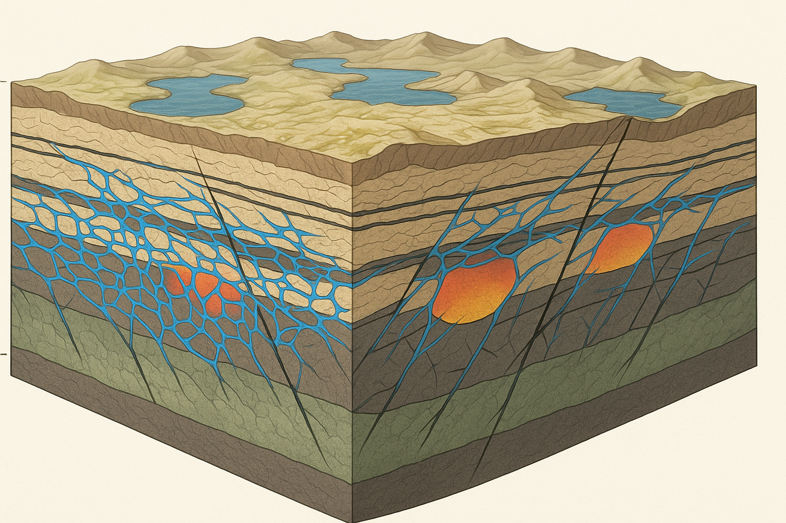

# Hydrotectonic Collapse: A Physically Plausible Mechanism for Rapid Continental Reorganization During a Global Flood

**Author:**  
James (JD) Longmire  
ORCID: 0009-0009-1383-7698  
Northrop Grumman Fellow (unaffiliated research)

---

## ABSTRACT

Catastrophic plate tectonics has been dismissed on thermodynamic grounds: moving continental blocks thousands of kilometers in months through mantle shear generates heat exceeding Earth's radiative capacity, producing surface temperatures incompatible with biosphere survival. This paper presents an alternative mechanism that bypasses the heat constraint by shifting from geothermal to hydraulic driving. In the hydrotectonic collapse model, the pre-flood Earth possessed a water-saturated lithosphere with distributed liquid water in surface basins, crustal aquifers, and interconnected fracture networks. Hydraulic seals maintained this metastable configuration until catastrophic breach initiated cascade failure. As pore pressures approached lithostatic values, effective stress collapsed, friction dropped to negligible levels, and crustal blocks began hydroplaning on thin water films along shallow detachment horizons. Energy dissipation occurred primarily in the water itself rather than through viscous mantle shear, producing heat fluxes of ~7 W/m² and temperature increases of ~1 K rather than the lethal hundreds of Kelvin required in conventional models. The mantle remained largely passive during collapse, with motion controlled by crustal hydraulics operating at velocities of tens to hundreds of meters per hour. Fossil order emerged naturally from ecological zonation, hydraulic sorting, and basin-scale depositional processes. Post-collapse, the hydraulic network exhausted itself as water drained into ocean basins or was subducted into the mantle transition zone, where it became sequestered in hydrous minerals. Blocks re-coupled to the mantle, and plate velocities dropped to modern geothermal rates. The model generates specific testable predictions including large-scale detachment horizons, chaotic megabreccias at basin boundaries, pressure and thermal anomalies, and geochemical signatures of massive fluid flow. Hydraulic collapse demonstrates that rapid global reorganization is physically plausible when thermal runaway is avoided through shallow, water-mediated processes.

---

## 1. INTRODUCTION

### 1.1. Purpose of the Paper

Catastrophic plate tectonics, as conventionally modeled, fails on thermodynamic grounds. The heat dissipation problem is not a rhetorical objection but a physical constraint: moving continental blocks thousands of kilometers in months through mantle shear generates radiative heat that exceeds Earth's capacity to dissipate without sterilizing the surface. Previous attempts to model rapid global reorganization have foundered precisely because they require mantle velocities that produce thermal budgets incompatible with the survival of any biosphere. This is not a minor calculational inconvenience but a fatal flaw.

This paper presents an alternative mechanism that bypasses the heat constraint entirely. Rather than invoking runaway mantle convection or geothermal acceleration, the model proposed here operates through hydraulic collapse: the catastrophic failure of crustal-scale seals in a water-saturated lithosphere. In this regime, crustal blocks move by hydroplaning on thin water films at shallow depths, with energy dissipation occurring in the fluid rather than through viscous mantle shear. The mantle remains largely passive. Motion is rapid but shallow, producing heat loads several orders of magnitude lower than conventional catastrophic models.

The aim is to demonstrate that rapid continental reorganization can occur within known physical constraints when the mechanism shifts from geothermal to hydraulic. This approach also addresses secondary objections regarding water volume and fossil record structure, but the primary contribution is thermodynamic: it solves the heat problem that has made catastrophic reorganization appear physically impossible.

### 1.2. The Problem Space

Any model proposing rapid, global-scale tectonic reorganization must first confront the energy budget. In standard plate tectonics, continental drift occurs at rates of centimeters per year, driven by mantle convection with viscous dissipation distributed over geological timescales. Accelerating this process to thousands of kilometers in months requires proportionally greater energy input and produces dissipation that scales with velocity. For viscous flow, dissipation increases as v², meaning that hundred-fold acceleration produces ten-thousand-fold increase in heat generation.

Conventional catastrophic plate models attempt to solve this by invoking runaway subduction or thermal instabilities that rapidly accelerate mantle flow. The problem is that such acceleration generates heat faster than Earth can radiate it away. The Stefan-Boltzmann limit for blackbody radiation constrains how much energy can leave Earth's surface per unit time. Exceeding this limit means temperatures rise until radiative capacity matches heat production—which for the velocities required means surface temperatures sufficient to vaporize oceans and sterilize continents. Attempts to distribute the dissipation over longer timescales or greater volumes merely postpone the problem; the integrated energy budget remains incompatible with biosphere survival.

This objection is not new. Critics of catastrophic models have pointed to the heat problem for decades, and responses have been inadequate. Appeals to "God cooled the Earth" abandon the goal of working within physical law. Proposals to radiate heat through expanded surface area or increased atmospheric convection fail quantitatively—the numbers do not close. Claims that dissipation occurs deep enough to be invisible conflict with the fact that heat generated at depth must eventually conduct to the surface. The heat problem has remained the most compelling reason to reject catastrophic reorganization as physically implausible.

Secondary objections reinforce this conclusion. Where did sufficient water exist to produce worldwide marine deposition, and where did it go afterward? Standard answers invoking atmospheric or extraterrestrial sources fail on both volumetric and energetic grounds. How does catastrophic deposition produce the apparent structure within the fossil record—ecological zonation, facies continuity, and taphonomic sorting that seems inconsistent with a single year of hydraulic violence? And why do we not observe the thermal signatures that runaway mantle convection should leave in the geologic record?

What is needed is not better calculation of impossible heat budgets but a fundamentally different mechanism—one that produces rapid motion without requiring mantle shear at catastrophic velocities.

### 1.3. Thesis

The mechanism proposed here is hydraulic collapse operating in a hydrotectonic crustal regime. Rather than accelerating mantle convection, this model invokes the sudden failure of hydraulic seals in a lithosphere with distributed water storage at multiple depths. Continental and oceanic blocks do not move through deep mantle drag but instead hydroplane on thin water films along shallow detachment horizons. Energy dissipation occurs primarily in the water itself—through turbulence, phase changes, and distributed flow—rather than through viscous shear in mantle rock.

This shift from geothermal to hydraulic driving fundamentally changes the energy budget. Water has far higher heat capacity than silicate (roughly four times per unit mass), meaning the same energy input produces smaller temperature increases. Dissipation in thin fluid films distributes heat over large areas at shallow depths where radiative and conductive cooling is most efficient. Most importantly, the mantle remains largely stationary; it is not required to flow at catastrophic velocities. Crustal blocks move relative to the surface and to each other, but the deep mantle is bypassed. The result is rapid surface reorganization without the thermal catastrophe that dooms conventional models.

The pre-flood Earth in this framework is not a slightly wetter version of the present configuration but a hydrotectonic system: water occupied not only surface basins but also crustal fracture networks, undercompacted sedimentary sequences, and high-permeability zones throughout the upper lithosphere. Pore pressures at depth reduced effective stress and weakened the crust. Hydraulic seals—low-permeability aquitards—isolated high-pressure reservoirs, maintaining metastable equilibrium. The flood event represents the catastrophic breach of these seals. Once failure began, it propagated: fluid migration increased pressures in adjacent zones, effective stress collapsed, friction dropped to negligible levels, and blocks began to move.

Motion continued until the hydraulic network drained. Water migrated into newly opened ocean basins, was subducted with hydrated crust into the mantle transition zone, or was redistributed into post-collapse crustal reservoirs. As the system exhausted its mobile water inventory, blocks re-coupled to the mantle, and plate velocities dropped to geothermal rates. What we observe today as a mantle-convection-driven tectonic system is the equilibrium state following the collapse of the pre-flood hydraulic regime.

This model addresses the heat problem directly: hydraulic motion does not require thermal runaway. It also resolves the water budget question: Earth's total water inventory remains constant, with transition-zone hydrous minerals (ringwoodite, wadsleyite) serving as the post-collapse sink for water that once lubricated rapid crustal motion. And it provides a mechanism for structured deposition during catastrophic conditions: facies sorting, ecological zonation, and taphonomic patterns emerge naturally from hydraulic transport and basin geometry, even in a single-year event.

The remainder of this paper develops the hydrotectonic model in detail, addresses specific objections, and identifies testable predictions that distinguish hydraulic collapse from both conventional uniformitarian processes and geothermally driven catastrophic models.

---

## 2. PRE-FLOOD EARTH AS A HYDROTECTONIC SYSTEM

### 2.1. High Water Inventory (Fixed Total Budget)

Earth's total water inventory is constrained by direct observation. The mantle transition zone (410-660 km depth) contains between one and three ocean masses equivalent of water stored in hydrous minerals, primarily ringwoodite and wadsleyite. This water did not originate in situ but was transported from the surface via subduction of hydrated oceanic crust. The presence of water in these high-pressure phases provides forensic evidence that Earth once possessed significantly greater volumes of mobile, surface-accessible water than currently reside in the oceans.

The critical insight is that ringwoodite hydration requires water to have existed as free liquid before being carried downward. Oceanic crust becomes hydrated through contact with liquid water at or near the surface—through hydrothermal circulation, serpentinization, and infiltration into fractures and pore spaces. When this hydrated material subducts and reaches transition zone pressures, the water becomes structurally bound in crystal lattices. Therefore, every kilogram of H₂O now sequestered at depth represents water that was once mobile in the crustal or surface hydrosphere.

This observation constrains the model in two directions. First, it establishes that Earth's total water budget has remained approximately constant; we are not invoking water that appears or disappears but water that redistributes between surface, crustal, and mantle reservoirs. Second, it indicates that the pre-flood hydrosphere was substantially larger than the present configuration, with water distributed not only in surface oceans but throughout multiple crustal levels. The question is not where the water came from but where it was located before progressive subduction sequestered it at depth.

**A critical clarification on crustal storage capacity:** Modern crustal porosity and permeability values are post-collapse end states and cannot be retroactively applied to the pre-flood lithosphere. Objections based on "modern crust can only store X amount of water" miss the point entirely. The hydrotectonic regime assumes a distinct, fluid-rich crustal architecture—more fractured, less compacted, more permeable—that accommodated a much larger mobile water fraction than the modern lithosphere. Present-day porosity statistics (1-5% in upper continental crust, <1% in lower crust) reflect billions of years of compaction, metamorphism, and tectonic stiffening. The pre-flood crust is not modeled as a slightly wetter version of modern lithosphere but as a different mechanical phase entirely: undercompacted sediments with high fluid retention, extensive interconnected fracture networks, fault-bounded aquifer compartments, overpressured basins approaching lithostatic pore pressure, and serpentinized zones in the upper mantle capable of holding 10-15 wt% water. The exact partitioning between surface, crustal, and pre-existing bound reservoirs is a quantitative question requiring detailed modeling, but the key assumption here is that the dominant share of the mechanically active water budget existed as liquid in surface and crustal reservoirs prior to collapse.

This distinction between mobile and total water budget is important. The model does not require literally zero water bound in minerals at depth before the flood. Some fraction of the total inventory was likely already sequestered in hydrated minerals—serpentinized mantle, amphiboles, micas, and early transition-zone phases from whatever subduction processes operated in the pre-flood regime. What matters is that the mechanically active portion of the budget—the water capable of participating in hydraulic collapse—was dominantly liquid and distributed through the crust and surface basins. This mobile fraction provided the hydraulic medium for rapid block motion. The bound fraction at depth was essentially passive during collapse but became the primary sink for mobile water in the post-flood transition as accelerated subduction progressively hydrated the transition zone to its present state.

### 2.2. Messy Multi-Level Water Networks

The pre-flood water distribution is not modeled as a simple deep ocean or as discrete, sheet-like aquifers. Instead, water occupied a complex, three-dimensional network of interconnected reservoirs at multiple crustal depths. This includes surface basins and inland seas, thick sequences of water-saturated sediments, extensive fracture networks in basement rock, fault-bounded aquifer systems, and undercompacted sedimentary packages with high fluid retention. Such a distribution provides far greater contact area with crustal materials and far more hydraulic connectivity than a purely surface reservoir.

Modern analogs exist in regions of high crustal fluid content: overpressured sedimentary basins, where pore pressures can approach lithostatic values and persist for millions of years; décollement horizons in accretionary wedges, where thin water-rich layers enable large-scale thrust motion; serpentinized mantle wedges above subduction zones, hydrated by fluids migrating from depth; and salt detachment systems, where evaporite layers create weak, fluid-lubricated slip surfaces. These are not exotic or hypothetical structures but observed features of modern tectonics. The difference is one of scale and connectivity: the pre-flood crust is modeled as having such features distributed globally and hydraulically linked, rather than isolated in specific tectonic settings (Figure 1).

**Figure 1. Pre-flood hydrotectonic crustal architecture showing multi-level water distribution and zones of mechanical weakening.** Surface basins and inland seas overlie thick sequences of undercompacted sediments containing extensive, interconnected liquid-water fracture networks (blue). Discontinuous aquitard layers (dark horizontal bands) act as hydraulic seals isolating overpressured compartments (orange-red gradients). Black lines indicate fault zones and potential detachment horizons. The lower crust (green-tinted) represents serpentinized upper mantle zones with 10-15 wt% bound water. This crustal regime is mechanically weak and metastable, capable of catastrophic hydraulic decoupling if seals fail. Approximate vertical scale: 0-50 km depth.

This architecture has specific mechanical implications. High pore pressures at depth reduce effective stress and weaken the crust. Laterally extensive permeable zones create potential slip horizons where blocks can decouple. Vertical fluid migration pathways allow rapid pressure equilibration across crustal levels. The result is a lithosphere that is mechanically weak compared to the modern configuration and prone to large-scale motion if critical seals fail.

### 2.3. Metastable Crustal Regime

The pre-flood crust is characterized as metastable: stable under normal conditions but capable of rapid failure if perturbed beyond a threshold. The stability derives from hydraulic seals—low-permeability layers such as clay-rich aquitards, compacted shales, or fine-grained sediments—that isolate high-pressure fluid reservoirs from one another and from the surface. As long as these seals remain intact, the system persists in a high-energy configuration. Pore pressures remain elevated, but fluid migration is restricted, and the crust does not collapse.

However, this stability is conditional. Metastable systems are sensitive to perturbation. A sufficiently large trigger can breach seals, allowing fluid communication between previously isolated reservoirs. Once breaching begins, it can propagate: increased fluid flow erodes seal integrity, pressure gradients drive further migration, and adjacent seals experience increased stress. The result is a cascade failure in which the entire hydraulic network destabilizes over short timescales.

Modern examples of metastable failure include catastrophic dam breaches, where small initial leaks rapidly erode barriers and release entire reservoirs; jökulhlaups, where subglacial water accumulates under pressure until ice seals fail and release megafloods; and induced seismicity in overpressured basins, where injection or extraction of fluids triggers widespread fault slip. In each case, the system appears stable until a threshold is crossed, after which rapid reorganization occurs. The pre-flood crust is modeled as occupying a similar state: structurally sound under equilibrium conditions but vulnerable to catastrophic failure if critical thresholds are exceeded.

### 2.4. Decoupled Mantle

In the hydrotectonic regime, crustal motion is largely decoupled from mantle convection. Continental and oceanic blocks do not move primarily through drag from underlying mantle flow but instead slide along hydraulically lubricated detachment horizons within the crust and uppermost lithosphere. Effective stress along these horizons is reduced by high pore pressures, dropping frictional resistance to levels that allow motion under relatively modest driving forces.

This decoupling has important implications for heat generation. In conventional plate tectonics, relative motion between plates and mantle generates viscous shear heating at depth. Rapid motion requires correspondingly rapid mantle flow, and the viscous dissipation scales with velocity squared. This is the source of the heat dissipation problem in catastrophic plate models: moving continents thousands of kilometers in months requires mantle velocities that produce lethal amounts of heat.

Hydraulic decoupling bypasses this constraint. If crustal blocks slide on thin water films at shallow depths, the primary dissipation occurs in the fluid layer rather than in mantle rock. Water has far higher heat capacity than silicate, and the dissipation is distributed over large areas at shallow levels where heat can be radiated or conducted away more efficiently. Moreover, the mantle itself remains largely stationary; it is not required to flow at catastrophic velocities. The blocks move relative to the surface and to each other, but the deep mantle is not the primary participant in the motion.

This does not mean the mantle plays no role. Isostatic adjustments, localized upwelling beneath thinned lithosphere, and eventual re-initiation of subduction all involve mantle processes. But during the peak of hydraulic collapse, the mantle functions more as a passive substrate than as an active driver. Motion is controlled by the hydraulics of the upper lithosphere, not by deep convective forces. This is the key distinction that allows rapid reorganization without thermal catastrophe.

---

## 3. HYDRAULIC COLLAPSE MECHANICS

### 3.1. Trigger Events

The pre-flood hydrotectonic system was metastable, meaning it persisted in a high-energy configuration only because hydraulic seals prevented fluid communication between pressurized reservoirs. Breaching these seals initiates collapse. Several mechanisms could serve as triggers, and multiple triggers may have operated simultaneously or in cascade.

Large meteor impacts provide both the energy and the fracture pathways necessary to breach deep seals. Impact-generated shock waves propagate through the crust, opening fractures and creating permeability where none existed. Crater formation disrupts aquitards over regional scales. The energy deposited—kinetic energy converted to heat, seismic waves, and hydrothermal circulation—can destabilize overpressured zones hundreds of kilometers from the impact site. If impacts occurred into shallow seas or directly into saturated sedimentary basins, the resulting pressure pulses could trigger widespread seal failure across hydraulically connected networks. Multiple impacts of varying sizes—ranging from modest events that contribute to distributed seal failure to larger structures capable of initiating regional cascades—could have operated in concert, with preservation depending on location and subsequent burial or subduction.

Seismic cascades represent a second class of trigger. Earthquakes along pre-existing fault systems can breach seals through shear displacement or by increasing permeability in damage zones. Once initial failure occurs, the resulting fluid migration alters stress fields in adjacent regions, potentially triggering secondary earthquakes. This cascade propagates through the crust: one failure leads to pressure redistribution, which triggers further failures, which generate more fluid migration. The process is analogous to induced seismicity in modern overpressured basins, where injection or extraction of fluids triggers earthquake swarms, but scaled to crustal dimensions.

Basin overfill provides a third mechanism. If sediment accumulation or tectonic subsidence increases the thickness of water-saturated sequences faster than fluids can escape, pore pressures rise. Once pressures approach lithostatic values, the effective stress holding seals intact drops toward zero. At some threshold, seals fail mechanically—either through hydraulic fracturing (where fluid pressure exceeds the tensile strength of the rock) or through ductile failure (where differential stress can no longer be supported). The failure releases fluids into adjacent formations, propagating the instability.

These triggers are not mutually exclusive. A large impact could initiate regional seal failure, which propagates seismically through connected aquifer systems, which in turn destabilizes overfilled basins elsewhere. The key requirement is that sufficient energy and permeability increase occur to breach critical seals and initiate positive feedback: fluid migration increases pressures, which cause further failure, which allows more migration.

### 3.2. Hydraulic Decoupling

Once seals fail, fluid pressures in previously isolated reservoirs equalize rapidly. As water migrates along newly opened fractures and permeable horizons, pore pressure throughout the system rises toward lithostatic values. This has immediate mechanical consequences for effective stress, which governs the strength of rock.

Effective stress is defined as σ_eff = σ - P_fluid, where σ is the total stress (lithostatic pressure from overlying rock) and P_fluid is the pore fluid pressure. When pore pressure approaches lithostatic values, effective stress approaches zero. Since frictional resistance along faults and fractures is proportional to effective stress (via Coulomb friction), reducing effective stress to near-zero drops friction to negligible levels. Blocks that were previously locked by friction become free to move.

This is not exotic physics. Modern décollement systems, accretionary wedges, and overpressured thrust belts all operate on this principle. Thin water-rich layers with near-lithostatic pore pressures allow large thrust sheets to move tens of kilometers horizontally with minimal driving force. The difference in the hydrotectonic collapse model is one of scale and connectivity: rather than isolated décollements in specific tectonic settings, the entire crust develops interconnected low-friction horizons along which blocks can decouple.

Hydroplaning occurs when a thin film of pressurized water separates moving blocks from the underlying substrate. As blocks begin to move, the motion generates additional pore pressure through dilatancy (volume expansion in shear zones) and through pumping effects as water is forced into and out of fractures. This can maintain near-zero effective stress even during motion, allowing sustained slip rather than stick-slip behavior. The blocks effectively float on pressurized water, with friction reduced by orders of magnitude compared to dry or poorly lubricated contacts.

The critical insight is that this decoupling occurs at shallow depths—within the crust and uppermost lithosphere—rather than requiring motion of the deep mantle. The mantle remains largely passive. It adjusts isostatically as blocks move above it and eventually participates through localized upwelling and the re-initiation of subduction, but during the peak of collapse, the mantle is not the driver. The motion is controlled by hydraulics and gravity acting on buoyant, partially decoupled blocks floating in a pressurized crustal fluid system.

### 3.3. Rapid Block Motion Without Overheating

The fundamental reason hydraulic collapse avoids the heat problem is that energy dissipation occurs in water rather than in viscous mantle shear. This difference is not rhetorical but thermodynamic.

In conventional catastrophic plate models, continental blocks move by dragging the underlying mantle along. The mantle must flow at velocities comparable to the surface motion. Since the mantle is a viscous fluid with effective viscosity around 10²¹ Pa·s, the rate of viscous dissipation per unit volume is given by τ·ε̇, where τ is the shear stress and ε̇ is the strain rate. For rapid motion, strain rates are high, and dissipation scales with velocity squared. Moving a continental block 1000 km in a year requires mantle flow velocities on the order of meters per year, producing dissipation rates that generate untenable amounts of heat.

Hydraulic decoupling bypasses this constraint. The blocks move by sliding on thin water films at shallow depths (upper crust to mid-crust, depths of a few kilometers to perhaps 20 km). The primary dissipation occurs through:

1. **Turbulent flow in water films**: As blocks slide, the thin water layer between block and substrate experiences shear. For turbulent flow, dissipation is distributed throughout the fluid rather than concentrated at boundaries, and the heat capacity of water (4.2 kJ/kg·K) is roughly four times that of silicate rock (~1 kJ/kg·K). The same energy input produces smaller temperature increases in water.

2. **Fracturing and grinding at shallow depths**: Some mechanical work goes into fracturing rock and producing fault gouge and breccia. This occurs at shallow levels where heat can be conducted or radiated away efficiently. Moreover, the energy required to fracture rock (surface energy times new surface area created) is far less than the energy dissipated in viscous mantle shear over equivalent displacements.

3. **Phase changes and fluid circulation**: Water can absorb large amounts of energy through vaporization (latent heat of vaporization ~2.3 MJ/kg) without large temperature increases. Hydrothermal circulation driven by pressure gradients redistributes heat laterally and vertically, preventing local overheating. Water expelled to the surface or into ocean basins carries heat away from deformation zones.

4. **Distributed strain over large areas**: Because the water network is extensive and interconnected, deformation is not concentrated in narrow shear zones but distributed over large areas. This spreads heat generation over volumes large enough that local temperature increases remain modest.

Quantitatively, consider a continental block 1000 km × 1000 km × 30 km thick moving 1000 km in one year. If motion occurs via hydroplaning on a 10-meter-thick water layer at the base of the block, the volume of water involved is approximately 10¹³ m³. With a density of 10³ kg/m³, this is 10¹⁶ kg of water. The heat capacity of this water is ~4 × 10¹⁹ J/K. Even if all the gravitational potential energy of the block (mass ~10²⁰ kg, elevation change ~1 km, ΔPE ~ 10²⁴ J) were dissipated as heat in the water, the temperature increase would be only ~25 K—significant but not catastrophic, and much of this heat would be conducted away or radiated during the year-long event.

Contrast this with mantle shear: dissipating 10²⁴ J in mantle rock with specific heat ~10³ J/kg·K over a mantle volume of 10¹⁸ m³ (density ~3300 kg/m³, mass ~3 × 10²¹ kg) produces temperature increases of hundreds of Kelvin—enough to initiate melting, which further increases dissipation and leads to thermal runaway.

The hydraulic model avoids this catastrophe. The mantle does not participate in rapid shear, so viscous heating in the mantle is negligible. The work is done in water at shallow depths, where heat capacity is high and cooling is efficient.

### 3.4. Basin Collapse & Mega-Sequence Formation

Hydraulic collapse produces distinctive sedimentary signatures. As crustal blocks decouple and move, basins undergo rapid subsidence while adjacent highs are uplifted or tilted. Water and sediment are mobilized on massive scales, generating the thick, laterally extensive sedimentary sequences observed in the geologic record.

Basin collapse occurs when underlying hydraulic support fails. A basin floored by overpressured sediments is partially supported by pore fluid pressure. When seals breach and fluids drain laterally into adjacent formations or vertically through newly opened fractures, pore pressure drops, effective stress increases, and the basin floor subsides rapidly. Subsidence can occur in pulses as different hydraulic compartments fail sequentially, producing multiple transgressive-regressive cycles within a short overall timeframe.

This rapid subsidence creates accommodation space for sediment on timescales far shorter than thermal subsidence in conventional basin models. Sediment is supplied by erosion of uplifted blocks, by mass wasting from oversteepened margins, and by the collapse of pre-existing sediment piles that lose cohesion as pore pressures fluctuate. Turbidity currents transport material into subsiding basins, depositing thick sequences rapidly. The distinction between "shallow" and "deep" water facies becomes ambiguous when basin depths change by hundreds of meters or kilometers over months.

Mega-sequences—thick, regionally extensive packages of sediment with relatively uniform characteristics—form naturally in this environment. A single pulse of subsidence and sediment transport can deposit hundreds of meters of material over areas of thousands of square kilometers. Because the trigger (hydraulic collapse) operates on crustal scales, the resulting deposits are likewise extensive. Local variations in subsidence rate, sediment supply, and water depth produce facies changes within the mega-sequence, but the overall package represents a single event or closely spaced series of events rather than slow accumulation over millions of years.

The transition from one mega-sequence to the next corresponds to shifts in basin geometry, sediment source, or hydraulic regime as the collapse progresses. These transitions may appear sharp in the stratigraphic record and may be mistaken for unconformities representing long time gaps. In the hydrotectonic model, they represent rapid reorganization events separated by days to months rather than millions of years.

This mechanism addresses the fossil record objection. Ecological zonation is preserved because different habitats occupied different elevations and environmental settings before the flood, and hydraulic transport sorts organisms by size, density, and mobility. Facies continuity arises because basin-scale processes produce regionally consistent depositional environments, even during catastrophic conditions. Taphonomic patterns—preservation quality, articulation, orientation—reflect the energy and duration of transport, which vary systematically with position in the basin and stage of collapse. The result is structure within catastrophe: not random mixing but ordered deposition controlled by hydraulic and gravitational sorting operating over short timescales.

---

## 4. FLOOD-YEAR DYNAMICS

### 4.1. Continental-Scale Reorganization in Months

The flood-year dynamics described in this section redistribute Earth's fixed water budget rather than creating new water. Because ringwoodite-bound water in the mantle transition zone represents post-collapse sequestration of once-mobile liquid water, the present inventory of 1-3 ocean masses constrains the amount of water that drained from the pre-flood crustal network during collapse. This redistribution—from distributed crustal storage to concentrated ocean basins and mantle reservoirs—is the key to understanding both the mechanics of collapse and the transition to modern plate tectonics.

Once hydraulic collapse initiates, crustal blocks move rapidly because friction has dropped to negligible levels. The timescale for motion is controlled not by mantle viscosity but by the rate at which gravitational and pressure-driven forces can overcome inertia and residual friction in a hydroplaning system. Blocks weighing 10²⁰ kg can achieve velocities of tens to hundreds of meters per hour under these conditions, allowing displacements of thousands of kilometers over the course of months. Because this crustal architecture differs fundamentally from today's compacted and cemented lithosphere, such rapid block velocities arise naturally once effective stress collapses. These velocities do not require mantle acceleration; they occur entirely within the decoupled, fluid-lubricated upper lithosphere.

The motion is not uniform or continuous. Different blocks respond to different driving forces: some are pushed by pressure gradients as water migrates through the crustal network, others slide under gravity as basin floors subside and adjacent regions are uplifted, still others rotate or tilt as differential subsidence creates torques. The result is a complex pattern of motion in which some blocks move rapidly while others remain relatively stationary, some collide and override one another, and some fragment as internal stresses exceed cohesive strength.

This complexity produces the large-scale tectonic features we observe today but attributes them to rapid reorganization rather than slow drift. Continental margins form where blocks separate, opening new ocean basins as water floods into the newly created space. Mountain ranges form where blocks collide, with one overriding the other along low-angle thrust faults lubricated by high pore pressures. Rifts and grabens form where blocks undergo extension, with normal faulting accommodating the deformation. In each case, the structure resembles what conventional tectonics produces over millions of years but forms in months through hydraulic processes operating at much higher velocities.

The preservation of pre-existing crustal structure within the blocks is important. Continental crust is not melted or thoroughly disrupted during motion because the deformation is concentrated along basal detachment horizons and boundary zones. The interior of a block experiences minimal strain. This explains why we observe ancient cratons with coherent internal structure: they moved as rigid units during collapse, with deformation accommodated at their boundaries rather than distributed throughout their volume.

### 4.2. Tsunami Behavior in a Pangea-Lid World

Tsunami dynamics during hydraulic collapse differ fundamentally from modern ocean tsunamis. If the pre-flood configuration involved a supercontinent or large connected landmass with multiple enclosed or semi-enclosed basins rather than a single global ocean, tsunami propagation was constrained by basin geometry (Figure 2). Waves generated by block motion, submarine landslides, or impacts propagated within individual basins rather than circling the globe.

**Figure 2. Conceptual pre-flood continental configuration showing basin compartmentalization.** Oblique view of a hypothetical pre-flood Earth with a single irregular supercontinent containing multiple enclosed and semi-enclosed inland seas. This basin geometry supports the model's prediction of localized rather than globally uniform tsunami propagation, independent hydraulic systems within distinct crustal domains, and differential subsidence patterns during collapse. Deep ocean basins (dark blue) surround the continental mass, while color variations on land indicate topographic relief. Such a configuration allows coordinated block motion during hydraulic collapse while producing regionally variable rather than globally uniform depositional signatures.

This basin-localized behavior explains the patchy distribution of megabreccias and impact signatures in the geologic record. A large impact into a semi-enclosed sea generates tsunamis that devastate the coastlines of that basin but dissipate before reaching distant regions. Submarine landslides triggered by crustal motion produce local tsunami deposits but not global wave trains. The result is a pattern in which some regions show clear evidence of catastrophic marine inundation—chaotic breccias, imbricated boulders, rip-up clasts of underlying formations—while adjacent regions separated by topographic barriers show more organized depositional sequences.

The misconception that a global flood requires globally uniform tsunami deposits reflects assumptions about pre-flood geography that the model does not require. If landmasses were interconnected and ocean basins were smaller and more numerous, each basin experienced its own tsunami regime. Some basins were sheltered, others exposed. Some experienced multiple tsunami events as different blocks shifted and collided, others experienced fewer or smaller waves. The heterogeneity is a feature, not a bug: it reflects realistic wave dynamics in a complex bathymetric configuration.

Moreover, the progressive nature of collapse means that tsunami activity was not concentrated in a single event but distributed over the flood year. Early in the collapse, tsunamis might be generated in one region as a block shifts. Weeks or months later, tsunamis in a different basin accompany the motion of a different block. This temporal distribution allows marine deposits with tsunami characteristics to appear at different stratigraphic levels in different locations, consistent with observations.

### 4.3. Sedimentation and Fossil Sorting

The fossil record shows structure: ecological zones represented at different stratigraphic levels, facies patterns that suggest orderly depositional environments, and taphonomic sorting that appears inconsistent with chaotic mixing. Hydraulic collapse produces this structure through sorting mechanisms that operate even during catastrophic transport.

Ecological zonation is preserved because different organisms occupied different pre-flood elevations and environments. Marine organisms living at various depths are buried as basin floors subside and sediment is deposited rapidly. Terrestrial organisms at low elevations are inundated first as water floods newly opened basins. Organisms from higher elevations are inundated later or not at all, depending on the extent of marine transgression. The vertical distribution of fossils thus reflects the original topographic distribution of habitats, preserved through rapid burial before significant mixing occurs.

Hydraulic sorting by size, density, and shape operates during transport. Turbidity currents and density flows sort particles according to settling velocity, producing graded beds even when deposition is rapid. Larger, denser organisms settle first; smaller, less dense organisms settle later or are transported farther. This creates a systematic pattern in which certain fossil types preferentially appear in certain facies—not because of evolutionary succession but because of hydraulic sorting.

Mobility sorting also plays a role. Mobile organisms (swimming or flying) can attempt to escape rising water, potentially reaching higher ground and being buried later or in different settings than sessile organisms. This produces apparent ecological progression even when all organisms existed simultaneously before the flood. Behavioral responses to inundation (aggregation, seeking shelter, moving to high ground) concentrate certain organisms in specific depositional settings, creating localized fossil assemblages that appear habitat-specific.

Taphonomic patterns—articulation, orientation, preservation quality—reflect the energy and duration of transport. Organisms buried rapidly in low-energy settings are more likely to remain articulated and well-preserved. Those transported long distances or subjected to multiple reworking events are more likely to be disarticulated and abraded. The result is a spectrum of preservation states that correlates with depositional environment and transport history, providing apparent order even within catastrophic deposition.

Facies continuity arises because basin-scale processes produce regionally consistent depositional environments. A subsiding basin receives sediment from adjacent uplifts via similar transport mechanisms (turbidity currents, slumps, submarine fans) over the duration of collapse. The facies patterns within that basin reflect the consistent geometry and sediment supply, even though the absolute rate of deposition is far higher than in uniformitarian models. Lateral facies changes occur where basin geometry changes or where different sediment sources contribute, producing the same lateral variability seen in modern depositional systems but compressed into far shorter timescales.

### 4.4. Heat Budget Accounting

The heat budget during hydraulic collapse remains within bounds that allow surface temperatures to remain habitable. This is the critical advantage over geothermal catastrophic models and deserves quantitative treatment.

Total energy dissipation during the flood year can be estimated from the work required to move crustal blocks and deform sediments. Consider moving N blocks with average mass M over average distance D against frictional force F. The work done is W = N·F·D. For hydroplaning on thin water films with near-zero effective stress, F is far smaller than for dry friction. If friction coefficient drops from ~0.6 (dry rock on rock) to ~0.01 (water-lubricated), the work required drops by a factor of 60. With friction reduced to roughly 1% of what would be required under lithostatic effective stress, only a small fraction of the available gravitational potential energy must be dissipated as frictional heat.

For order-of-magnitude estimation: moving ten continental-scale blocks (M ~ 10²⁰ kg each) an average of 1000 km with friction coefficient 0.01 and effective stress reduced to 1% of lithostatic gives total work W ~ 10²³ J. This is one to two orders of magnitude above the integrated global seismic energy release over thousands of years, but dissipated in one year. Distributed over Earth's surface area (5 × 10¹⁴ m²) over one year (3 × 10⁷ s), this corresponds to an average flux of ~7 W/m².

For comparison, Earth's geothermal heat flux is ~0.1 W/m², and solar input is ~340 W/m². An additional 7 W/m² is significant but not catastrophic. Surface temperature increase depends on how efficiently this heat can be radiated away. If surface temperature rises by ΔT, the increase in outgoing radiation is approximately 4σT³ΔT, where σ is the Stefan-Boltzmann constant and T is surface temperature. For T ~ 288 K, 4σT³ ~ 6 W/m²·K. To radiate an additional 7 W/m² requires ΔT ~ 1 K—completely negligible.

The critical assumption enabling this benign result is that dissipation occurs in water at shallow depths where heat can be radiated efficiently, and that the mantle does not participate in rapid viscous shear. Most gravitational potential energy is dissipated through water turbulence, fracture creation in shallow crust, and sediment transport rather than through rock shear at depth. If the same blocks moved through deep mantle coupling, viscous dissipation at depth would generate heat that must conduct through tens of kilometers of rock before reaching the surface. Conduction timescales are thousands of years, meaning heat accumulates during the flood year, raising temperatures to intolerable levels.

Hydraulic collapse avoids this trap. The water itself acts as a heat sink and transport medium. Water expelled to the surface or circulated through fractures carries heat away from deformation zones. Vaporization of water at high-temperature contacts absorbs latent heat without temperature increase. The distributed nature of deformation—occurring over large areas along multiple detachment horizons rather than concentrated in narrow shear zones—spreads heat generation so that no single location experiences runaway heating.

Post-collapse, Earth retains a thermal anomaly. Regions that experienced particularly intense deformation or rapid subsidence show elevated heat flow initially. But this anomaly dissipates over centuries to millennia as heat conducts away and hydrothermal circulation redistributes it. The long-term geothermal signature we observe today reflects post-collapse equilibration of the crust and mantle, not the persistence of flood-year heat generation. The system resets to a steady-state geothermal regime once hydraulic motion ceases and the crust re-couples to mantle convection.

---

## 5. TRANSITION TO MODERN PLATE TECTONICS

### 5.1. Collapse Exhausts the Water Network

Hydraulic collapse is self-limiting. As blocks move and basins subside, the water that enabled motion is progressively removed from the crustal system. The mechanisms of water removal determine how quickly the hydraulic regime terminates and conventional plate tectonics reasserts itself.

First, water migrates into newly opened ocean basins. As blocks separate and continental margins form, accommodation space for water increases dramatically. Basins that were previously shallow or isolated deepen as their floors subside. Water that had been stored in crustal aquifers or inland seas drains into these deepening basins under gravity. The net effect is a transfer of water from distributed crustal storage to concentrated surface ocean basins. This reduces pore pressures in the crust, increases effective stress, and begins to restore frictional coupling between blocks and substrate.

Second, water is subducted with hydrated oceanic crust and sediments. As new subduction zones initiate or existing ones accelerate, they carry water-saturated material into the mantle. The high temperatures and pressures at depth drive dehydration reactions, releasing free water as fluids that migrate upward into the mantle wedge or bind structurally in high-pressure hydrous minerals. This process likely operated at some level in the pre-flood regime, accounting for the bound water fraction mentioned in Section 2.1, but accelerated dramatically post-collapse as subduction rates increased and larger volumes of hydrated material descended. Over post-flood centuries to millennia, this accelerated subduction progressively transferred the bulk of mobile water from surface and crustal reservoirs into the mantle transition zone, where it became sequestered in ringwoodite and wadsleyite. The current 1-3 ocean mass inventory in the transition zone thus represents cumulative hydration over both pre-flood and post-flood time, with the dominant contribution occurring post-collapse as the hydraulic network drained and subduction became the primary tectonic driver.

Third, water is redistributed into post-collapse crustal reservoirs that are hydraulically isolated. As blocks settle into new configurations, sediments compact, and fractures seal through mineralization and pressure solution, the interconnected aquifer network fragments into isolated compartments. Water trapped in these compartments can no longer participate in large-scale hydraulic processes. Pore pressures in some regions remain elevated—accounting for modern overpressured basins—but the global connectivity that enabled coordinated block motion is lost.

The timescale for exhaustion depends on the efficiency of these removal mechanisms. Surface drainage into ocean basins occurs over months to years as topography adjusts. Subduction-driven sequestration occurs over centuries to millennia as hydrated slabs descend and dehydrate. Hydraulic isolation through compaction and sealing occurs over decades to centuries in shallow sediments, longer at depth. The overall result is that within a few thousand years post-flood, the crustal water content has dropped to levels insufficient to maintain widespread hydraulic decoupling. At that point, conventional plate-driving forces reassert control.

### 5.2. Re-Coupling to the Mantle

As pore pressures drop and effective stress increases, friction along basal detachment horizons rises. Blocks that were hydroplaning on thin water films begin to experience significant drag. Motion slows. Eventually, effective stress recovers to the point where blocks are mechanically coupled to the underlying lithosphere and, through it, to the mantle. At this stage, plate motion becomes dependent on mantle convection forces rather than crustal hydraulics.

The re-initiation of slab pull is particularly important. During collapse, subduction occurred but was not the primary driver of motion—blocks moved by hydroplaning, and any subduction was a consequence rather than a cause. Post-collapse, as slabs descend into the mantle and cool, they become denser than the surrounding mantle. The negative buoyancy of these dense slabs generates slab pull, which becomes the dominant force driving plate motion. This transition marks the shift from hydraulic to geothermal control.

Ridge push also reasserts itself as oceanic crust cools and subsides away from mid-ocean ridges, creating a gravitational slope that drives spreading. Mantle convection, which was largely passive during collapse, begins to exert drag on the base of the lithosphere as plates re-couple. The forces that dominate modern plate tectonics—slab pull, ridge push, mantle drag—all depend on thermal structure and density contrasts that operate over geologically long timescales. These forces could not produce rapid motion on their own, but once hydraulic motion ceases, they control the slow drift we observe today.

The velocity transition is dramatic. During collapse, blocks move meters per day. Once re-coupled to the mantle, velocities drop to centimeters per year—a factor of 10⁴ reduction. This does not require any change in mantle properties or driving forces; it simply reflects the difference between near-frictionless hydroplaning and viscously controlled mantle drag. The same mantle that was bypassed during collapse now controls motion, but at velocities dictated by its viscosity rather than by surface hydraulics.

### 5.3. Why Today Looks Like a Geothermal Earth

The modern Earth exhibits all the characteristics of a mantle-convection-driven plate tectonic system: seismic structure showing subducting slabs descending into the mantle, mantle tomography revealing thermal heterogeneities associated with convection, heat flow patterns consistent with cooling oceanic lithosphere, and crustal thickness variations that correlate with tectonic setting. These observations are real and are correctly interpreted as evidence that mantle processes currently control plate motion. The hydrotectonic model does not deny this; it simply asserts that what we observe today is the post-collapse equilibrium state, not the condition that prevailed during the flood.

Seismic structure provides a clear example. Modern seismology images cold, fast slabs descending through the mantle—direct evidence of ongoing subduction driven by negative buoyancy. This is exactly what the model predicts post-collapse: as the hydraulic network drains, subduction becomes the dominant mechanism, and slabs descend in the conventional manner. The fact that we see these structures today confirms that mantle-driven subduction has been operating for thousands of years since collapse, sufficient time for slabs to descend hundreds of kilometers. The absence of different seismic structure is not evidence against past hydraulic collapse; it is evidence that the system has transitioned to a new regime.

Mantle tomography shows thermal anomalies associated with upwelling plumes and descending slabs. These reflect the current convective state of the mantle. Convection operates on timescales of millions of years in uniformitarian models, but the thermal structure adjusts continuously. Post-collapse, the mantle has had millennia to develop convective patterns appropriate to the new crustal configuration. The tomographic signature we observe is the equilibrium structure given the present geometry of slabs and ridges, not a fossil record of pre-flood conditions.

Heat flow measurements show elevated heat flux at mid-ocean ridges and low flux in old oceanic basins, consistent with the cooling of oceanic lithosphere as it moves away from spreading centers. This pattern requires tens of millions of years to establish in uniformitarian models. In the hydrotectonic framework, it reflects rapid cooling of newly formed oceanic crust in the immediate post-collapse period followed by thermal equilibration over several thousand years. The functional form of heat flow vs. age can be similar even if the absolute timescale differs, particularly if one accounts for the elevated initial temperatures in regions that experienced intense deformation during collapse.

Crustal thickness patterns correlate with tectonic setting: thick continental crust, thin oceanic crust, intermediate arc crust. These variations are established during and immediately after collapse through the processes described earlier: continental blocks retain their thick crust because interior deformation is minimal, oceanic crust forms thin because it is generated at mid-ocean ridges where mantle upwelling provides limited magma supply, and arc crust thickens through magmatic addition in subduction zones. Once established, these patterns persist because erosion and sedimentation operate slowly. The crustal structure we observe today is thus a combination of syn-collapse formation and post-collapse modification, both of which are consistent with known processes even if the timescales differ radically from uniformitarian assumptions.

The critical point is that the transition from hydrotectonic to geothermal regime is not ad hoc but follows naturally from the exhaustion of mobile water. Once water drains from the crustal network, hydraulic processes cease, and mantle-driven processes take over. What we observe today reflects the operation of those mantle processes over the post-flood period. The absence of active hydrotectonic processes in the modern Earth is not evidence against the model but confirmation that the collapse was a transient event that exhausted itself and transitioned into the current regime.

---

## 6. ADDRESSING MAJOR OBJECTIONS

### 6.1. "Where Are the Global Water Layers?"

The model does not require neat, laterally continuous water layers analogous to a simple aquifer system. The pre-flood hydrotectonic network was messy: laterally discontinuous, vertically stacked, with variable thickness and permeability. Modern analogs exist in systems that are well-documented but localized: décollements in accretionary wedges where thin water-rich clay layers enable large thrust sheets to move tens of kilometers; overpressured sedimentary basins like the Gulf Coast, where pore pressures approach lithostatic over thick sections and persist for millions of years; salt detachment systems where evaporite layers create weak, fluid-lubricated slip surfaces; and serpentinized mantle wedges in subduction zones where water content reaches 10-15 wt%. 

The difference between these modern examples and the pre-flood system is not one of physics but of scale and connectivity. The model posits that such features were globally distributed and hydraulically linked rather than isolated in specific tectonic settings. Once collapse occurred and water drained, these features either compacted, mineralized, were subducted, or became isolated compartments. What we observe today are the remnants: isolated overpressured zones, fossil fluid pathways now cemented, and scattered décollement surfaces that represent fragments of what was once a connected network. The absence of a single, obvious global aquifer layer is expected, not problematic.

### 6.2. "Why Didn't It Collapse Earlier?"

Metastable systems can persist indefinitely until perturbed beyond a threshold. The pre-flood hydrotectonic system was maintained in equilibrium by hydraulic seals—low-permeability aquitards that isolated overpressured reservoirs from one another and from the surface. As long as seals remained intact, pore pressures could remain elevated without triggering collapse. The question "why didn't it collapse earlier?" is equivalent to asking "why didn't the seals fail earlier?"—and the answer is that seals fail when subjected to sufficient stress, either through overpressure buildup, external forcing (impacts, earthquakes), or gradual weakening.

Modern analogs demonstrate that overpressured systems can persist for geologically long times. The Gulf Coast basin has maintained near-lithostatic pore pressures in thick shale sections for tens of millions of years in conventional timescales. Natural dams and ice dams hold back enormous volumes of water until catastrophic failure releases them in jökulhlaups or outburst floods. Landslides remain stable on oversteepened slopes for centuries until an earthquake or heavy rainfall triggers failure. In each case, the trigger is external and often unpredictable. The pre-flood system persisted until sufficient triggering occurred—whether through accumulated strain, impact events, or threshold overpressure—at which point cascade failure initiated and propagated rapidly through the network.

### 6.3. "Fossil Order Is Too Neat"

The apparent structure in the fossil record is addressed in detail in Section 4.3. Briefly, hydraulic collapse produces order through multiple sorting mechanisms operating simultaneously: ecological zonation reflects the original spatial distribution of habitats and is preserved through rapid burial; hydraulic sorting by size, density, and shape produces graded beds and facies-specific fossil assemblages even during catastrophic transport; mobility and behavioral sorting separate organisms that could escape rising water from sessile forms; and basin-scale processes produce regionally consistent depositional environments despite rapid sedimentation rates. The result is structure within catastrophe—not the random mixing that naive catastrophism would predict, but ordered deposition controlled by physical sorting processes and pre-existing ecological distributions. Anomalies and mixed assemblages do occur and are documented in the literature; their existence alongside ordered sequences is exactly what the model predicts in a complex, multi-basin collapse scenario.

### 6.4. "Where Are the Craters?"

Large impact structures capable of triggering hydraulic collapse would be subject to rapid burial, subduction, or emplacement in settings that obscure them. If impacts occurred into shallow seas or saturated sedimentary basins rather than onto exposed crystalline basement, the craters would be buried under kilometers of sediment deposited during subsequent collapse. Impacts into ocean basins would create structures on oceanic crust, which is preferentially subducted and recycled on timescales of thousands of years in the post-flood regime. The Chicxulub crater is often cited as evidence that large impacts can be preserved and recognized, but Chicxulub is unusual in being located on continental margin crust that has not been subducted. Most oceanic impact structures are simply lost to subduction.

Moreover, the flood model does not require impacts as the sole or even primary trigger. Seismic cascades, basin overfill, or threshold failure of critical seals could initiate collapse without any impact signature. If impacts did occur, they may have been numerous but individually modest, contributing to distributed seal failure rather than producing a single dominant crater. The relative scarcity of obvious large impact structures is thus not a strong objection; it reflects preservation bias, subduction recycling, and the possibility that triggers were distributed rather than singular.

### 6.5. "Radiometric Dating Disagrees"

Radiometric dating systems assume closed-system behavior: parent and daughter isotopes remain in the sample without addition or loss except through radioactive decay. In catastrophic environments with rapid deformation, high fluid fluxes, elevated temperatures, and pervasive fracturing, this assumption is suspect. Fluids migrating through fractures can leach or introduce isotopes, resetting or partially resetting apparent ages. Rapid burial and heating can drive diffusion and isotopic re-equilibration. Mixing of materials from different sources during collapse can produce apparent ages that reflect mixing rather than true crystallization or closure.

This is not special pleading. Modern geochronology recognizes that isotopic systems can be disturbed by metamorphism, fluid flow, and deformation. The question is whether disturbance is pervasive enough to invalidate radiometric chronology entirely. In a single-year catastrophic event with global crustal reorganization and massive fluid migration, the burden of proof shifts: one must demonstrate that isotopic systems remained closed, not assume it. The model does not claim to have solved radiometric dating; it points out that concordant ages in a uniformitarian framework may represent post-event equilibration or systematic offsets rather than accurate crystallization ages. This remains an open problem requiring careful isotopic and geochemical work to distinguish primary signatures from disturbance.

### 6.6. "Too Much Heat"

This objection has been central to the paper's framing since Section 1 and is addressed throughout Sections 3 and 4. The heat problem is fatal for geothermal catastrophic models because they require rapid mantle shear, which generates heat at rates far exceeding Earth's radiative capacity. Hydraulic collapse bypasses this constraint by decoupling crustal motion from mantle flow. Energy dissipation occurs in water at shallow depths where heat capacity is high and cooling is efficient, not through viscous shear in deep mantle rock. Quantitative estimates in Section 4.4 show that the integrated heat flux from hydraulic dissipation is ~7 W/m², producing a surface temperature increase of ~1 K—negligible compared to the hundreds-of-Kelvin increases required in mantle-shear models.

The mantle remains largely passive during collapse. It adjusts isostatically and eventually participates through subduction and convection, but it does not flow at catastrophic velocities. The thermal signature we observe today reflects post-collapse equilibration over thousands of years, not the persistence of flood-year heat. The heat problem, which has been the strongest objection to catastrophic models, is thus not merely mitigated but eliminated by the shift from geothermal to hydraulic driving mechanisms.

---

## 7. PREDICTIONS AND TESTABILITY

A scientific model must generate predictions that can be tested against observations and that distinguish it from competing explanations. The hydrotectonic collapse model makes several specific predictions about structures, geochemical signatures, and spatial patterns that should be observable in the geologic record. Some of these features are already documented but have been interpreted within uniformitarian frameworks; others represent targets for future investigation.

**Prediction 1: Large-scale detachment horizons at multiple crustal levels**

Hydraulic collapse requires widespread low-friction surfaces along which blocks moved. These should appear as:
- Laterally extensive décollement surfaces with evidence of large-magnitude slip (tens to hundreds of kilometers)
- Fault rocks showing textural evidence of fluid-assisted deformation (pressure solution seams, phyllosilicate enrichment, fluid inclusion trails)
- Orientations that cut across rather than parallel to modern plate boundaries, reflecting pre-collapse crustal architecture
- Multiple stacked detachment levels within single crustal sections

These features exist in accretionary wedges and thrust belts but are typically interpreted as slow convergence over millions of years. The prediction is that similar structures should be found in settings where convergence is not the obvious explanation, and that slip magnitudes should be larger than conventional models predict.

**Prediction 2: Chaotic megabreccias and olistostromes at basin margins**

Rapid basin collapse should produce:
- Massive breccia bodies with clasts ranging from centimeters to kilometers in size
- Chaotic mixing of lithologies from multiple stratigraphic levels
- Sharp basal contacts indicating catastrophic emplacement
- Internal structure showing minimal sorting or organization
- Distribution concentrated at basin boundaries and hinge zones where differential subsidence was greatest

Modern submarine landslides provide analogs, but the prediction is that pre-modern examples should be larger, more numerous, and preferentially located at major basin boundaries formed during collapse.

**Prediction 3: Pressure and thermal anomalies in deep crustal sections**

If pore pressures approached lithostatic during collapse, evidence should remain in:
- Fluid inclusion assemblages showing high-pressure, moderate-temperature conditions inconsistent with normal burial
- Mineral textures indicating rapid pressure changes (skeletal crystals, disequilibrium assemblages)
- Overpressured compartments in deep basins that have persisted since formation
- Thermal maturation patterns that indicate rapid burial and heating followed by rapid cooling

Distinguishing these from slow burial requires detailed thermochronology and fluid inclusion microthermometry, but the signature should be identifiable: high pressures achieved rapidly at relatively low temperatures, followed by pressure release without corresponding thermal equilibration.

**Prediction 4: Mixed fossil assemblages in collapse zones**

While most of the stratigraphic column shows ordered fossil sequences (as explained in Section 4.3), specific locations should show catastrophic mixing:
- Marine and terrestrial organisms in immediate contact without gradational transition
- Mixing of fossils from different ecological zones in chaotic deposits
- Concentration of such mixing at basin boundaries, fault zones, and beneath overthrust blocks
- Articulated specimens within otherwise chaotic assemblages (indicating rapid burial)

These "problematic" assemblages already exist and are often explained as reworking or bioturbation. The prediction is that they should be spatially associated with structural features indicating collapse (megabreccias, detachments, rapid subsidence).

**Prediction 5: Seismic evidence of rapid slip events**

Modern seismology should detect:
- Fossil seismic structures in exhumed fault zones showing slip indicators consistent with single large-magnitude events rather than accumulated small events
- Pseudotachylytes (frictional melts) along major detachment surfaces, indicating moments of high slip velocity despite overall water lubrication
- Injection dikes and clastic intrusions showing fluid mobilization during slip
- Preferential alignment of these features with inferred collapse-related structures

**Prediction 6: Geochemical evidence of massive fluid flow**

Large-scale water migration should leave geochemical signatures:
- Isotopic alteration halos around major fault zones showing fluid-rock interaction on crustal scales
- Oxygen and hydrogen isotope signatures in minerals indicating interaction with large volumes of meteoric water at depth
- Trace element mobility patterns consistent with high fluid-rock ratios
- Hydrothermal mineral assemblages (zeolites, clays, carbonates) distributed along inferred fluid pathways

The key distinction from slow hydrothermal systems is the scale and spatial coherence: fluid signatures should be traceable across hundreds of kilometers along detachment horizons rather than being localized to individual fault zones.

**Prediction 7: Rapid uplift and subsidence indicators**

Basin histories should show:
- Abrupt changes in accommodation space inconsistent with thermal subsidence models
- Thick sedimentary sequences deposited rapidly (evidenced by lack of bioturbation, absence of hardgrounds, minimal soil development)
- Unconformities that represent structural rather than erosional events
- Regional patterns of synchronous rapid subsidence in multiple basins

Distinguishing rapid from slow deposition requires multiple lines of evidence, but the combination of thick sequences, minimal time indicators, and structural association should be distinctive.

**Prediction 8: Geographic distribution patterns**

The spatial arrangement of collapse features should show:
- Concentration along inferred basin boundaries in pre-collapse configuration
- Alignment with major crustal-scale lineaments rather than modern plate boundaries
- Regional patterns suggesting coordinated motion of adjacent blocks
- Transition from chaotic to ordered deposition moving away from collapse centers

This requires reconstructing pre-collapse geography, but once done, the pattern of features should make sense in terms of differential block motion rather than appearing randomly distributed.

**Falsification criteria:**

The model would be falsified or severely weakened by:
- Demonstration that all major detachment surfaces show unambiguous evidence of slow slip accumulated over millions of events rather than rapid motion
- Proof that chaotic deposits universally show time gaps (multiple generations of boring, mineralization, weathering) inconsistent with single-event emplacement
- Geochemical evidence that fluid-rock ratios were always low and interactions occurred over geologically long timescales
- Thermal histories showing that all crustal sections experienced slow, continuous burial and metamorphism without rapid pressure or temperature excursions

The critical test is whether the signatures of catastrophic processes—rapid slip, massive fluid flow, chaotic mixing—can be distinguished from slow accumulation of similar features. This requires detailed structural, geochemical, and geochronological work at specific sites, but the predictions are clear enough to guide such work and specific enough to allow falsification.

---

## 8. CONCLUSION

Catastrophic plate tectonics has long been dismissed on thermodynamic grounds: the heat dissipation problem appeared insurmountable. Moving continental blocks thousands of kilometers in months through mantle shear generates thermal budgets incompatible with biosphere survival. This objection is not rhetorical but physical, and previous catastrophic models have failed precisely because they could not solve it.

Hydraulic collapse provides the solution by changing the mechanism entirely. Rather than accelerating mantle convection, the model invokes catastrophic failure of hydraulic seals in a water-saturated lithosphere. Crustal blocks move by hydroplaning on thin water films at shallow depths, with energy dissipation occurring in the fluid rather than through viscous mantle shear. The mantle remains largely passive. This shift from geothermal to hydraulic driving fundamentally changes the energy budget: dissipation occurs in water with high heat capacity at shallow levels where cooling is efficient, rather than in deep mantle rock where heat accumulates. The result is rapid surface reorganization producing temperature increases of ~1 K rather than the hundreds of Kelvin that doom conventional models.

The model preserves fossil structure while allowing catastrophic deposition. Ecological zonation, facies continuity, and taphonomic sorting emerge naturally from hydraulic transport operating in complex basin geometries. Order within catastrophe is expected, not problematic. Basin-scale processes produce regionally consistent depositional environments even during rapid sedimentation, while local variations in subsidence, transport energy, and sediment supply generate the facies patterns we observe.

The water budget is constrained by observation rather than invented. Earth's total water inventory—surface plus crustal plus mantle—has remained approximately constant. The transition zone currently holds 1-3 ocean masses in hydrous minerals that originated as surface water carried downward by subduction. This constrains the pre-flood distribution: more water resided in surface and crustal reservoirs, less at depth. Post-flood subduction progressively transferred mobile water into transition zone storage, explaining both where the water came from and where it went.

The transition to modern plate tectonics occurs naturally as the hydraulic network exhausts itself. Water drains into ocean basins, subducts with hydrated crust, or becomes isolated in sealed compartments. Pore pressures drop, effective stress recovers, friction rises, and blocks re-couple to the mantle. Slab pull and ridge push reassert themselves as dominant forces, and plate velocities drop from meters per hour to centimeters per year. What we observe today as a mantle-convection-driven system is the post-collapse equilibrium state. The absence of active hydrotectonic processes in the modern Earth confirms that collapse was a transient event that transitioned into the current geothermal regime.

The model generates testable predictions: large-scale detachment horizons showing evidence of rapid slip, chaotic megabreccias at basin boundaries, pressure and thermal anomalies indicating rapid burial, mixed fossil assemblages in collapse zones, geochemical signatures of massive fluid flow, and spatial patterns reflecting coordinated block motion. These predictions distinguish hydraulic collapse from both uniformitarian processes and geothermally driven catastrophic models. The predictions are specific enough to guide future investigation and clear enough to allow falsification.

Hydraulic collapse is not the final word but a physically plausible framework within which catastrophic reorganization can occur without violating known constraints. It solves the heat problem that has made rapid tectonic reorganization appear impossible. It operates within Earth's fixed water budget rather than invoking external sources. It produces structured deposition during catastrophic conditions. And it transitions naturally into the plate tectonic regime we observe today. Whether this framework accurately describes Earth history remains to be determined through detailed testing of its predictions, but it demonstrates that rapid global reorganization is physically possible when the mechanism shifts from thermal to hydraulic driving.

---

## APPENDICES (OPTIONAL)

### A. Mathematical Slip Models
### B. Energy Budget Tables
### C. Taphonomic Sorting Patterns
### D. Comparative Tsunami Modeling
### E. Ringwoodite Water-Cycle Notes

---

**Draft Status:** Outline complete. Ready for section-by-section development.
