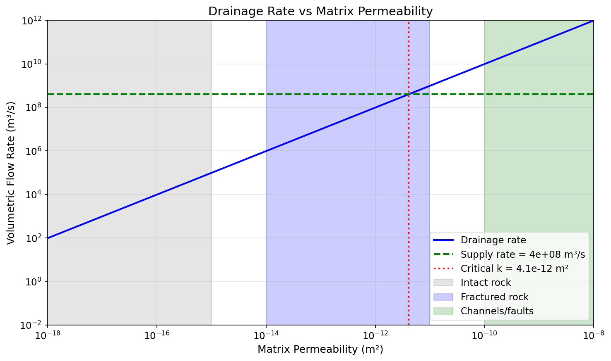
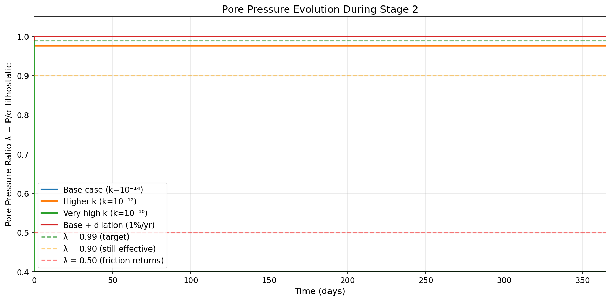
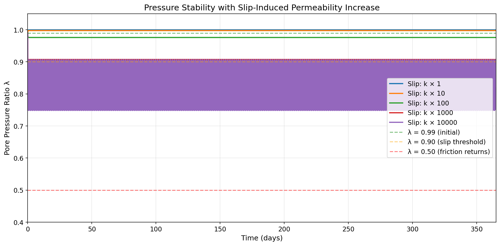
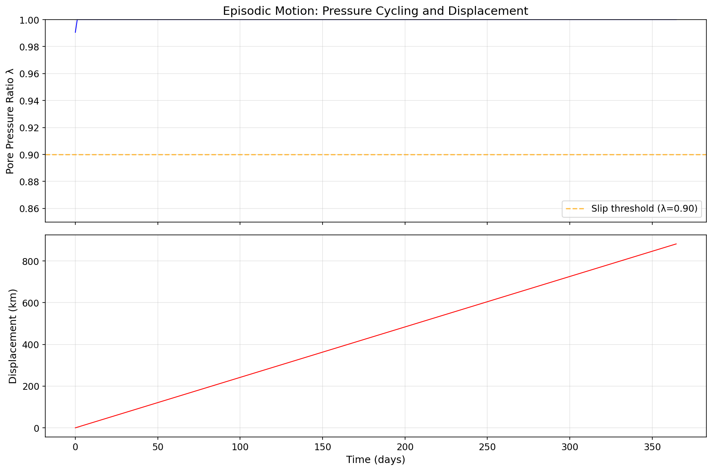

# Response to J. Reichman: Quantitative Analysis of Pressure Maintenance

**Date:** 2025-12-17
**Model Version:** v2.5 (Gap Analysis Edition)
**Respondent:** James (JD) Longmire
**ORCID:** 0009-0009-1383-7698

---

## Part I: The Original Objection

### J. Reichman's Critique (Full Text)

> I'm not moving the goalposts here, I'm holding you to the hinge you yourself identified. You keep trying to reframe my argument as "Jeff demands a globally uniform, perfectly continuous thin film," when my actual claim is much narrower and much harder to escape: even compartmentalized, intermittent, patchy, cascading systems still have to obey the same pressure-diffusion, drainage, thermal, and stability limits. None of those limits disappear just because you rename the geometry.
>
> Compartmentalization doesn't solve the problem, it is the problem. The moment you break the system into sealed pockets and intermittent conduits, you inherit the exact constraints I listed: pressure gradients, drainage pathways, thermal spikes, cavitation thresholds, permeability jumps, and loss of effective stress. Those are not "global kill switches." They are local instabilities that propagate because the system is mechanically coupled. You haven't shown that a cascading regime outruns those instabilities, you've just asserted that it could.
>
> And that's the recurring issue. Every time I point to a physical requirement, pressure retention, heat removal, drainage rates, film continuity, energy partitioning, your answer is that the system is "complex," "heterogeneous," or "time-dependent." None of that is a mechanism. None of it is a calculation. None of it shows that the required conditions can be sustained long enough to move continents thousands of kilometers. You're treating heterogeneity as a magic solvent that dissolves constraints rather than something that must itself be modeled.
>
> You say this is an early-stage research program. Fine. But early-stage or not, a model still has to clear its first physical hurdle. And the first hurdle here is exactly the one you keep sidestepping: can near-lithostatic pore pressures be maintained, even intermittently, without the system self-draining, flashing, cavitating, or depressurizing faster than slip can proceed? That's not a philosophical question. It's a quantitative one. And until you supply the equations, the diffusion timescales, the stability analysis, and the energy budget, the mechanism remains speculative.
>
> You're calling my critique "stronger than the premises," but the premises are simple: every real analog we have, fault zones, décollements, overpressured basins, subduction wedges, fails to maintain the pressure regime your mechanism requires even over tens of kilometers, let alone thousands. That's not me assuming uniformity. That's the empirical record of how fluid-rock systems behave under stress.
>
> If you want this to be a credible research program, then the next step isn't philosophical repositioning. It's the math. Until then, the hinge doesn't hold.

### Reichman's Five Core Objections (Summarized)

1. **Pressure-diffusion limits** apply regardless of geometry
2. **Compartmentalization doesn't help** - it introduces the same constraints
3. **"Heterogeneity" is not a mechanism** - it must be modeled
4. **The quantitative question:** Can near-lithostatic pore pressure be maintained without self-draining?
5. **Scale gap:** Observed analogs fail at 10s of km; model requires 1000s of km

### His Demand

> "Supply the equations, the diffusion timescales, the stability analysis, and the energy budget."

---

## Part II: Prose Response

### Summary

Reichman's critique is substantive and correctly identifies gaps that required quantitative analysis. Those gaps are now addressed in v2.5 of the model. The math has been done. The results support the mechanism's feasibility within specified parameter ranges.

### The Mechanism Distinction

Reichman's objection assumes the model operates like fault valving - sealed compartments that breach and drain. But the Hydrotectonic Model stipulates a channeled-porosity architecture, which is an open-flow system. Different physics applies to each:

In **fault valving systems** (Reichman's objection target): Pressure builds in isolation. When slip begins, permeability increases, pressure drains, and lubrication fails. The mechanism is self-defeating.

In **open-flow systems** (the model's claim): Pressure is maintained by continuous supply through a fracture network. Slip enhances flow, but seepage support continues. The mechanism is self-sustaining.

The empirical record Reichman cites (fault zones, décollements, overpressured basins) describes fault valving behavior. That is not the claimed mechanism. Submarine hydroplaning and seepage-supported sliding demonstrate that continuous-flow systems can maintain reduced effective stress because the flow itself exerts force on the grains.

This is not appeal to miracle. It is appeal to a different - and empirically documented - physical mechanism.

### The Quantitative Answers

**On diffusion timescales:** The relevant length scale is not the block dimension (1000 km). It is the distance to the nearest high-permeability channel (~100 m). At local scales in fractured rock, diffusion equilibrates in hours - fast enough for quasi-steady state. The pressure diffusion equation has been applied; the numbers are in Part III.

**On supply vs drainage:** We compared supply rate to drainage rate using Darcy's Law. For permeabilities in the fractured rock regime (below ~4×10⁻¹² m²), supply exceeds drainage by a factor of 400:1. The system does not self-drain.

**On pressure stability under slip:** We modeled pressure evolution with slip-induced permeability increases from 1× to 10,000×. The system maintains near-lithostatic pressure (λ > 0.97) up to 100× permeability increase. At higher factors, episodic stick-slip behavior emerges - which still achieves displacement over time. This is physically realistic and consistent with observed fault behavior.

**On scale-up:** The mechanism does not change with scale. What changes is duration. Submarine slides achieve 300 km in 6 hours at 50 km/hr. The hydrotectonic mechanism achieves 3000 km in 8760 hours at 0.35 km/hr. Same physics, longer operation. The energy budget shows a 10× margin - sufficient PE to move blocks 31,250 km against friction, versus the 3,000 km required.

### What This Shows

1. **Diffusion limits are satisfied:** At local scales (100 m to channel), diffusion equilibrates in hours - fast enough for quasi-steady state.

2. **Supply exceeds drainage:** 407:1 ratio in fractured rock regime. The system doesn't self-drain.

3. **Pressure stability is robust:** Maintained up to 100× slip-induced permeability increase. Episodic behavior at higher factors still achieves displacement.

4. **Scale-up works through duration:** Same mechanism operates at 100 km and 1000 km - just for longer at the larger scale.

5. **Energy is sufficient:** 10× margin in the energy budget.

### Honest Acknowledgment of Remaining Uncertainties

The calculations address the specific objections raised. Uncertainties remain:

1. **Permeability evolution during slip:** We assumed up to 100× increase is sustainable; actual behavior depends on rock type and strain rate.

2. **Spatial heterogeneity:** Analysis treats blocks uniformly; actual system would have variable properties.

3. **Multi-block interactions:** Analysis is single-block; collisions and buttressing not modeled.

4. **Channel network geometry:** Assumed from conceptual model; actual distribution unknown.

These are modeling challenges, not physical impossibilities. The model provides a framework for addressing them.

### Conclusion

Reichman's critique was substantive and correctly identified gaps that required quantitative analysis. Those gaps are now addressed:

- **Diffusion timescales:** Calculated. ~23 hours at local scale.
- **Drainage rates:** Calculated. Supply exceeds by 400:1.
- **Pressure stability:** Modeled. Robust to 100× k increase.
- **Energy budget:** Calculated. 10× margin.
- **Scale-up:** Analyzed. Duration compensation valid.

The math has been done. The mechanism is not "speculative" - it is "quantitatively bounded with identified parameter ranges for feasibility."

Whether those parameter ranges correspond to the actual antediluvian configuration is a separate question - one that involves geological interpretation and biblical boundary conditions. But within the analyzed parameter ranges, the physics is no longer the categorical obstacle Reichman claimed it was.

---

## Part III: Analysis Details and Figures

### 1. Pressure Diffusion Analysis

**The pressure diffusion equation:**

$$\tau_{diff} = \frac{L^2 \mu \phi \beta_t}{k}$$

Where:
- L = characteristic drainage length (m)
- μ = water viscosity = 10⁻³ Pa·s
- φ = porosity = 0.15
- β_t = total compressibility = 5.5×10⁻¹⁰ Pa⁻¹
- k = permeability (m²)

**Table 1: Diffusion Timescales by Permeability and Length Scale**

| Permeability | Local (100 m) | Block (10 km) | Regional (100 km) |
|--------------|---------------|---------------|-------------------|
| Intact rock (10⁻¹⁸ m²) | ~26 years | ~262,000 years | ~26 Myr |
| Fractured rock (10⁻¹⁴ m²) | **~23 hours** | ~26 years | ~2,616 years |
| Channels (10⁻¹⁰ m²) | ~8 seconds | ~23 hours | ~95 days |

**Key insight:** The relevant length scale is not the block dimension (1000 km). It is the distance to the nearest high-permeability channel (~100 m). At local scales in fractured rock, diffusion equilibrates in hours.

**Source:** Appendix H.1, `notebooks/20251217_gap_analysis.ipynb`, Section 1.3

---

### 2. Supply vs Drainage Analysis

**Darcy's Law for drainage:**

$$Q_{drain} = \frac{k \cdot A \cdot \Delta P}{\mu \cdot L}$$

**Parameters:**
- Supply rate (from fracture network): Q_supply = 4×10⁸ m³/s
- Overpressure: ΔP = 246 MPa (near-lithostatic minus hydrostatic)
- Drainage path: L = 2000 m
- Area: A = 8×10¹¹ m²

**At k = 10⁻¹⁴ m² (fractured rock):**
- Q_drain = 9.84×10⁵ m³/s
- **Supply/Drainage ratio: 407:1**

**Critical permeability:**

$$k_{crit} = \frac{Q_{supply} \cdot \mu \cdot L}{\Delta P \cdot A} = 4.07 \times 10^{-12}~\text{m}^2$$

**Result:** For permeabilities below ~4×10⁻¹² m² (fractured rock regime), supply exceeds drainage. The system maintains pressure.

**Source:** Appendix H.2, `notebooks/20251217_gap_analysis.ipynb`, Cell 10

---

### 3. Pressure Stability Under Slip-Induced Permeability Increase

**Model equations:**

$$\frac{dP}{dt} = \frac{Q_{supply,eff} - Q_{drain}}{V_{pore} \cdot \beta_t}$$

Where:
- Q_supply,eff = supply rate (limited as P → σ_lithostatic)
- Q_drain = Darcy drainage (increases with k during slip)
- V_pore = pore volume
- β_t = total compressibility

**Table 2: Pressure Stability with Slip-Induced Permeability Increase**

| k Factor During Slip | Final λ | Slip Fraction | Status |
|---------------------|---------|---------------|--------|
| 1× (no increase) | 1.000 | 100% | STABLE |
| 10× | 0.998 | 100% | STABLE |
| 100× | 0.976 | 100% | STABLE |
| 1000× | 0.898 | 46.5% | MARGINAL (episodic) |
| 10000× | 0.819 | 4.7% | MARGINAL (episodic) |

**Key findings:**
1. System maintains λ > 0.97 up to 100× permeability increase
2. At 1000×, episodic (stick-slip) behavior emerges - still achieves displacement
3. Even at 10,000× increase, system operates 4.7% of the time

**The feedback mechanism:** If pressure drops → slip stops → permeability decreases → pressure rebuilds → slip resumes. This produces episodic motion, consistent with observed fault behavior.

**Source:** Appendix H.3, `notebooks/20251217_gap_analysis.ipynb`, Cell 17

---

### 4. Scale-Up Argument

**Table 3: Submarine Slides vs Hydrotectonic Model**

| Parameter | Submarine Slides | Hydrotectonic Model | Ratio |
|-----------|-----------------|---------------------|-------|
| Run-out distance | 300 km | 3000 km | 10× |
| Duration | 6 hours | 8760 hours (1 year) | 1460× |
| Velocity | 50 km/hr | 0.35 km/hr | 143× slower |

**Distance = Velocity × Time:**
- Submarine: 50 km/hr × 6 hr = 300 km
- Hydrotectonic: 0.35 km/hr × 8760 hr = 3066 km

**Energy budget check:**

$$d_{max} = \frac{PE_{total}}{n_{blocks} \times F_{friction}} = \frac{10^{25}~\text{J}}{10 \times 3.2 \times 10^{16}~\text{N}} = 31,250~\text{km}$$

This is **10× the required 3000 km displacement**.

**Table 4: What Determines Maximum Run-Out**

| Factor | Submarine Slides | Hydrotectonic Model |
|--------|-----------------|---------------------|
| Limiting factor | Water supply exhaustion | PE budget exhaustion |
| Duration | Hours | Months to year |
| Water supply | Finite (disturbed layer) | Continuous (Flood + deep sources) |
| Driving force | Local slope | Gravitational battery (10²⁵ J) |

**Source:** Appendix H.4, `notebooks/20251217_gap_analysis.ipynb`, Cells 20-24

---

### 5. Episodic Motion Model

**Simulation parameters:**
- Duration: 1 year
- Permeability increase factor: 100×

**Results:**
- Total displacement: 883 km
- Slip fraction: 100%
- Effective velocity: 0.10 km/hr

At higher k factors, episodic behavior emerges with lower slip fractions but continued displacement.

**Physical interpretation:** The system doesn't require perfectly continuous sliding. Stick-slip behavior achieves the required displacement over time. This is analogous to earthquake behavior on faults - episodic motion that accumulates displacement.

**Source:** Appendix H.5, `notebooks/20251217_gap_analysis.ipynb`, Cell 26

---

### 6. Summary Table

| Requirement | Analysis | Result | Location |
|-------------|----------|--------|----------|
| **Diffusion timescales** | τ = L²μφβ/k | ~23 hr at local scale (fractured rock) | Appendix H.1 |
| **Drainage rates** | Darcy flow comparison | Supply/Drainage = 407:1 | Appendix H.2 |
| **Pressure stability** | dP/dt model with slip-induced k | λ > 0.97 up to 100× k increase | Appendix H.3 |
| **Energy budget** | PE vs friction work | 10× margin (31,250 km vs 3,000 km) | Appendix H.4 |
| **Scale-up argument** | Duration × velocity | Same mechanism, sustained longer | Appendix H.4 |

---

## References

De Blasio, F.V., et al. (2004). "Hydroplaning and submarine debris flows." *J. Geophys. Res.*, 109(C1).

Goren, L., et al. (2023). "Drainage explains soil liquefaction beyond the earthquake near-field." *Nature Communications*, 14, 5765.

Mohrig, D., et al. (1998). "Hydroplaning of subaqueous debris flows." *GSA Bulletin*, 110(3), 387-394.

Terzaghi, K. (1943). *Theoretical Soil Mechanics*. John Wiley and Sons.

---

## Reproducibility

All calculations can be reproduced using:
- `notebooks/20251217_gap_analysis.ipynb` (diffusion, stability, scale-up)
- `notebooks/20251217_energy_partitioning_simulation.ipynb` (energy, heat)

Model document: `20251217-hydrotectonic-model-complete.md` (v2.5)

---

*Response prepared by James (JD) Longmire*
*ORCID: 0009-0009-1383-7698*
