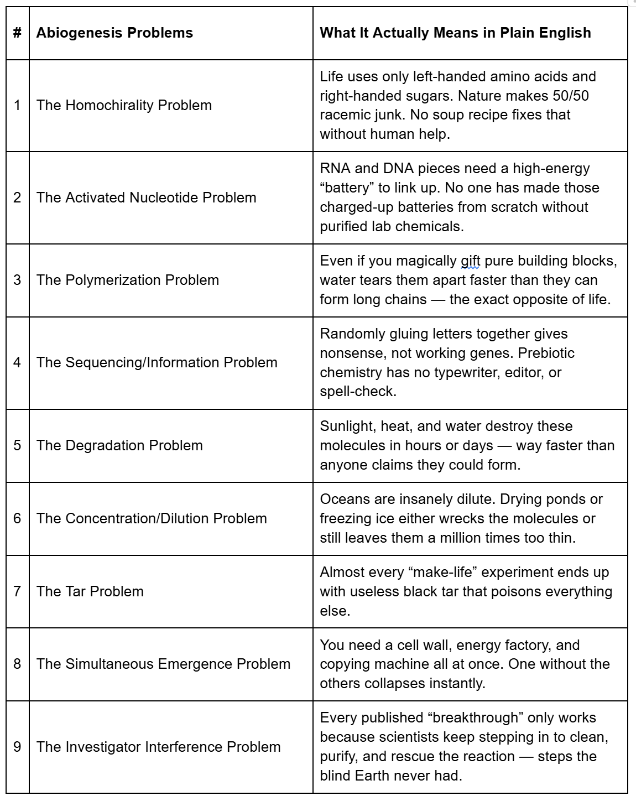

# We Are Nowhere Near Solving the Origin of Life
## (And One of the World's Top Chemist Keeps Proving It)

**James (JD) Longmire**
November 14, 2025

---

If you ever hear someone say, "Science is close to creating life in a test tube," or "We basically know how life started; it's just chemistry," you can stop the conversation with one fact:

**Dr. James Tour — one of the most cited chemists alive — says we are nowhere close.**

Not drifting.
Not inching forward.
Clueless.

Tour builds nanomachines for a living. He designs molecular systems the size of viruses. When the world's leading synthetic chemist says origin-of-life (OOL) research is a dead end, you pay attention.

And after five years of reviewing every major claim in the field, his verdict hasn't budged.

Below is the table he uses in his public lectures. I've translated each problem into plain English. When someone says OOL research is "making great progress," ask them which line on this chart has been solved under real, unguided conditions.

## The Nine Roadblocks No One Has Solved

---

Tour's standing challenge to the entire field is simple:

**Show one peer-reviewed paper that solves even one of these nine problems under honest prebiotic conditions — without human babysitting.**

As of November 2025, the score is still **9–0**.

Every time a headline shouts, "Scientists take major step toward creating life!", Tour reads the paper, breaks it down, and shows the quiet truth: the experiment only worked because researchers purified ingredients, timed reactions, adjusted conditions, and removed contaminants — exactly the actions that undercut the claim.

**When you remove human hands from the process, the chemistry collapses.**

## The Simple Test

So the next time someone confidently says, "We basically solved how life began," ask a single question:

**"Great. Which line disappeared this year?"**

Because until even one of these nine roadblocks actually vanishes, the origin of life remains one of the strongest arguments against blind chemistry.

The evidence points in one direction:

**Life looks designed because — on the chemistry alone — it is.**

---

*(Share the table. Bookmark it. Show it to anyone who thinks "we're almost there." Reality doesn't bend to headlines or wishful thinking.)*

*Soli Deo Gloria*
